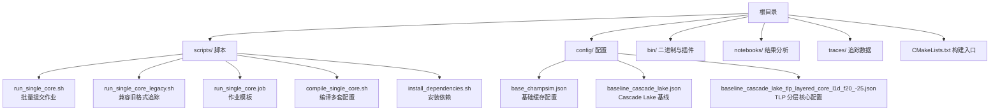
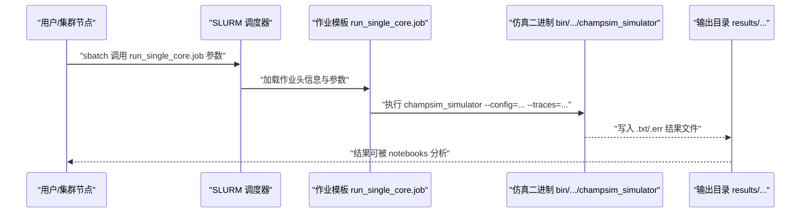
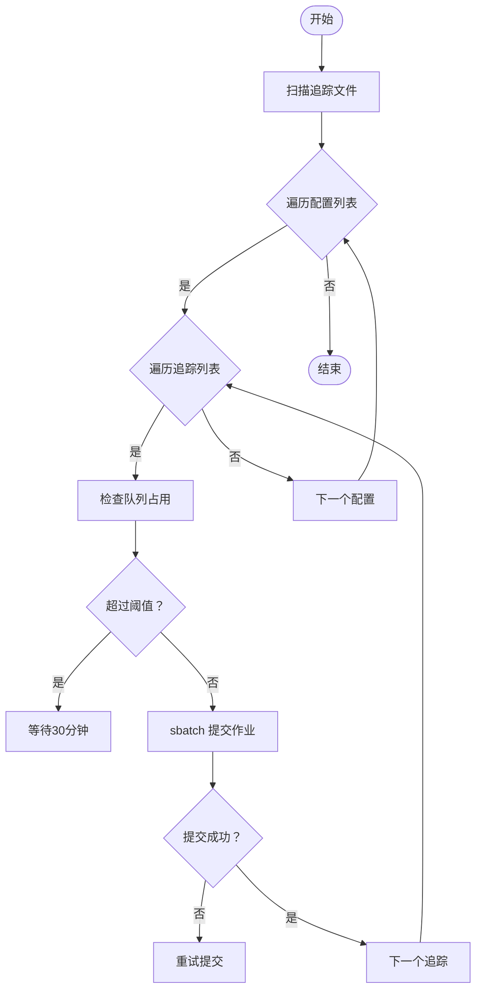
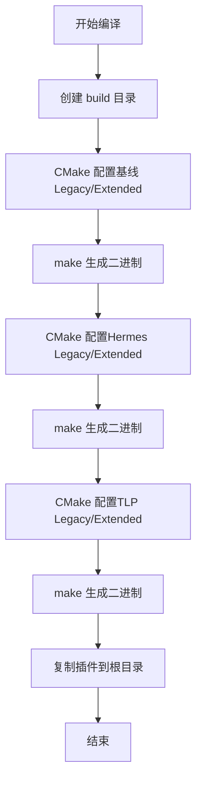
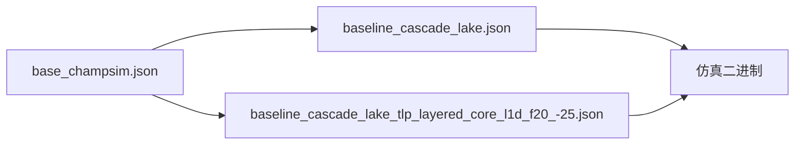
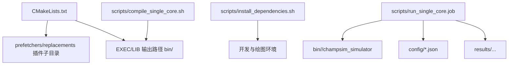

# 实验执行流程

<cite>
**本文引用的文件**
- [README.md](file://README.md)
- [CMakeLists.txt](file://CMakeLists.txt)
- [scripts/compile_single_core.sh](file://scripts/compile_single_core.sh)
- [scripts/install_dependencies.sh](file://scripts/install_dependencies.sh)
- [scripts/run_single_core.sh](file://scripts/run_single_core.sh)
- [scripts/run_single_core_legacy.sh](file://scripts/run_single_core_legacy.sh)
- [scripts/run_single_core.job](file://scripts/run_single_core.job)
- [config/base_champsim.json](file://config/base_champsim.json)
- [config/baseline_cascade_lake.json](file://config/baseline_cascade_lake.json)
- [config/baseline_cascade_lake_tlp_layered_core_l1d_f20_-25.json](file://config/baseline_cascade_lake_tlp_layered_core_l1d_f20_-25.json)
- [notebooks/single_core.ipynb](file://notebooks/single_core.ipynb)
</cite>

## 目录
1. [简介](#简介)
2. [项目结构](#项目结构)
3. [核心组件](#核心组件)
4. [架构总览](#架构总览)
5. [详细组件分析](#详细组件分析)
6. [依赖关系分析](#依赖关系分析)
7. [性能考虑](#性能考虑)
8. [故障排查指南](#故障排查指南)
9. [结论](#结论)
10. [附录](#附录)

## 简介
本指南面向 TLP-HPCA30 实验的完整执行流程，覆盖实验设计、仿真运行、结果收集与分析的全流程。重点说明如何在 SLURM 集群上进行批处理作业的编写与提交、资源调度策略、错误处理与监控方法，并给出大规模实验的组织与管理建议。该实验基于 ChampSim 模拟器，采用单核（1 核）配置，结合多种缓存与预测策略（含 TLP/Hermes/IPCP/BERTI 等），通过 SLURM 提交成百上千个作业以完成全量基准测试。

## 项目结构
仓库采用模块化布局：构建系统由 CMake 组织；仿真二进制与插件位于 bin/；配置文件集中于 config/；实验脚本位于 scripts/；结果与分析在 notebooks/；大规模追踪数据位于 traces/（需按说明下载并解压到根目录后生成）。

图表来源
- [CMakeLists.txt:1-66](file://CMakeLists.txt#L1-L66)
- [scripts/run_single_core.sh:1-126](file://scripts/run_single_core.sh#L1-L126)
- [scripts/run_single_core_legacy.sh:1-133](file://scripts/run_single_core_legacy.sh#L1-L133)
- [scripts/run_single_core.job:1-19](file://scripts/run_single_core.job#L1-L19)
- [scripts/compile_single_core.sh:1-39](file://scripts/compile_single_core.sh#L1-L39)
- [config/base_champsim.json:1-23](file://config/base_champsim.json#L1-L23)
- [config/baseline_cascade_lake.json:1-64](file://config/baseline_cascade_lake.json#L1-L64)
- [config/baseline_cascade_lake_tlp_layered_core_l1d_f20_-25.json:1-69](file://config/baseline_cascade_lake_tlp_layered_core_l1d_f20_-25.json#L1-L69)

章节来源
- [README.md:135-179](file://README.md#L135-L179)
- [CMakeLists.txt:1-66](file://CMakeLists.txt#L1-L66)

## 核心组件
- 构建系统与二进制
  - 使用 CMake 多次构建不同配置的仿真二进制，分别对应基线、Hermes、TLP 等策略，以及“扩展格式”与“旧格式”追踪支持。
  - 关键变量：SIMULATOR_OUTPUT_DIRECTORY、CHAMPSIM_CPU_NUMBER_CORE、CHAMPSIM_CPU_DRAM_IO_FREQUENCY、ENABLE_FSP/ENABLE_DELAYED_FSP/ENABLE_BIMODAL_FSP/ENABLE_SSP 等。
- 批处理脚本
  - run_single_core.sh：扫描 traces/ 下的 .sdc.xz 追踪，遍历多个配置，逐个提交 SLURM 作业。
  - run_single_core_legacy.sh：扫描 4xxx 与 6xxx 前缀的旧格式追踪，提交作业。
  - run_single_core.job：SLURM 作业模板，调用 bin/ 中对应二进制执行仿真。
- 配置文件
  - base_champsim.json：定义 L1/L2/LLC/SDC 的基础缓存配置。
  - baseline_cascade_lake.json：Cascade Lake 平台的基线配置，包含 L1D/L2C/LLC 缓存参数、元数据缓存、PC/地址预测器、离片预测等。
  - baseline_cascade_lake_tlp_layered_core_l1d_f20_-25.json：TLP 分层核心配置示例，调整 off-chip 预测阈值与特征集。
- 结果分析
  - notebooks/single_core.ipynb：Jupyter Notebook，用于汇总与可视化结果。

章节来源
- [scripts/compile_single_core.sh:1-39](file://scripts/compile_single_core.sh#L1-L39)
- [scripts/run_single_core.sh:1-126](file://scripts/run_single_core.sh#L1-L126)
- [scripts/run_single_core_legacy.sh:1-133](file://scripts/run_single_core_legacy.sh#L1-L133)
- [scripts/run_single_core.job:1-19](file://scripts/run_single_core.job#L1-L19)
- [config/base_champsim.json:1-23](file://config/base_champsim.json#L1-L23)
- [config/baseline_cascade_lake.json:1-64](file://config/baseline_cascade_lake.json#L1-L64)
- [config/baseline_cascade_lake_tlp_layered_core_l1d_f20_-25.json:1-69](file://config/baseline_cascade_lake_tlp_layered_core_l1d_f20_-25.json#L1-L69)
- [notebooks/single_core.ipynb](file://notebooks/single_core.ipynb)

## 架构总览
下图展示了从本地或集群节点触发到作业在 SLURM 上执行、调用仿真二进制、写入结果文件的端到端流程。

图表来源
- [scripts/run_single_core.job:14-18](file://scripts/run_single_core.job#L14-L18)
- [scripts/run_single_core.sh:116-119](file://scripts/run_single_core.sh#L116-L119)
- [scripts/run_single_core_legacy.sh:123-126](file://scripts/run_single_core_legacy.sh#L123-L126)

## 详细组件分析

### 组件A：SLURM 作业提交与队列管理
- 作业提交
  - run_single_core.sh 与 run_single_core_legacy.sh 会循环遍历配置与追踪，逐个提交作业。每个作业命名规则为 “config-trace”，输出与错误文件路径在 results/single_core/100M/100M 下按配置分层存放。
  - 作业模板 run_single_core.job 设置内存限制与队列优先级，并调用对应二进制执行仿真。
- 队列管理与节流
  - 两个脚本均包含 jobs_in_queue 与 should_wait 函数，当当前排队作业数达到阈值（如 10000）时，自动休眠一段时间再重试提交，避免瞬时拥塞导致失败。
- 错误处理与重试
  - 提交阶段对 sbatch 返回码进行检查，若失败则循环重试，确保作业最终进入队列。
- 监控与告警
  - 作业头中启用邮件通知（FAIL、TIME_LIMIT），便于及时发现异常退出。

图表来源
- [scripts/run_single_core.sh:14-34](file://scripts/run_single_core.sh#L14-L34)
- [scripts/run_single_core.sh:97-124](file://scripts/run_single_core.sh#L97-L124)
- [scripts/run_single_core_legacy.sh:14-34](file://scripts/run_single_core_legacy.sh#L14-L34)
- [scripts/run_single_core_legacy.sh:104-131](file://scripts/run_single_core_legacy.sh#L104-L131)

章节来源
- [scripts/run_single_core.sh:1-126](file://scripts/run_single_core.sh#L1-L126)
- [scripts/run_single_core_legacy.sh:1-133](file://scripts/run_single_core_legacy.sh#L1-L133)
- [scripts/run_single_core.job:1-19](file://scripts/run_single_core.job#L1-L19)

### 组件B：编译与二进制生成
- 多配置编译
  - compile_single_core.sh 为每种策略（基线、Hermes、TLP）分别构建“扩展格式”与“旧格式”两套二进制，确保与不同追踪格式兼容。
  - 关键构建参数：CHAMPSIM_CPU_NUMBER_CORE=1、CHAMPSIM_CPU_DRAM_IO_FREQUENCY=800、ENABLE_FSP/ENABLE_DELAYED_FSP/ENABLE_BIMODAL_FSP/ENABLE_SSP 等。
- 插件复制
  - 编译完成后将 prefetchers 与 replacements 插件复制到项目根目录，便于后续使用。

图表来源
- [scripts/compile_single_core.sh:8-32](file://scripts/compile_single_core.sh#L8-L32)
- [scripts/compile_single_core.sh:34-39](file://scripts/compile_single_core.sh#L34-L39)

章节来源
- [scripts/compile_single_core.sh:1-39](file://scripts/compile_single_core.sh#L1-L39)
- [CMakeLists.txt:1-66](file://CMakeLists.txt#L1-L66)

### 组件C：仿真配置与参数
- 基础配置
  - base_champsim.json 定义 L1I/L1D/L2C/LLC/SDC 的基础缓存配置，作为各平台配置的公共基底。
- 平台配置
  - baseline_cascade_lake.json：针对 Cascade Lake 平台的完整配置，包含 L1D/L2C/LLC 参数、元数据缓存、PC/地址预测器、离片预测器等。
  - baseline_cascade_lake_tlp_layered_core_l1d_f20_-25.json：TLP 分层核心配置，调整 off-chip 预测器的 demand/prefetch 特征与阈值。
- 运行参数
  - run_single_core.job 中设置 --warmup_instructions 与 --simulation_instructions 均为 1 亿条，确保充分预热与稳定统计。

图表来源
- [config/base_champsim.json:1-23](file://config/base_champsim.json#L1-L23)
- [config/baseline_cascade_lake.json:1-64](file://config/baseline_cascade_lake.json#L1-L64)
- [config/baseline_cascade_lake_tlp_layered_core_l1d_f20_-25.json:1-69](file://config/baseline_cascade_lake_tlp_layered_core_l1d_f20_-25.json#L1-L69)
- [scripts/run_single_core.job:18](file://scripts/run_single_core.job#L18)

章节来源
- [config/base_champsim.json:1-23](file://config/base_champsim.json#L1-L23)
- [config/baseline_cascade_lake.json:1-64](file://config/baseline_cascade_lake.json#L1-L64)
- [config/baseline_cascade_lake_tlp_layered_core_l1d_f20_-25.json:1-69](file://config/baseline_cascade_lake_tlp_layered_core_l1d_f20_-25.json#L1-L69)
- [scripts/run_single_core.job:14-18](file://scripts/run_single_core.job#L14-L18)

### 组件D：结果收集与分析
- 结果落盘
  - 作业输出与错误文件按“配置/追踪名.txt/.err”组织在 results/single_core/100M/100M 下，便于后续批量读取与汇总。
- 分析工具
  - notebooks/single_core.ipynb 提供完整的分析流程，可直接在 VS Code 的 Jupyter 扩展中打开与执行；也可使用 ipython 直接运行。

章节来源
- [scripts/run_single_core.sh:100-101](file://scripts/run_single_core.sh#L100-L101)
- [scripts/run_single_core_legacy.sh:107-108](file://scripts/run_single_core_legacy.sh#L107-L108)
- [README.md:160-179](file://README.md#L160-L179)
- [notebooks/single_core.ipynb](file://notebooks/single_core.ipynb)

## 依赖关系分析
- 构建期依赖
  - CMakeLists.txt 引入 cpu_config.cmake，查找 Boost 库并包含内部源码目录，设置二进制输出路径。
- 运行期依赖
  - 作业模板依赖已编译的二进制与配置文件；结果分析依赖 Jupyter/Python 环境与绘图依赖包。
- 资源与环境
  - install_dependencies.sh 安装 Boost、IPython、VS Code 及 LaTeX 绘图依赖；run_single_core.job 设置内存与队列优先级。

图表来源
- [CMakeLists.txt:14-32](file://CMakeLists.txt#L14-L32)
- [CMakeLists.txt:27-29](file://CMakeLists.txt#L27-L29)
- [scripts/compile_single_core.sh:34-39](file://scripts/compile_single_core.sh#L34-L39)
- [scripts/install_dependencies.sh:1-21](file://scripts/install_dependencies.sh#L1-L21)
- [scripts/run_single_core.job:14-18](file://scripts/run_single_core.job#L14-L18)

章节来源
- [CMakeLists.txt:1-66](file://CMakeLists.txt#L1-L66)
- [scripts/compile_single_core.sh:1-39](file://scripts/compile_single_core.sh#L1-L39)
- [scripts/install_dependencies.sh:1-21](file://scripts/install_dependencies.sh#L1-L21)
- [scripts/run_single_core.job:1-19](file://scripts/run_single_core.job#L1-L19)

## 性能考虑
- 队列节流与重试
  - 在高并发场景下，通过 should_wait 与 sleep 降低瞬时提交压力，提升整体成功率与稳定性。
- 内存与时间配额
  - 作业模板设置合理内存上限与队列优先级，避免资源争用与频繁抢占。
- 追踪与指令数
  - 预热与仿真指令数均为 1 亿条，确保统计收敛性；建议在大规模实验中保持一致参数以保证可比性。
- 插件与二进制复用
  - 将编译好的插件复制到根目录，减少运行时路径查找开销。

## 故障排查指南
- 作业未提交或反复失败
  - 检查 SLURM 用户名与工作目录是否正确；确认 should_wait 阈值与集群队列容量匹配；查看 sbatch 返回码与重试逻辑。
- 结果缺失或命名不一致
  - 确认 run_single_core.sh/run_single_core_legacy.sh 中 OUTPUT_DIR 与 CONFIGS/BINARIES 映射关系；检查作业输出/错误文件路径是否按“配置/追踪名.txt/.err”生成。
- 追踪文件未找到
  - 确保 traces/ 已正确解压且包含目标追踪；run_single_core.sh 使用 *.sdc-*.xz 匹配，run_single_core_legacy.sh 使用 4*.xz 与 6*.xz 匹配。
- 分析无法运行
  - 确认已安装 Jupyter/VS Code 扩展与 LaTeX 依赖；在 notebooks/single_core.ipynb 中检查路径与内核选择。

章节来源
- [scripts/run_single_core.sh:14-34](file://scripts/run_single_core.sh#L14-L34)
- [scripts/run_single_core_legacy.sh:14-34](file://scripts/run_single_core_legacy.sh#L14-L34)
- [scripts/run_single_core.job:14-18](file://scripts/run_single_core.job#L14-L18)
- [README.md:180-185](file://README.md#L180-L185)

## 结论
本指南提供了 TLP-HPCA30 单核实验的完整执行蓝图：从编译多套仿真二进制、准备追踪数据，到在 SLURM 集群上批量提交作业、节流与重试保障、再到结果落盘与分析。遵循本文流程可在大规模实验中实现高效、稳定与可重复的结果收集与评估。

## 附录
- 实验前准备
  - 安装依赖：参考 install_dependencies.sh；下载并解压 traces 到根目录；按 README.md 的构建命令生成仿真二进制。
- 实验执行
  - 先运行 compile_single_core.sh 生成所需二进制；再运行 run_single_core.sh 或 run_single_core_legacy.sh 启动实验。
- 结果分析
  - 使用 notebooks/single_core.ipynb 或 ipython 执行单核分析脚本，生成论文所需的统计与图表。

章节来源
- [README.md:71-101](file://README.md#L71-L101)
- [README.md:113-134](file://README.md#L113-L134)
- [README.md:135-179](file://README.md#L135-L179)
- [scripts/install_dependencies.sh:1-21](file://scripts/install_dependencies.sh#L1-L21)
- [scripts/compile_single_core.sh:1-39](file://scripts/compile_single_core.sh#L1-L39)
- [scripts/run_single_core.sh:147-156](file://scripts/run_single_core.sh#L147-L156)
- [scripts/run_single_core_legacy.sh:147-156](file://scripts/run_single_core_legacy.sh#L147-L156)
- [notebooks/single_core.ipynb](file://notebooks/single_core.ipynb)