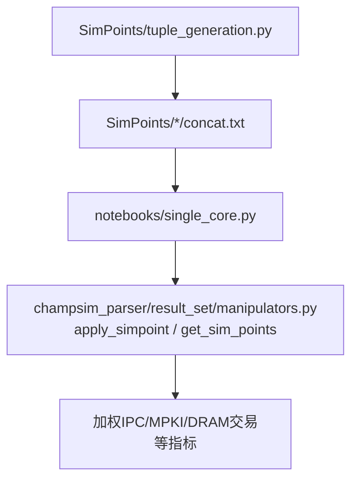
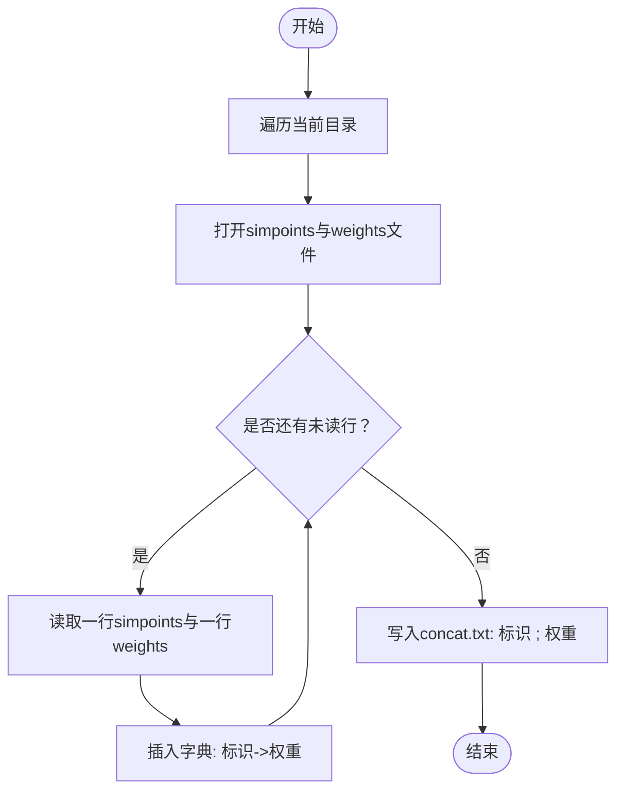
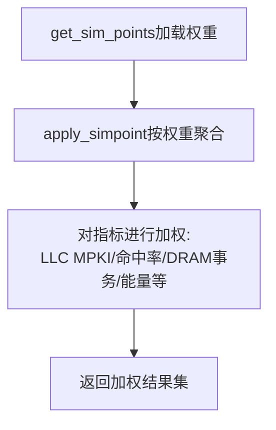

# SimPoints方法学

<cite>
**本文引用的文件**
- [tuple_generation.py](file://SimPoints/tuple_generation.py)
- [concat.txt（示例：400.perlbench）](file://SimPoints/400.perlbench/concat.txt)
- [concat.txt（示例：bc.kron）](file://SimPoints/400.perlbench/bc.kron/concat.txt)
- [concat.txt（示例：bc.road）](file://SimPoints/400.perlbench/bc.road/concat.txt)
- [concat.txt（示例：bc.twitter）](file://SimPoints/400.perlbench/bc.twitter/concat.txt)
- [manipulators.py（SimPoints应用逻辑）](file://champsim_parser/result_set/manipulators.py)
- [single_core.py（工作负载聚类与结果后处理）](file://notebooks/single_core.py)
- [README.md](file://README.md)
</cite>

## 目录
1. [引言](#引言)
2. [项目结构](#项目结构)
3. [核心组件](#核心组件)
4. [架构总览](#架构总览)
5. [详细组件分析](#详细组件分析)
6. [依赖关系分析](#依赖关系分析)
7. [性能考量](#性能考量)
8. [故障排查指南](#故障排查指南)
9. [结论](#结论)
10. [附录](#附录)

## 引言
本文件系统化阐述SimPoints方法学在该工件中的落地实践，重点覆盖以下方面：
- 工作负载聚类的基本原理与实现要点：时间戳序列聚类、代表性轨迹选择与权重计算。
- tuple_generation.py脚本的工作流程：simpoints文件与weights文件的读取、合并与输出格式。
- 不同网络拓扑（kron、road、twitter、urand、web）下的工作负载特性对比，以及这些图数据结构对缓存性能的影响。

本说明面向具备基础仿真背景的读者，力求以循序渐进的方式呈现从数据准备到结果分析的完整链路。

## 项目结构
SimPoints相关产物主要位于SimPoints目录中，每个基准/场景下生成一个concat.txt文件，记录“轨迹标识；权重”的键值对。notebooks中的single_core.py负责加载这些权重，并通过manipulators.py中的SimPoints应用逻辑对仿真结果进行加权聚合与对比分析。



图表来源
- [tuple_generation.py:1-28](file://SimPoints/tuple_generation.py#L1-L28)
- [concat.txt（示例：400.perlbench）:1-6](file://SimPoints/400.perlbench/concat.txt#L1-L6)
- [single_core.py:140-145](file://notebooks/single_core.py#L140-L145)
- [manipulators.py（SimPoints应用逻辑）:323-635](file://champsim_parser/result_set/manipulators.py#L323-L635)

章节来源
- [README.md:113-134](file://README.md#L113-L134)

## 核心组件
- SimPoints权重生成与合并
  - 通过遍历SimPoints目录，读取每个子目录下的simpoints文件与weights文件，将二者按行合并为“轨迹标识；权重”的字典，并写入concat.txt。
- 结果集加权聚合
  - 使用get_sim_points加载SimPoints权重，再调用apply_simpoint对各工作负载的结果进行加权，得到代表整个程序行为的综合指标（如IPC、MPKI、DRAM事务数等）。
- 工作负载筛选与分组
  - 在notebooks中通过正则表达式与过滤函数对SPEC/GAP/ALL等类别进行区分与筛选，确保统计稳健性。

章节来源
- [tuple_generation.py:4-27](file://SimPoints/tuple_generation.py#L4-L27)
- [manipulators.py（SimPoints应用逻辑）:323-635](file://champsim_parser/result_set/manipulators.py#L323-L635)
- [single_core.py:140-145](file://notebooks/single_core.py#L140-L145)

## 架构总览
下图展示了从SimPoints权重文件到最终加权指标的端到端流程。

```mermaid
sequenceDiagram
participant TG as "tuple_generation.py"
participant FS as "文件系统(SimPoints/*)"
participant NC as "notebooks/single_core.py"
participant MP as "manipulators.py"
participant RS as "结果集"
TG->>FS : 遍历目录并读取simpoints/weights
TG->>TG : 合并为"轨迹标识; 权重"字典
TG->>FS : 写入concat.txt
NC->>NC : 解析结果集与配置
NC->>MP : 调用get_sim_points('SimPoints/')
MP-->>NC : 返回simpoints_data(权重字典)
NC->>MP : 调用apply_simpoint(参考集, 权重, 过滤器)
MP->>RS : 对各项指标按权重加权聚合
RS-->>NC : 返回加权后的结果集
```

图表来源
- [tuple_generation.py:4-27](file://SimPoints/tuple_generation.py#L4-L27)
- [single_core.py:140-145](file://notebooks/single_core.py#L140-L145)
- [manipulators.py（SimPoints应用逻辑）:323-635](file://champsim_parser/result_set/manipulators.py#L323-L635)

## 详细组件分析

### 组件A：SimPoints权重生成与合并（tuple_generation.py）
- 输入
  - 每个工作负载目录包含两个文本文件：simpoints文件与weights文件。两者按行一一对应，分别表示轨迹标识与对应的聚类权重。
- 处理流程
  - 遍历当前目录，打开simpoints与weights文件。
  - 逐行读取，构建“轨迹标识 -> 权重”的映射字典。
  - 将该字典写入concat.txt，格式为“轨迹标识 ; 权重”，每条占一行。
- 输出
  - 每个工作负载目录生成一个concat.txt，作为后续SimPoints应用的输入。



图表来源
- [tuple_generation.py:4-27](file://SimPoints/tuple_generation.py#L4-L27)

章节来源
- [tuple_generation.py:1-28](file://SimPoints/tuple_generation.py#L1-L28)

### 组件B：工作负载聚类与代表性轨迹选择（基于concat.txt）
- 数据形态
  - concat.txt中每行是一个“轨迹标识；权重”的键值对，权重越大，代表该轨迹在时间维度上越具代表性。
- 代表性轨迹选择
  - 通常选择权重较大的若干轨迹作为代表性轨迹，用于后续仿真或分析。
- 权重计算方法
  - 权重由SimPoints聚类算法给出，反映轨迹片段在整个运行期内的重要性。具体算法细节不在仓库内直接实现，但其输出以“轨迹标识；权重”形式呈现于concat.txt。

章节来源
- [concat.txt（示例：400.perlbench）:1-6](file://SimPoints/400.perlbench/concat.txt#L1-L6)
- [concat.txt（示例：bc.kron）:1-7](file://SimPoints/400.perlbench/bc.kron/concat.txt#L1-L7)
- [concat.txt（示例：bc.road）:1-9](file://SimPoints/400.perlbench/bc.road/concat.txt#L1-L9)
- [concat.txt（示例：bc.twitter）:1-11](file://SimPoints/400.perlbench/bc.twitter/concat.txt#L1-L11)

### 组件C：结果集加权聚合（manipulators.py）
- 关键函数
  - get_sim_points：从SimPoints目录加载权重数据，返回“基准名 -> {轨迹标识: 权重}”的数据结构。
  - apply_simpoint：对目标结果集按权重进行加权聚合，返回新的结果集，其中各项指标均按权重线性组合。
- 加权聚合范围
  - 包括但不限于：速度比、LLC MPKI、命中率、DRAM事务数、能量消耗等。
- 过滤与分组
  - 在notebooks中通过正则与过滤函数对SPEC/GAP/ALL等类别进行筛选，确保统计稳健性。



图表来源
- [manipulators.py（SimPoints应用逻辑）:323-635](file://champsim_parser/result_set/manipulators.py#L323-L635)
- [single_core.py:140-145](file://notebooks/single_core.py#L140-L145)

章节来源
- [manipulators.py（SimPoints应用逻辑）:323-635](file://champsim_parser/result_set/manipulators.py#L323-L635)
- [single_core.py:263-274](file://notebooks/single_core.py#L263-L274)

### 组件D：不同网络拓扑下的工作负载特性对比
- 数据来源
  - 不同拓扑（kron、road、twitter、urand、web）在各自目录下生成各自的concat.txt，权重分布体现该拓扑下的访问模式特征。
- 分析思路
  - 通过比较同一基准在不同拓扑下的权重分布，可识别热点轨迹与访问模式差异。
  - 结合加权后的缓存指标（如LLC MPKI、DRAM事务数），评估不同拓扑对缓存性能的影响。

章节来源
- [concat.txt（示例：bc.kron）:1-7](file://SimPoints/400.perlbench/bc.kron/concat.txt#L1-L7)
- [concat.txt（示例：bc.road）:1-9](file://SimPoints/400.perlbench/bc.road/concat.txt#L1-L9)
- [concat.txt（示例：bc.twitter）:1-11](file://SimPoints/400.perlbench/bc.twitter/concat.txt#L1-L11)

## 依赖关系分析
- 文件级依赖
  - tuple_generation.py依赖SimPoints目录下的simpoints与weights文件；生成的concat.txt被notebooks/single_core.py读取。
- 代码级依赖
  - notebooks/single_core.py依赖champsim_parser.result_set.manipulators模块提供的get_sim_points与apply_simpoint。
- 可能的耦合点
  - concat.txt的格式需保持一致（“标识 ; 权重”），否则tuple_generation.py与后续解析逻辑会失败。
  - apply_simpoint依赖权重字典的键（轨迹标识）与结果集中的键一致，否则加权聚合会缺失或错误。


图表来源
- [tuple_generation.py:23-26](file://SimPoints/tuple_generation.py#L23-L26)
- [single_core.py:140-145](file://notebooks/single_core.py#L140-L145)
- [manipulators.py（SimPoints应用逻辑）:323-635](file://champsim_parser/result_set/manipulators.py#L323-L635)

章节来源
- [tuple_generation.py:1-28](file://SimPoints/tuple_generation.py#L1-L28)
- [single_core.py:140-145](file://notebooks/single_core.py#L140-L145)
- [manipulators.py（SimPoints应用逻辑）:323-635](file://champsim_parser/result_set/manipulators.py#L323-L635)

## 性能考量
- 计算复杂度
  - 权重生成阶段：O(N)，N为轨迹总数。
  - 结果集加权阶段：O(M×K)，M为工作负载数量，K为指标维度（如LLC MPKI、命中率、DRAM事务等）。
- 存储与I/O
  - concat.txt体积较小，主要瓶颈在于结果集解析与加权聚合。
- 稳健性
  - 建议在生成concat.txt后进行格式校验，确保“标识 ; 权重”格式正确且无重复标识。

## 故障排查指南
- concat.txt为空或格式异常
  - 检查simpoints与weights文件是否在同一目录且行数一致。
  - 确认tuple_generation.py执行环境与权限。
- apply_simpoint报错或结果异常
  - 确认get_sim_points返回的权重字典与结果集中的键匹配。
  - 检查过滤函数是否正确区分SPEC/GAP/ALL类别。
- 结果不显著或波动较大
  - 检查权重分布是否过于集中或稀疏，必要时调整过滤阈值（例如mpki_filter）。

章节来源
- [tuple_generation.py:11-26](file://SimPoints/tuple_generation.py#L11-L26)
- [single_core.py:93-104](file://notebooks/single_core.py#L93-L104)
- [manipulators.py（SimPoints应用逻辑）:323-635](file://champsim_parser/result_set/manipulators.py#L323-L635)

## 结论
本工件通过tuple_generation.py将SimPoints聚类得到的轨迹标识与权重整合为统一格式的concat.txt，并借助notebooks/single_core.py与manipulators.py完成对仿真结果的加权聚合。该流程既保证了代表性轨迹的有效利用，又便于跨不同网络拓扑与基准场景进行系统性对比分析，从而为缓存性能优化提供可靠依据。

## 附录
- 快速检查清单
  - 确认SimPoints目录下每个工作负载均有simpoints与weights文件。
  - 确认concat.txt格式为“轨迹标识 ; 权重”。
  - 确认notebooks/single_core.py能够成功加载SimPoints权重并调用apply_simpoint。
  - 确认过滤函数与类别划分满足预期。