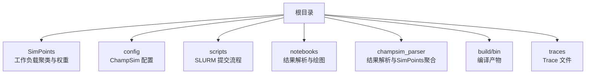
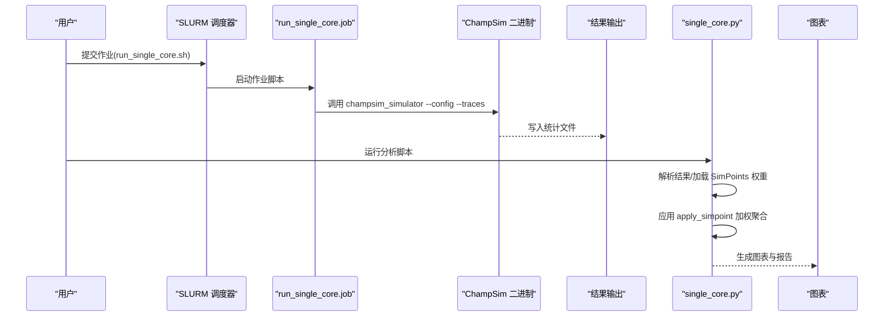
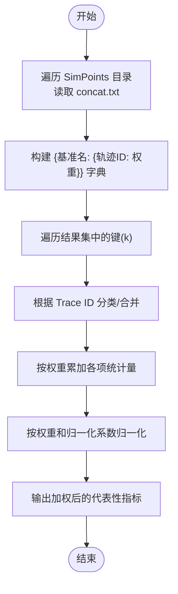
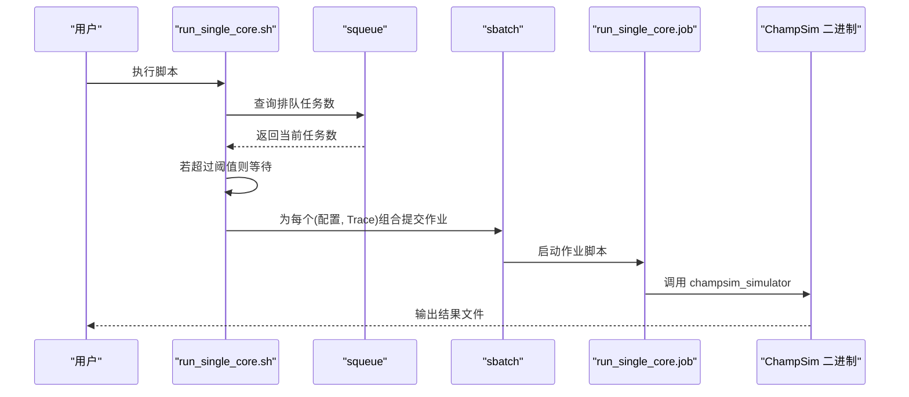
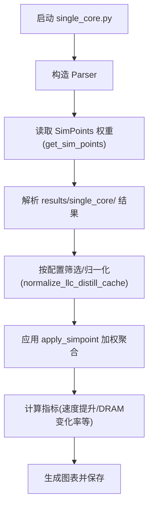
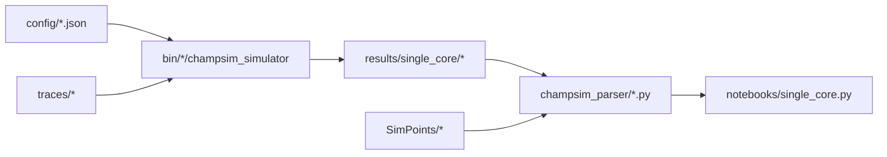

# 工作负载管理

<cite>
**本文引用的文件**   
- [README.md](file://README.md)
- [tuple_generation.py](file://SimPoints/tuple_generation.py)
- [manipulators.py](file://champsim_parser/result_set/manipulators.py)
- [single_core.py](file://notebooks/single_core.py)
- [run_single_core.sh](file://scripts/run_single_core.sh)
- [run_single_core_legacy.sh](file://scripts/run_single_core_legacy.sh)
- [run_single_core.job](file://scripts/run_single_core.job)
- [baseline_cascade_lake.json](file://config/baseline_cascade_lake.json)
- [baseline_cascade_lake_ipcp.json](file://config/baseline_cascade_lake_ipcp.json)
- [baseline_cascade_lake_ipcp_tlp_layered_core_l1d_f20_-25.json](file://config/baseline_cascade_lake_ipcp_tlp_layered_core_l1d_f20_-25.json)
</cite>

## 目录
1. [引言](#引言)
2. [项目结构](#项目结构)
3. [核心组件](#核心组件)
4. [架构总览](#架构总览)
5. [详细组件分析](#详细组件分析)
6. [依赖关系分析](#依赖关系分析)
7. [性能考量](#性能考量)
8. [故障排查指南](#故障排查指南)
9. [结论](#结论)
10. [附录](#附录)

## 引言
本文件面向 TLP-HPCA30 工作负载管理系统，系统性阐述以下内容：
- SimPoints 方法学：工作负载聚类、权重计算与代表性轨迹生成
- Trace 文件准备：下载、解压与组织
- SLURM 集群作业提交：脚本配置、资源分配与并行执行策略
- 不同工作负载类型特性与适用场景
- 性能基准测试设计与执行方法（以 IPC、LLC MPKI、DRAM transactions 等指标为主）

该系统基于 ChampSim 模拟器，通过 SLURM 批处理调度大规模仿真，并使用 Python 分析工具对结果进行汇总与可视化。

## 项目结构
仓库采用“按功能域分层”的组织方式：
- SimPoints：包含各工作负载的 SimPoints 聚类结果与权重文件，用于代表性轨迹加权聚合
- config：ChampSim 配置 JSON，定义缓存层次、预测器与参数
- scripts：SLURM 提交与运行脚本
- notebooks：结果解析与绘图的 Jupyter/IPython 脚本
- champsim_parser：结果解析与 SimPoints 加权聚合的 Python 模块
- build/bin：编译产物（模拟器二进制）
- traces：仿真所需的 Trace 文件目录

章节来源
- [README.md:113-134](file://README.md#L113-L134)

## 核心组件
- SimPoints 权重与轨迹聚合
  - 使用 tuple_generation.py 将每个工作负载下的“轨迹标识-权重”映射写入 concat.txt
  - 在分析阶段，通过 get_sim_points 读取 concat.txt 并构建权重字典
  - apply_simpoint 对各基准在参考集上的统计量按权重加权求和，得到代表性指标
- Trace 准备与组织
  - 从 Zenodo 下载三卷压缩包，按提示顺序解压至根目录，生成 traces 目录
  - 支持两类 Trace：.sdc-*.xz（现代格式）与 .xz（传统格式）
- SLURM 作业提交
  - run_single_core.job 定义作业资源与单次仿真命令
  - run_single_core.sh 与 run_single_core_legacy.sh 组织配置与 Trace 列表，批量提交 sbatch
- 结果解析与可视化
  - single_core.py 使用 champsim_parser 的解析器与 manipulators 进行加权聚合与绘图

章节来源
- [tuple_generation.py:1-28](file://SimPoints/tuple_generation.py#L1-L28)
- [manipulators.py:19-48](file://champsim_parser/result_set/manipulators.py#L19-L48)
- [manipulators.py:323-413](file://champsim_parser/result_set/manipulators.py#L323-L413)
- [README.md:113-134](file://README.md#L113-L134)
- [run_single_core.job:14-18](file://scripts/run_single_core.job#L14-L18)
- [run_single_core.sh:36-50](file://scripts/run_single_core.sh#L36-L50)
- [run_single_core_legacy.sh:36-57](file://scripts/run_single_core_legacy.sh#L36-L57)
- [single_core.py:140-145](file://notebooks/single_core.py#L140-L145)

## 架构总览
下图展示从 Trace 到结果可视化的端到端流程：

图表来源
- [run_single_core.job:14-18](file://scripts/run_single_core.job#L14-L18)
- [single_core.py:140-145](file://notebooks/single_core.py#L140-L145)

章节来源
- [run_single_core.job:14-18](file://scripts/run_single_core.job#L14-L18)
- [single_core.py:140-145](file://notebooks/single_core.py#L140-L145)

## 详细组件分析

### SimPoints 方法学：聚类、权重与代表性轨迹
- 数据来源
  - 每个工作负载目录包含 concat.txt，记录“轨迹标识 ; 权重”
- 读取与构建权重字典
  - get_sim_points 遍历 SimPoints 目录，读取 concat.txt，按基准名组织权重映射
- 加权聚合
  - apply_simpoint 对每个统计量（如 CPI、LLC MPKI、DRAM transactions 等）按权重累加并归一化
  - 通过权重和可选过滤函数（如 mpki_filter），实现代表性轨迹的代表性评估

图表来源
- [manipulators.py:19-48](file://champsim_parser/result_set/manipulators.py#L19-L48)
- [manipulators.py:323-413](file://champsim_parser/result_set/manipulators.py#L323-L413)
- [manipulators.py:1013-1169](file://champsim_parser/result_set/manipulators.py#L1013-L1169)

章节来源
- [tuple_generation.py:1-28](file://SimPoints/tuple_generation.py#L1-L28)
- [manipulators.py:19-48](file://champsim_parser/result_set/manipulators.py#L19-L48)
- [manipulators.py:323-413](file://champsim_parser/result_set/manipulators.py#L323-L413)
- [manipulators.py:1013-1169](file://champsim_parser/result_set/manipulators.py#L1013-L1169)

### Trace 准备：下载、解压与组织
- 下载三卷压缩包，分别对应不同工作负载集合
- 将三卷压缩包置于仓库根目录，使用 tar -xMf 顺序解压，依次提示输入下一卷名称
- 解压完成后生成 traces 目录，包含所有工作负载的 Trace 文件

章节来源
- [README.md:113-134](file://README.md#L113-L134)

### SLURM 作业提交：脚本配置、资源分配与并行策略
- 作业脚本 run_single_core.job
  - 设置队列 QOS、内存限制
  - 接收三个参数：配置文件路径、二进制名称、Trace 文件路径
  - 调用 champsim_simulator 执行仿真
- 主提交脚本 run_single_core.sh
  - 构造 CONFIGS 与 BINARIES 数组，覆盖多套配置与二进制
  - 枚举 traces 目录中的 .sdc-*.xz 文件，逐个组合配置与 Trace 提交
  - 通过 squeue 查询当前排队数量，超过阈值则等待，避免队列过载
- 兼容传统 Trace 的脚本 run_single_core_legacy.sh
  - 仅匹配 4*.xz 与 6*.xz 的传统格式 Trace
  - 其他逻辑与上述脚本一致

图表来源
- [run_single_core.job:14-18](file://scripts/run_single_core.job#L14-L18)
- [run_single_core.sh:13-34](file://scripts/run_single_core.sh#L13-L34)
- [run_single_core.sh:97-124](file://scripts/run_single_core.sh#L97-L124)
- [run_single_core_legacy.sh:13-34](file://scripts/run_single_core_legacy.sh#L13-L34)
- [run_single_core_legacy.sh:104-131](file://scripts/run_single_core_legacy.sh#L104-L131)

章节来源
- [run_single_core.job:14-18](file://scripts/run_single_core.job#L14-L18)
- [run_single_core.sh:13-34](file://scripts/run_single_core.sh#L13-L34)
- [run_single_core.sh:97-124](file://scripts/run_single_core.sh#L97-L124)
- [run_single_core_legacy.sh:13-34](file://scripts/run_single_core_legacy.sh#L13-L34)
- [run_single_core_legacy.sh:104-131](file://scripts/run_single_core_legacy.sh#L104-L131)

### 结果解析与可视化：Jupyter/IPython 流程
- single_core.py
  - 导入解析模块，构造 Parser
  - 读取 SimPoints 权重数据
  - 解析 results/single_core/ 下的结果，按配置筛选与归一化
  - 使用 apply_simpoint 对不同工作负载子集（SPEC/GAP/ALL 等）进行加权聚合
  - 计算速度提升、DRAM transactions 变化率等指标并绘制图表

图表来源
- [single_core.py:140-145](file://notebooks/single_core.py#L140-L145)
- [single_core.py:263-274](file://notebooks/single_core.py#L263-L274)
- [single_core.py:357-412](file://notebooks/single_core.py#L357-L412)
- [single_core.py:477-578](file://notebooks/single_core.py#L477-L578)
- [single_core.py:681-788](file://notebooks/single_core.py#L681-L788)

章节来源
- [single_core.py:140-145](file://notebooks/single_core.py#L140-L145)
- [single_core.py:263-274](file://notebooks/single_core.py#L263-L274)
- [single_core.py:357-412](file://notebooks/single_core.py#L357-L412)
- [single_core.py:477-578](file://notebooks/single_core.py#L477-L578)
- [single_core.py:681-788](file://notebooks/single_core.py#L681-L788)

### 配置文件与工作负载类型
- 基准配置示例
  - baseline_cascade_lake.json：基础配置，定义 L1/L2/LLC 缓存与部分预测器参数
  - baseline_cascade_lake_ipcp.json：启用 IPCP 预取器的基础配置
  - baseline_cascade_lake_ipcp_tlp_layered_core_l1d_f20_-25.json：TLP 层叠式核心配置（含 offchip_pred 参数）
- 工作负载类型与适用场景
  - SPEC CPU2006/2017：整数/浮点混合，侧重 IPC 与缓存层次优化
  - GAPBS（bc/bfs/cc/pr/sssp/tc）：图算法，强调带宽与缓存一致性
  - 其他科学与高性能计算应用：侧重 LLC 命中与 DRAM transactions 控制

章节来源
- [baseline_cascade_lake.json:1-64](file://config/baseline_cascade_lake.json#L1-L64)
- [baseline_cascade_lake_ipcp.json:1-69](file://config/baseline_cascade_lake_ipcp.json#L1-L69)
- [baseline_cascade_lake_ipcp_tlp_layered_core_l1d_f20_-25.json:1-69](file://config/baseline_cascade_lake_ipcp_tlp_layered_core_l1d_f20_-25.json#L1-L69)

## 依赖关系分析
- 组件耦合
  - scripts 依赖 config 中的 JSON 配置与 bin 中的二进制
  - notebooks 依赖 champsim_parser 的解析器与 manipulators
  - SimPoints 目录提供权重，贯穿解析与可视化阶段
- 外部依赖
  - SLURM 调度器（sbatch/squeue）
  - Python 生态（pandas、numpy、matplotlib、scipy.stats）

图表来源
- [run_single_core.job:14-18](file://scripts/run_single_core.job#L14-L18)
- [single_core.py:140-145](file://notebooks/single_core.py#L140-L145)

章节来源
- [run_single_core.job:14-18](file://scripts/run_single_core.job#L14-L18)
- [single_core.py:140-145](file://notebooks/single_core.py#L140-L145)

## 性能考量
- 并行与队列控制
  - 通过 should_wait 与 squeue 限制同时作业数，避免资源争用
- 指标选择
  - IPC（CPI 比值）、LLC MPKI、DRAM transactions 变化率、预取准确率与覆盖率
- 可扩展性
  - SimPoints 加权聚合使代表性轨迹更贴近整体分布，降低实验规模与时间成本

## 故障排查指南
- Trace 解压失败
  - 确认三卷压缩包均位于根目录，按提示顺序输入卷名
- 作业长时间排队或失败
  - 检查 run_single_core.sh 中的队列阈值与等待逻辑
  - 查看作业错误日志（.err 文件）
- 结果解析异常
  - 确认 SimPoints concat.txt 格式正确（轨迹标识 ; 权重）
  - 检查 single_core.py 中的过滤条件（如 mpki_filter）是否过于严格

章节来源
- [README.md:113-134](file://README.md#L113-L134)
- [run_single_core.sh:13-34](file://scripts/run_single_core.sh#L13-L34)
- [single_core.py:93-104](file://notebooks/single_core.py#L93-L104)

## 结论
本系统通过 SimPoints 方法学对大规模 Trace 进行代表性采样与加权聚合，结合 SLURM 批处理与 Python 分析工具，实现了高效、可复现的工作负载管理与性能评估流程。针对不同工作负载类型（SPEC、GAPBS 等），可依据 IPC、LLC MPKI 与 DRAM transactions 等指标进行对比分析，支撑缓存与预取策略的优化决策。

## 附录
- 实验流程建议
  - 准备阶段：下载并解压 Trace，确认 traces 目录存在
  - 提交阶段：设置用户名、输出目录，执行 run_single_core.sh 或 run_single_core_legacy.sh
  - 分析阶段：运行 single_core.py 或 Jupyter Notebook，生成图表与报告
- 关键参数参考
  - warmup_instructions、simulation_instructions：预热与仿真步数
  - CHAMPSIM_CPU_DRAM_IO_FREQUENCY：DRAM I/O 频率
  - LEGACY_TRACE：是否使用传统 Trace 格式

章节来源
- [README.md:95-112](file://README.md#L95-L112)
- [run_single_core.job:14-18](file://scripts/run_single_core.job#L14-L18)
- [single_core.py:140-145](file://notebooks/single_core.py#L140-L145)