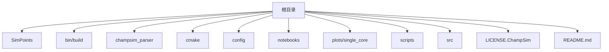
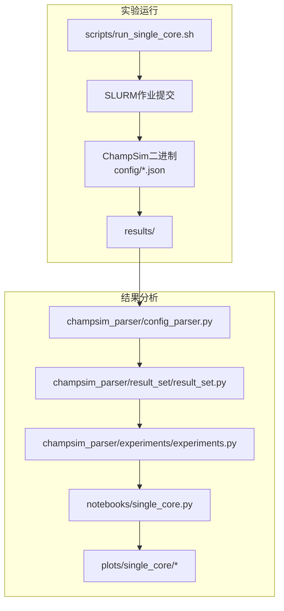
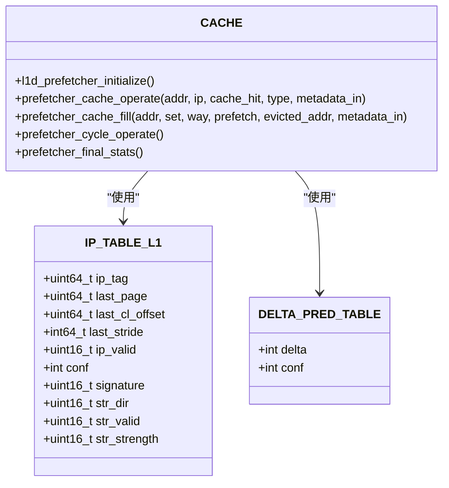
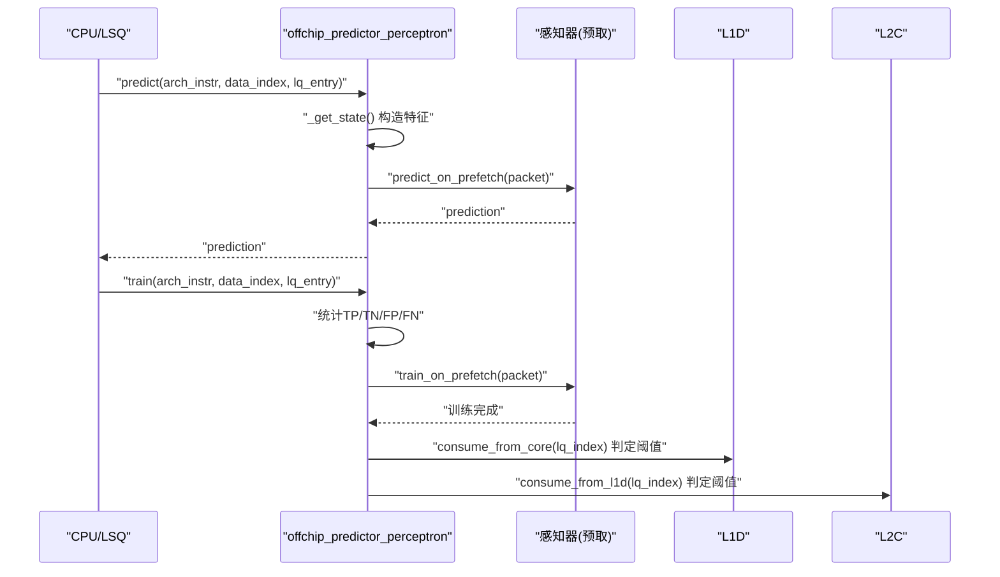
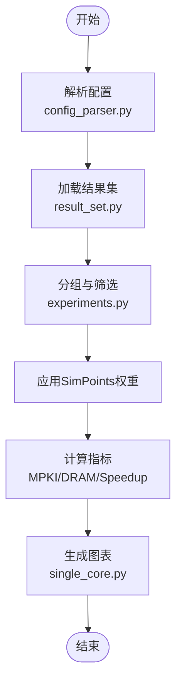
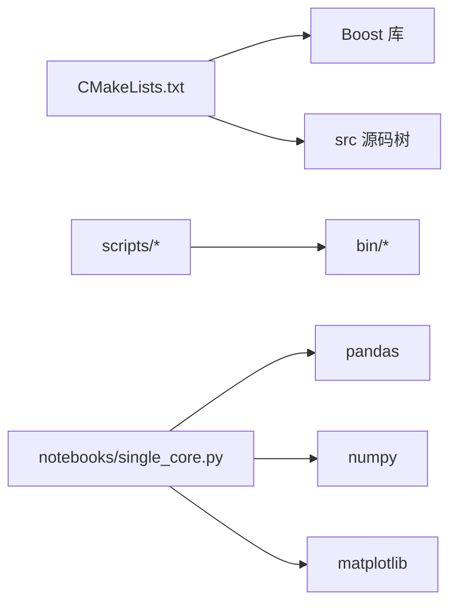

# 开发者指南

<cite>
**本文档引用的文件**
- [README.md](file://README.md)
- [CMakeLists.txt](file://CMakeLists.txt)
- [LICENSE.ChampSim](file://LICENSE.ChampSim)
- [scripts/install_dependencies.sh](file://scripts/install_dependencies.sh)
- [scripts/run_single_core.sh](file://scripts/run_single_core.sh)
- [notebooks/single_core.py](file://notebooks/single_core.py)
- [champsim_parser/config_parser.py](file://champsim_parser/config_parser.py)
- [champsim_parser/result_set/result_set.py](file://champsim_parser/result_set/result_set.py)
- [champsim_parser/experiments/experiments.py](file://champsim_parser/experiments/experiments.py)
- [src/prefetchers/ipcp/ipcp.cc](file://src/prefetchers/ipcp/ipcp.cc)
- [src/internals/components/offchip_pred_perc.cc](file://src/internals/components/offchip_pred_perc.cc)
</cite>

## 目录
1. [简介](#简介)
2. [项目结构](#项目结构)
3. [核心组件](#核心组件)
4. [架构总览](#架构总览)
5. [详细组件分析](#详细组件分析)
6. [依赖关系分析](#依赖关系分析)
7. [性能考虑](#性能考虑)
8. [故障排除指南](#故障排除指南)
9. [结论](#结论)
10. [附录](#附录)

## 简介
本指南面向TLP-HPCA30项目的开发者，提供从环境搭建、构建与运行到数据分析与可视化的一体化开发流程说明；同时覆盖代码贡献规范、命名约定、编码标准、测试框架使用、版本控制最佳实践、分支管理与发布流程、许可证与法律注意事项，以及常见问题排查建议。项目基于ChampSim仿真器，围绕两级感知器（TLP）在L1D级进行“是否离片”预测与自适应预取过滤，结合SPP-PPF/Hermes-O等策略进行对比评估。

## 项目结构
项目采用模块化组织方式，核心目录与职责如下：
- SimPoints：用于生成SimPoints权重与样本点的脚本与数据
- bin/build：编译产物输出与中间构建目录
- champsim_parser：结果解析与分析工具链（Python）
- cmake：CPU配置与构建参数模板
- config：大量ChampSim配置文件（不同缓存/预取/替换策略组合）
- notebooks：Jupyter与Python分析脚本
- plots/single_core：单核实验结果图表输出
- scripts：安装依赖、运行实验与批处理作业的Shell脚本
- src：ChampSim源码树（internals、plugins、prefetchers、replacement_policies等）
- LICENSE.ChampSim：ChampSim许可证
- README.md：项目说明、安装与工作流

图示来源
- [README.md:1-203](file://README.md#L1-L203)
- [CMakeLists.txt:1-66](file://CMakeLists.txt#L1-L66)

章节来源
- [README.md:15-37](file://README.md#L15-L37)
- [CMakeLists.txt:1-66](file://CMakeLists.txt#L1-L66)

## 核心组件
- 构建系统与依赖
  - 使用CMake 3.10.2+，C++20标准，依赖Boost程序选项、文件系统与系统组件
  - 可通过CMake变量定制输出目录、核心数、DRAM频率、是否使用Legacy Trace、启用哪些预测器/策略
- 预取器与替换策略
  - 内置多类预取器（如l1d_ipcp、l1d_berti、l1d_next_line等）与替换策略（LRU、SRIP、TOP等），支持插件化扩展
- 结果解析与分析
  - Python解析器负责从results目录读取ChampSim输出，按配置解析、应用SimPoints权重、计算统计量并生成图表
- 实验调度与运行
  - 提供SLURM作业脚本与批量运行脚本，支持大规模并行实验

章节来源
- [CMakeLists.txt:1-66](file://CMakeLists.txt#L1-L66)
- [README.md:57-112](file://README.md#L57-L112)
- [scripts/install_dependencies.sh:1-21](file://scripts/install_dependencies.sh#L1-L21)
- [notebooks/single_core.py:1-800](file://notebooks/single_core.py#L1-L800)

## 架构总览
下图展示从实验运行到结果分析的端到端流程：

图示来源
- [scripts/run_single_core.sh:1-126](file://scripts/run_single_core.sh#L1-L126)
- [champsim_parser/config_parser.py:1-337](file://champsim_parser/config_parser.py#L1-L337)
- [champsim_parser/result_set/result_set.py:1-161](file://champsim_parser/result_set/result_set.py#L1-L161)
- [champsim_parser/experiments/experiments.py:1-20](file://champsim_parser/experiments/experiments.py#L1-L20)
- [notebooks/single_core.py:1-800](file://notebooks/single_core.py#L1-L800)

## 详细组件分析

### 组件A：IPC预取器（IPCP）
- 功能概述
  - 基于指令指针（IP）分类的预取器，识别常步长（CS）、复杂步长（CPLX）、流（S）与下一行（NL）模式，并据此在L1D级发起预取
  - 使用全局历史缓冲（GHB）与签名（signature）跟踪步长变化，动态调整预取度与是否进行下一行推测
- 关键特性
  - 多级状态表：IP表L1、Delta预测表（DPT）
  - 元数据编码：将步长、类型、是否推测下一行打包为32位元数据
  - 自适应阈值：根据每千次缺失率（MPKC）动态切换是否进行推测式下一行预取
- 数据结构与算法
  - IP表项包含标签、页号、最后块偏移、最后步长、有效位、置信度、签名、流方向/强度等
  - 步长置信度更新采用饱和计数器机制
  - GHB用于检测正负向流，超过阈值判定强流

图示来源
- [src/prefetchers/ipcp/ipcp.cc:32-406](file://src/prefetchers/ipcp/ipcp.cc#L32-L406)

章节来源
- [src/prefetchers/ipcp/ipcp.cc:1-406](file://src/prefetchers/ipcp/ipcp.cc#L1-L406)

### 组件B：两级感知器（Off-chip Predictor Perceptron）
- 功能概述
  - 在ChampSim中实现感知器预测器，用于判断访存是否“离片”，并记录命中L1D/L2C的离片预测情况，支持训练与消费阶段的阈值区分
- 关键特性
  - 两套感知器：主预测器与预取预测器
  - 页面缓冲（page buffer）与访问位图，记录每页的首次访问
  - 控制流特征（最近N条加载PC、PC序列、VPN序列）作为感知器输入
- 训练与消费
  - 训练时比较预测与实际离片结果，更新权重与激活阈值
  - 消费阶段根据权重和阈值决定是否从核心或L1D路径触发离片预测

图示来源
- [src/internals/components/offchip_pred_perc.cc:282-394](file://src/internals/components/offchip_pred_perc.cc#L282-L394)

章节来源
- [src/internals/components/offchip_pred_perc.cc:1-394](file://src/internals/components/offchip_pred_perc.cc#L1-L394)

### 组件C：结果解析与分析流水线
- 配置解析
  - 解析results子目录结构，提取模拟指令数、预热指令数、二进制名、是否使用SDC等信息
- 结果集与实验容器
  - ResultSet/MultiCoreResultSet封装结果字典与配置，支持排序、索引与运算符重载
  - Experiments容器支持对多个结果集进行筛选与组合
- 分析与绘图
  - 应用SimPoints权重，按SPEC/GAP/ALL等类别分组，计算MPKI、DRAM事务增益、速度提升等指标并生成图表

图示来源
- [champsim_parser/config_parser.py:13-41](file://champsim_parser/config_parser.py#L13-L41)
- [champsim_parser/result_set/result_set.py:9-161](file://champsim_parser/result_set/result_set.py#L9-L161)
- [champsim_parser/experiments/experiments.py:4-20](file://champsim_parser/experiments/experiments.py#L4-L20)
- [notebooks/single_core.py:180-800](file://notebooks/single_core.py#L180-L800)

章节来源
- [champsim_parser/config_parser.py:1-337](file://champsim_parser/config_parser.py#L1-L337)
- [champsim_parser/result_set/result_set.py:1-161](file://champsim_parser/result_set/result_set.py#L1-L161)
- [champsim_parser/experiments/experiments.py:1-20](file://champsim_parser/experiments/experiments.py#L1-L20)
- [notebooks/single_core.py:1-800](file://notebooks/single_core.py#L1-L800)

## 依赖关系分析
- 构建依赖
  - CMake：定义C++20标准、包含头文件路径、Boost查找与链接
  - Boost：program_options、filesystem、system
- 运行时依赖
  - Python生态：pandas、numpy、matplotlib、scipy等用于数据分析与可视化
  - LaTeX相关包用于PDF渲染（可选）

图示来源
- [CMakeLists.txt:17-25](file://CMakeLists.txt#L17-L25)
- [scripts/install_dependencies.sh:4-21](file://scripts/install_dependencies.sh#L4-L21)
- [notebooks/single_core.py:16-32](file://notebooks/single_core.py#L16-L32)

章节来源
- [CMakeLists.txt:1-66](file://CMakeLists.txt#L1-L66)
- [scripts/install_dependencies.sh:1-21](file://scripts/install_dependencies.sh#L1-L21)
- [notebooks/single_core.py:1-800](file://notebooks/single_core.py#L1-L800)

## 性能考虑
- 并行与资源限制
  - 单核实验在集群上需合理设置队列上限，避免长时间排队；脚本提供等待与重试逻辑
- 缓存与预取策略
  - 不同预取器（如IPCP、SPP-PPF、Hermes-O）与替换策略（LRU、SRIP、TOPT）对DRAM事务与MPKI有显著影响，应结合SimPoints权重进行加权评估
- 可视化与输出
  - 图表输出包含高分辨率PNG/PDF，便于论文与报告使用；注意LaTeX依赖以确保PDF渲染

章节来源
- [scripts/run_single_core.sh:13-34](file://scripts/run_single_core.sh#L13-L34)
- [notebooks/single_core.py:357-412](file://notebooks/single_core.py#L357-L412)

## 故障排除指南
- 构建失败
  - 确认CMake版本与C++20支持；检查Boost安装与头文件路径
  - 若链接失败，确认Boost program_options、filesystem、system组件可用
- 运行时错误
  - SLURM作业未被接受：检查用户名、输出/错误文件路径、作业重试逻辑
  - 结果为空：确认results目录结构与config解析逻辑一致
- 分析异常
  - Pandas/NumPy版本不兼容：升级至推荐版本
  - LaTeX渲染失败：安装dvipng、texlive-latex-extra、texlive-fonts-recommended、cm-super

章节来源
- [CMakeLists.txt:17-25](file://CMakeLists.txt#L17-L25)
- [scripts/run_single_core.sh:106-124](file://scripts/run_single_core.sh#L106-L124)
- [scripts/install_dependencies.sh:13-21](file://scripts/install_dependencies.sh#L13-L21)
- [notebooks/single_core.py:146-165](file://notebooks/single_core.py#L146-L165)

## 结论
本指南提供了从环境准备、构建配置、实验运行到结果分析与可视化的完整开发流程。通过模块化的CMake工程、丰富的ChampSim配置与插件体系、以及Python解析与绘图工具链，开发者可以高效地迭代与验证TLP等新预取策略，并在大规模集群上并行执行实验。

## 附录

### A. 代码贡献规范
- 提交信息
  - 使用清晰语义的提交信息，描述变更目的与范围
- 分支策略
  - 主分支仅合并稳定功能；特性开发在独立分支进行，完成后通过Pull Request评审
- 代码风格
  - C++：遵循C++20标准，保持命名一致性（类/函数/变量），注释简洁明确
  - Python：PEP8风格，函数/类文档字符串完整，导入顺序规范
- 测试
  - 新增功能需配套单元测试或集成测试；测试用例应覆盖边界条件与典型场景

### B. 开发环境设置
- 必备工具
  - CMake 3.10.2+、GCC、Boost 1.71.0、Python 3.9、VSCode与Jupyter扩展、LaTeX相关包
- 安装脚本
  - 使用scripts/install_dependencies.sh一键安装依赖与VSCode扩展

章节来源
- [README.md:57-94](file://README.md#L57-L94)
- [scripts/install_dependencies.sh:1-21](file://scripts/install_dependencies.sh#L1-L21)

### C. 调试技巧
- 构建调试
  - 启用更详细的日志与断言，定位链接与编译问题
- 运行调试
  - 使用SLURM的--mail-type=FAIL与TIME_LIMIT监控作业状态
  - 小规模样例先行验证，再扩展到全量实验
- 结果调试
  - 对比不同配置下的MPKI与DRAM事务变化，定位异常波动

章节来源
- [scripts/run_single_core.sh:4-126](file://scripts/run_single_core.sh#L4-L126)
- [notebooks/single_core.py:180-800](file://notebooks/single_core.py#L180-L800)

### D. 版本控制与发布流程
- 分支管理
  - main：稳定发布；develop：集成开发；feature/*：功能开发；hotfix/*：紧急修复
- 发布流程
  - 合并前进行代码审查与测试；打标签并生成发布说明；同步到Zenodo等归档平台

### E. 许可证与法律注意事项
- 项目许可证
  - 本项目受MIT许可证约束；ChampSim部分遵循GPL v2
- 使用与分发
  - 分发时保留版权与许可声明；衍生作品需遵循相同许可证条款

章节来源
- [README.md:191-192](file://README.md#L191-L192)
- [LICENSE.ChampSim:1-357](file://LICENSE.ChampSim#L1-L357)