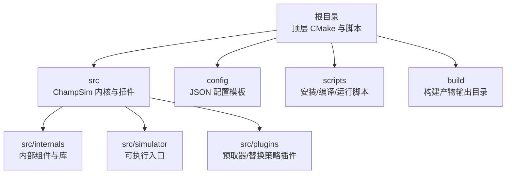
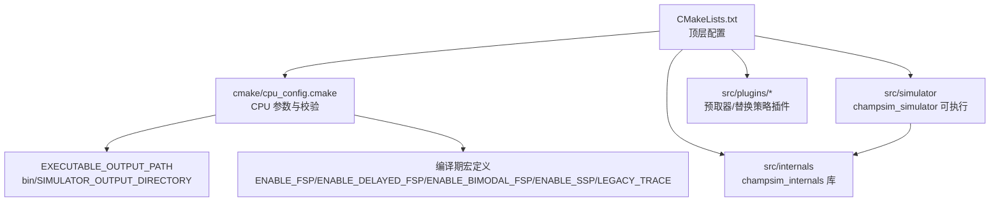
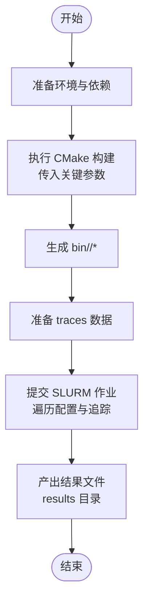
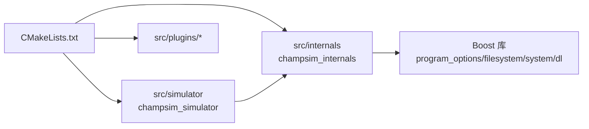

# 快速开始

<cite>
**本文引用的文件**
- [README.md](file://README.md)
- [CMakeLists.txt](file://CMakeLists.txt)
- [cpu_config.cmake](file://cmake/cpu_config.cmake)
- [install_dependencies.sh](file://scripts/install_dependencies.sh)
- [run_single_core.sh](file://scripts/run_single_core.sh)
- [run_single_core_legacy.sh](file://scripts/run_single_core_legacy.sh)
- [compile_single_core.sh](file://scripts/compile_single_core.sh)
- [base_champsim.json](file://config/base_champsim.json)
- [baseline_cascade_lake.json](file://config/baseline_cascade_lake.json)
- [internals CMakeLists.txt](file://src/internals/CMakeLists.txt)
- [simulator CMakeLists.txt](file://src/simulator/CMakeLists.txt)
</cite>

## 目录
1. [简介](#简介)
2. [项目结构](#项目结构)
3. [核心组件](#核心组件)
4. [架构总览](#架构总览)
5. [详细组件分析](#详细组件分析)
6. [依赖关系分析](#依赖关系分析)
7. [性能注意事项](#性能注意事项)
8. [故障排除指南](#故障排除指南)
9. [结论](#结论)
10. [附录](#附录)

## 简介
本指南面向首次接触 TLP-HPCA30 项目的用户，目标是帮助你在最短时间内完成环境搭建、编译配置与基本使用，从而开展仿真与实验工作。内容覆盖系统要求、依赖安装、CMake 构建参数说明、编译与运行流程，并提供常见问题排查建议。

## 项目结构
该仓库基于 CMake 构建系统，主体由以下部分组成：
- 根目录：顶层 CMake 配置、脚本与配置样例
- src：ChampSim 内核与插件（分支预测、预取器、替换策略、内存子系统等）
- config：JSON 配置模板，定义缓存层级与核心参数
- scripts：安装依赖、编译与作业调度脚本
- build：构建产物输出目录（按 SIMULATOR_OUTPUT_DIRECTORY 分类）

图表来源
- [CMakeLists.txt:1-66](file://CMakeLists.txt#L1-L66)
- [internals CMakeLists.txt:1-26](file://src/internals/CMakeLists.txt#L1-L26)
- [simulator CMakeLists.txt:1-11](file://src/simulator/CMakeLists.txt#L1-L11)

章节来源
- [CMakeLists.txt:1-66](file://CMakeLists.txt#L1-L66)
- [README.md:113-134](file://README.md#L113-L134)

## 核心组件
- 构建系统与参数
  - 顶层 CMake 负责设置 C++20 标准、引入 CPU 配置、查找 Boost 库、指定输出目录，并添加各子模块（内核、仿真器、插件）。
  - CPU 配置通过 cmake/cpu_config.cmake 提供默认值与校验逻辑，支持核心数、频率、DRAM 接口频率、是否启用旧格式追踪等。
- 配置模板
  - base_champsim.json 定义了 LLC、L1I/L1D/L2C 的缓存配置入口。
  - baseline_cascade_lake.json 给出了 Cascade Lake 平台下的具体参数（如 L1D/L2C 缓存、SDC、不规则访问预测器、元数据缓存、离片预测器等）。
- 插件体系
  - 预取器与替换策略以插件形式组织在 src/plugins 下，CMakeLists.txt 中统一注册，便于按需启用。

章节来源
- [CMakeLists.txt:1-66](file://CMakeLists.txt#L1-L66)
- [cpu_config.cmake:1-56](file://cmake/cpu_config.cmake#L1-L56)
- [base_champsim.json:1-23](file://config/base_champsim.json#L1-L23)
- [baseline_cascade_lake.json:1-64](file://config/baseline_cascade_lake.json#L1-L64)

## 架构总览
下图展示了从配置到可执行程序的关键路径，以及构建参数如何影响最终二进制产物的命名与行为。

图表来源
- [CMakeLists.txt:14-33](file://CMakeLists.txt#L14-L33)
- [CMakeLists.txt:27-29](file://CMakeLists.txt#L27-L29)
- [cpu_config.cmake:20-55](file://cmake/cpu_config.cmake#L20-L55)
- [internals CMakeLists.txt:22-25](file://src/internals/CMakeLists.txt#L22-L25)
- [simulator CMakeLists.txt:9-10](file://src/simulator/CMakeLists.txt#L9-L10)

## 详细组件分析

### 环境与依赖安装
- 系统要求与依赖
  - 已验证环境：CMake、GCC、Boost、VSCode、Jupyter 扩展、Python、LaTeX 相关包。
  - Ubuntu 用户可通过安装 libboost-all-dev、VSCode、IPython 与 LaTeX 支撑包满足依赖。
- 自动化安装脚本
  - scripts/install_dependencies.sh 提供一键安装命令，包括 Boost、IPython、VSCode 与 LaTeX 包，并安装 Jupyter VSCode 扩展。

章节来源
- [README.md:57-94](file://README.md#L57-L94)
- [install_dependencies.sh:1-21](file://scripts/install_dependencies.sh#L1-L21)

### CMake 构建参数详解
以下参数均可通过 cmake 命令行传入，或在构建目录中通过 ccmake/编辑生成器界面修改：

- SIMULATOR_OUTPUT_DIRECTORY
  - 含义：指定可执行文件与库的输出目录名，最终产物位于 bin/${SIMULATOR_OUTPUT_DIRECTORY}。
  - 影响：决定最终二进制的存放位置与命名前缀。
  - 示例：见“编译与运行”小节中的构建命令片段。

- CHAMPSIM_CPU_NUMBER_CORE
  - 含义：模拟的 CPU 核心数量。
  - 校验：必须大于 0；否则触发致命错误。
  - 示例：单核场景传入 1。

- CHAMPSIM_CPU_DRAM_IO_FREQUENCY
  - 含义：CPU 与 DRAM 之间的 I/O 频率（MHz），用于建模内存接口带宽与时序。
  - 示例：800。

- LEGACY_TRACE
  - 含义：是否启用旧版 ChampSim 追踪格式。
  - 影响：控制读取追踪时的数据解析方式。

- ENABLE_FSP / ENABLE_DELAYED_FSP / ENABLE_BIMODAL_FSP / ENABLE_SSP
  - 含义：分别控制是否启用 FSP（两级感知）、延迟消费预测、双模式策略与 SSP 组件。
  - 约束：ENABLE_DELAYED_FSP 与 ENABLE_BIMODAL_FSP 不能同时开启；若启用后两者，必须先启用 ENABLE_FSP。
  - 示例：TLP 场景通常开启 ENABLE_FSP、ENABLE_BIMODAL_FSP 与 ENABLE_SSP。

章节来源
- [CMakeLists.txt:27-29](file://CMakeLists.txt#L27-L29)
- [cpu_config.cmake:1-56](file://cmake/cpu_config.cmake#L1-L56)

### 编译与运行流程
- 单核编译脚本
  - scripts/compile_single_core.sh 演示了如何为不同场景（Baseline、Hermes、TLP）与两种追踪格式（Legacy/Extended）批量编译。
  - 该脚本会创建多个 build 子目录，并调用 cmake + make 完成构建，最后复制预取器与替换策略插件到 bin 对应目录。
- 交互式构建示例
  - README.md 提供了直接使用 cmake/make 的示例，包含 SIMULATOR_OUTPUT_DIRECTORY、CHAMPSIM_CPU_NUMBER_CORE、CHAMPSIM_CPU_DRAM_IO_FREQUENCY 等参数。
- 运行实验
  - scripts/run_single_core.sh 与 scripts/run_single_core_legacy.sh 展示了如何在 SLURM 集群上提交作业，遍历 traces 与配置组合，将结果写入 results 目录。
  - 两个脚本分别针对 Extended 与 Legacy 追踪格式，作业名称、输出路径与二进制名称均有所区分。

图表来源
- [compile_single_core.sh:1-39](file://scripts/compile_single_core.sh#L1-L39)
- [run_single_core.sh:1-126](file://scripts/run_single_core.sh#L1-L126)
- [run_single_core_legacy.sh:1-133](file://scripts/run_single_core_legacy.sh#L1-L133)

章节来源
- [compile_single_core.sh:1-39](file://scripts/compile_single_core.sh#L1-L39)
- [README.md:95-102](file://README.md#L95-L102)
- [run_single_core.sh:147-158](file://README.md#L147-L158)
- [run_single_core_legacy.sh:147-158](file://README.md#L147-L158)

### 关键配置文件说明
- base_champsim.json
  - 定义了 LLC、L1I/L1D/L2C 的缓存配置入口，便于在具体平台配置中复用。
- baseline_cascade_lake.json
  - 提供 Cascade Lake 平台下的具体参数，包括：
    - L1D/L2C 缓存参数（如 psel_bits、psel_threshold）
    - SDC 状态开关与配置
    - 不规则访问预测器（stride_threshold、sets、ways、stride_bits、psel_bits、latency）
    - 元数据缓存（sets、ways、miss_rate_threshold、地址/PC 预测器参数）
    - 离片预测器（prefetch 特征与阈值）
    - Popular Level Detector（阈值）

章节来源
- [base_champsim.json:1-23](file://config/base_champsim.json#L1-L23)
- [baseline_cascade_lake.json:1-64](file://config/baseline_cascade_lake.json#L1-L64)

## 依赖关系分析
- 组件耦合
  - 顶层 CMake 将 internals 作为共享库，simulator 作为可执行程序链接 internals。
  - plugins 通过 add_subdirectory 注册，CMake 在构建时自动处理其依赖与编译。
- 外部依赖
  - Boost::program_options、Boost::filesystem、Boost::system 与动态链接库（dl）被链接至 internals。
- 构建期宏定义
  - ENABLE_* 与 LEGACY_TRACE 等宏在 cpu_config.cmake 中定义，影响编译期条件编译与运行时行为。

图表来源
- [CMakeLists.txt:31-33](file://CMakeLists.txt#L31-L33)
- [internals CMakeLists.txt:22-25](file://src/internals/CMakeLists.txt#L22-L25)
- [simulator CMakeLists.txt:9-10](file://src/simulator/CMakeLists.txt#L9-L10)

章节来源
- [CMakeLists.txt:16-25](file://CMakeLists.txt#L16-L25)
- [internals CMakeLists.txt:22-25](file://src/internals/CMakeLists.txt#L22-L25)
- [simulator CMakeLists.txt:9-10](file://src/simulator/CMakeLists.txt#L9-L10)

## 性能注意事项
- 核心数与频率
  - CHAMPSIM_CPU_NUMBER_CORE 与 CHAMPSIM_CPU_DRAM_IO_FREQUENCY 直接影响仿真粒度与内存接口建模精度。单核场景建议保持默认值以获得稳定结果。
- 追踪格式选择
  - LEGACY_TRACE 控制追踪解析路径，Extended 格式通常更通用；Legacy 格式用于兼容历史数据集。
- 插件与宏定义
  - 启用 ENABLE_FSP/ENABLE_BIMODAL_FSP/ENABLE_SSP 会增加计算开销与内存占用，仅在需要验证 TLP/Hermes 等机制时启用。
- 作业调度
  - 使用 SLURM 时，合理设置队列上限与重试逻辑，避免大规模并发导致资源争用。

## 故障排除指南
- 构建失败（CMake 版本过低）
  - 症状：提示 CMake 版本不满足最低要求。
  - 处理：升级 CMake 至推荐版本以上。
- 核心数非法
  - 症状：出现“CPU 核心数无效”的致命错误。
  - 处理：确保 CHAMPSIM_CPU_NUMBER_CORE > 0。
- ENABLE_DELAYED_FSP 与 ENABLE_BIMODAL_FSP 冲突
  - 症状：同时开启两者时报错。
  - 处理：仅开启其一，或关闭二者。
- 未启用 ENABLE_FSP 却开启 ENABLE_DELAYED_FSP/ENABLE_BIMODAL_FSP
  - 症状：报错提示不允许在未启用 FSP 的情况下开启上述标志。
  - 处理：先启用 ENABLE_FSP。
- 依赖缺失（Boost）
  - 症状：找不到 Boost 组件或链接失败。
  - 处理：安装 libboost-all-dev，并确保 CMake 能找到 Boost。
- 追踪提取与路径
  - 症状：运行时找不到 traces。
  - 处理：按 README 步骤下载三卷追踪并解压至根目录，确保 traces 目录存在且路径正确。
- SLURM 作业无法提交
  - 症状：sbatch 返回错误或作业长时间 pending。
  - 处理：检查用户名、队列限制、作业时间配额；必要时降低并发或延长时限。

章节来源
- [cpu_config.cmake:15-51](file://cmake/cpu_config.cmake#L15-L51)
- [README.md:180-184](file://README.md#L180-L184)

## 结论
通过本快速开始指南，你已掌握：
- 系统要求与依赖安装
- CMake 关键参数的含义与使用
- 编译与运行的基本流程
- 常见问题的定位与修复思路

建议在单核场景下先行验证环境与配置，再逐步扩展到多核与复杂预取策略组合。

## 附录

### 快速命令清单
- 安装依赖
  - 参考：[install_dependencies.sh:1-21](file://scripts/install_dependencies.sh#L1-L21)
- 构建（示例）
  - 参考：[README.md:95-102](file://README.md#L95-L102)
- 编译脚本（单核）
  - 参考：[compile_single_core.sh:1-39](file://scripts/compile_single_core.sh#L1-L39)
- 运行实验（Extended/Legacy）
  - 参考：[run_single_core.sh:147-158](file://README.md#L147-L158)、[run_single_core_legacy.sh:147-158](file://README.md#L147-L158)