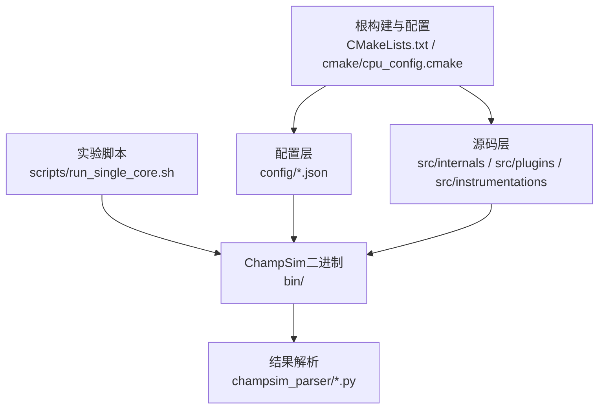
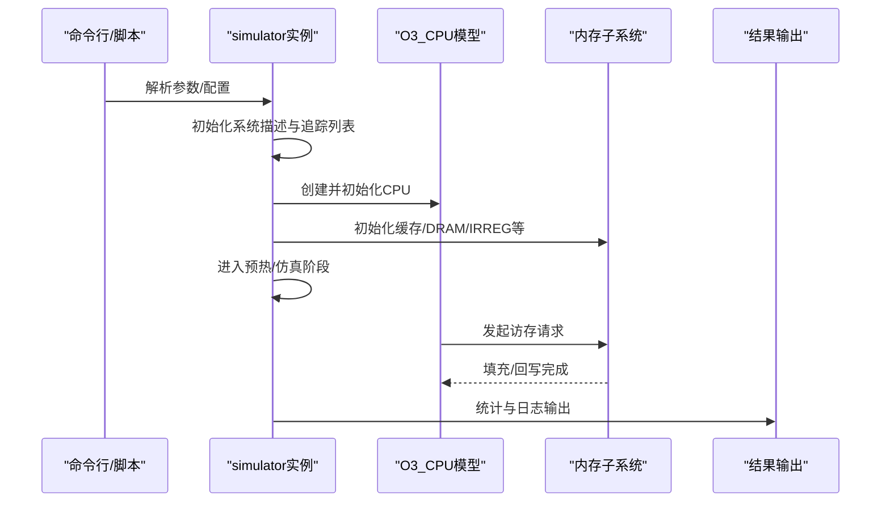
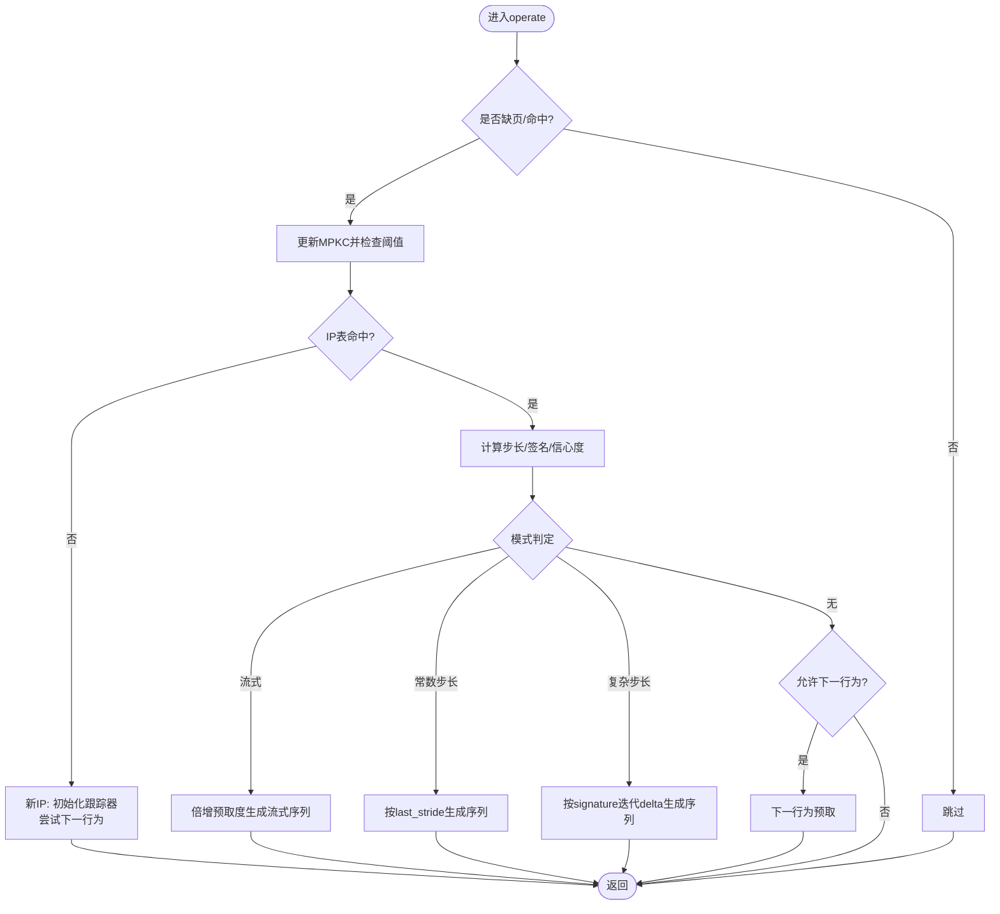
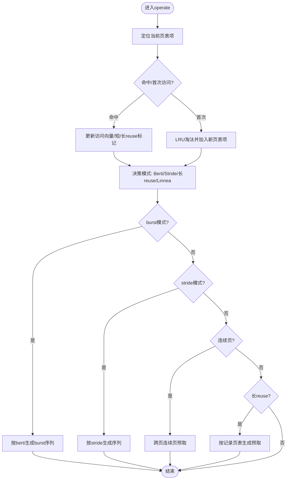
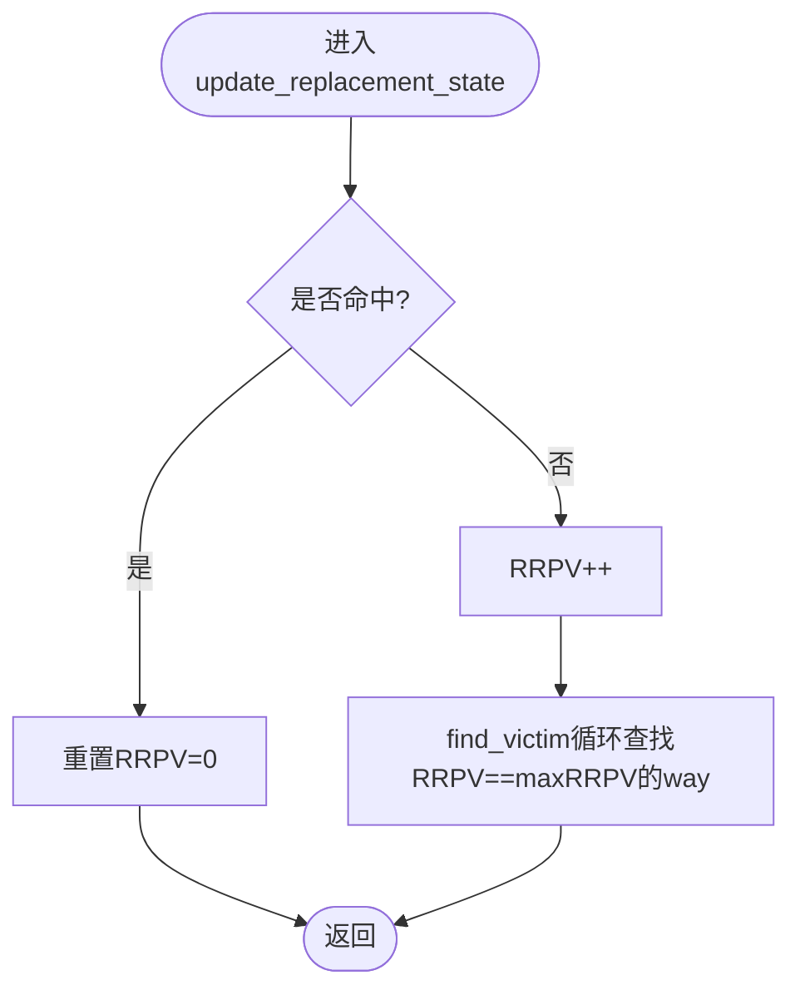
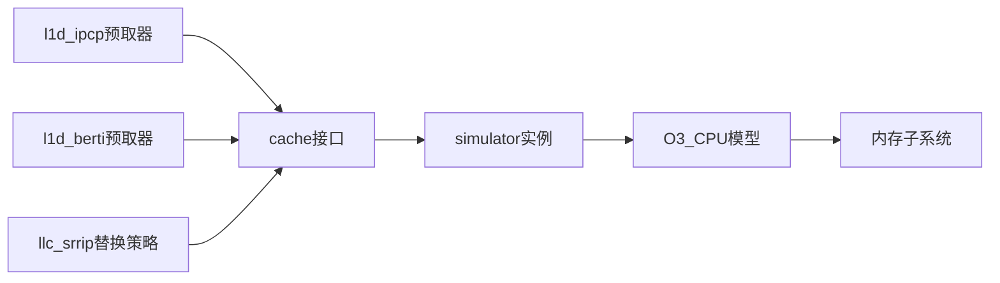

# 性能优化指南

<cite>
**本文引用的文件**
- [README.md](file://README.md)
- [CMakeLists.txt](file://CMakeLists.txt)
- [cmake/cpu_config.cmake](file://cmake/cpu_config.cmake)
- [src/internals/champsim.h](file://src/internals/champsim.h)
- [src/internals/simulator.hh](file://src/internals/simulator.hh)
- [config/base_champsim.json](file://config/base_champsim.json)
- [config/baseline_cascade_lake.json](file://config/baseline_cascade_lake.json)
- [src/plugins/prefetchers/l1d_ipcp/l1d_ipcp.cc](file://src/plugins/prefetchers/l1d_ipcp/l1d_ipcp.cc)
- [src/plugins/prefetchers/l1d_berti/l1d_berti.cc](file://src/plugins/prefetchers/l1d_berti/l1d_berti.cc)
- [src/plugins/replacements/llc_srrip/llc_srrip.cc](file://src/plugins/replacements/llc_srrip/llc_srrip.cc)
- [scripts/run_single_core.sh](file://scripts/run_single_core.sh)
- [champsim_parser/parser.py](file://champsim_parser/parser.py)
- [champsim_parser/result_parsers.py](file://champsim_parser/result_parsers.py)
- [champsim_parser/experiments/experiments.py](file://champsim_parser/experiments/experiments.py)
- [src/instrumentations/cache_utilization.cc](file://src/instrumentations/cache_utilization.cc)
- [src/instrumentations/reuse_tracker.cc](file://src/instrumentations/reuse_tracker.cc)
- [src/instrumentations/memory_region.cc](file://src/instrumentations/memory_region.cc)
</cite>

## 目录
1. [简介](#简介)
2. [项目结构](#项目结构)
3. [核心组件](#核心组件)
4. [架构总览](#架构总览)
5. [详细组件分析](#详细组件分析)
6. [依赖关系分析](#依赖关系分析)
7. [性能考量与优化建议](#性能考量与优化建议)
8. [故障排查指南](#故障排查指南)
9. [结论](#结论)
10. [附录](#附录)

## 简介
本指南面向在TLP-HPCA30项目中进行大规模仿真与性能评估的研究者与工程师，系统阐述如何在ChampSim仿真框架上开展高性能、可扩展的缓存与预取优化实验。内容覆盖内存使用优化、并行计算优化、大规模实验管理、硬件参数影响（CPU核心数、缓存大小、内存带宽）以及瓶颈识别与定位方法，并给出预取器与替换策略的选择标准与实操建议。

## 项目结构
该项目围绕ChampSim仿真器构建，采用模块化插件式设计，支持灵活配置不同层级缓存、预取器与替换策略。关键目录与文件职责如下：
- 根级构建与配置：CMakeLists.txt定义编译选项与插件子目录；cpu_config.cmake提供CPU建模参数。
- 配置层：config目录包含基础与基准配置JSON，用于描述缓存结构、核心数量、DRAM频率、IRREG/地址预测等。
- 源码层：src目录按功能划分为internals（内核）、plugins（插件）、instrumentations（观测工具）等。
- 实验脚本：scripts目录提供单核实验调度脚本，结合SLURM实现大规模并行作业管理。
- 结果解析：champsim_parser提供解析器与结果集处理工具，便于批量统计与可视化。

**图示来源**
- [CMakeLists.txt:1-66](file://CMakeLists.txt#L1-L66)
- [cmake/cpu_config.cmake](file://cmake/cpu_config.cmake)
- [config/base_champsim.json:1-23](file://config/base_champsim.json#L1-L23)
- [config/baseline_cascade_lake.json:1-64](file://config/baseline_cascade_lake.json#L1-L64)
- [scripts/run_single_core.sh:1-126](file://scripts/run_single_core.sh#L1-L126)

**章节来源**
- [README.md:15-37](file://README.md#L15-L37)
- [CMakeLists.txt:1-66](file://CMakeLists.txt#L1-L66)
- [config/base_champsim.json:1-23](file://config/base_champsim.json#L1-L23)
- [config/baseline_cascade_lake.json:1-64](file://config/baseline_cascade_lake.json#L1-L64)
- [scripts/run_single_core.sh:1-126](file://scripts/run_single_core.sh#L1-L126)

## 核心组件
- 编译与运行时参数
  - 构建参数：通过CMake变量控制核心数、DRAM频率、是否启用特定预取器/分支预测器等。
  - 运行时参数：通过JSON配置描述缓存结构、IRREG/地址预测器、离线预测器等。
- 内核与内存子系统
  - 宏常量定义了块大小、最大每周期读取/填充数、页大小等关键参数。
  - DRAM通道/rank/bank/行/列等维度参数用于建模内存带宽与延迟。
- 插件化预取器与替换策略
  - 预取器：如l1d_ipcp、l1d_berti等，提供不同预取粒度与模式（Berti的burst/stride/连续页）。
  - 替换策略：如llc_srrip，基于RRPV的改进替换算法。
- 观测与统计
  - 提供缓存利用率、重用追踪、内存区域等观测工具，辅助性能分析。

**章节来源**
- [src/internals/champsim.h:24-84](file://src/internals/champsim.h#L24-L84)
- [src/internals/champsim.h:85-142](file://src/internals/champsim.h#L85-L142)
- [src/internals/simulator.hh:23-126](file://src/internals/simulator.hh#L23-L126)
- [src/plugins/prefetchers/l1d_ipcp/l1d_ipcp.cc:1-358](file://src/plugins/prefetchers/l1d_ipcp/l1d_ipcp.cc#L1-L358)
- [src/plugins/prefetchers/l1d_berti/l1d_berti.cc:1-597](file://src/plugins/prefetchers/l1d_berti/l1d_berti.cc#L1-L597)
- [src/plugins/replacements/llc_srrip/llc_srrip.cc:1-66](file://src/plugins/replacements/llc_srrip/llc_srrip.cc#L1-L66)
- [src/instrumentations/cache_utilization.cc](file://src/instrumentations/cache_utilization.cc)
- [src/instrumentations/reuse_tracker.cc](file://src/instrumentations/reuse_tracker.cc)
- [src/instrumentations/memory_region.cc](file://src/instrumentations/memory_region.cc)

## 架构总览
下图展示从命令行到仿真执行、再到结果产出的整体流程，涵盖配置加载、CPU/缓存/内存初始化、执行阶段与统计输出。

**图示来源**
- [src/internals/simulator.hh:39-126](file://src/internals/simulator.hh#L39-L126)
- [README.md:145-162](file://README.md#L145-L162)

**章节来源**
- [src/internals/simulator.hh:23-126](file://src/internals/simulator.hh#L23-L126)
- [README.md:145-162](file://README.md#L145-L162)

## 详细组件分析

### 预取器：l1d_ipcp
该预取器基于IP表、GHB与Delta预测表，支持常数步长、复杂步长与流式模式，并在跨页场景下提供“下一行为”作为后备策略。其关键特性：
- IP表索引/标签位宽、GHB大小、Delta表容量等参数来自配置树，可在JSON中调整。
- 通过MPKC阈值动态切换“下一行为”开关，平衡吞吐与误预测成本。
- 在流式/常数步长/复杂步长三种路径分别生成预取序列，受队列占用与节流限制。

**图示来源**
- [src/plugins/prefetchers/l1d_ipcp/l1d_ipcp.cc:27-248](file://src/plugins/prefetchers/l1d_ipcp/l1d_ipcp.cc#L27-L248)

**章节来源**
- [src/plugins/prefetchers/l1d_ipcp/l1d_ipcp.cc:1-358](file://src/plugins/prefetchers/l1d_ipcp/l1d_ipcp.cc#L1-L358)

### 预取器：l1d_berti
该预取器融合Berti（同页连续性）与Linnea（跨页连续性），并在长reuse场景下采用stride策略。其关键特性：
- 当前页表、历史请求表、延迟表、记录页表与IP表共同工作，形成多维状态机。
- 支持burst/stride/连续页/长reuse等多种模式，且具备节流与“继续burst”机制避免过度预取。
- 在填充回调中根据实际latency反推Berti距离，提升预测准确性。

**图示来源**
- [src/plugins/prefetchers/l1d_berti/l1d_berti.cc:34-508](file://src/plugins/prefetchers/l1d_berti/l1d_berti.cc#L34-L508)

**章节来源**
- [src/plugins/prefetchers/l1d_berti/l1d_berti.cc:1-597](file://src/plugins/prefetchers/l1d_berti/l1d_berti.cc#L1-L597)

### 替换策略：llc_srrip
基于RRPV（剩余参考距离）的替换策略，命中时重置为最小值，未命中时提升等级，最终在达到上限的way中选择victim。该策略有助于抑制抖动并保留长期活跃数据。

**图示来源**
- [src/plugins/replacements/llc_srrip/llc_srrip.cc:26-65](file://src/plugins/replacements/llc_srrip/llc_srrip.cc#L26-L65)

**章节来源**
- [src/plugins/replacements/llc_srrip/llc_srrip.cc:1-66](file://src/plugins/replacements/llc_srrip/llc_srrip.cc#L1-L66)

### 配置与运行时参数
- CMake构建参数
  - CHAMPSIM_CPU_NUMBER_CORE：模拟核心数
  - CHAMPSIM_CPU_DRAM_IO_FREQUENCY：DRAM I/O频率
  - ENABLE_*：控制是否启用特定预取器或分支预测器
- JSON配置
  - base_champsim.json：定义LLC/L1I/L1D/L2C/SDC的基础缓存配置
  - baseline_cascade_lake.json：针对Cascade Lake的IRREG/元数据缓存/离线预测等参数

**章节来源**
- [CMakeLists.txt:7-14](file://CMakeLists.txt#L7-L14)
- [README.md:95-112](file://README.md#L95-L112)
- [config/base_champsim.json:1-23](file://config/base_champsim.json#L1-L23)
- [config/baseline_cascade_lake.json:1-64](file://config/baseline_cascade_lake.json#L1-L64)

## 依赖关系分析
- 组件耦合
  - 预取器依赖cache接口与simulator实例获取CPU周期信息，耦合于cache抽象与全局状态。
  - 替换策略依赖cache的set/way/associativity等属性，耦合于组件接口。
- 外部依赖
  - Boost程序选项与属性树用于解析配置与参数。
  - SLURM用于大规模集群作业调度。

**图示来源**
- [src/plugins/prefetchers/l1d_ipcp/l1d_ipcp.cc:36](file://src/plugins/prefetchers/l1d_ipcp/l1d_ipcp.cc#L36)
- [src/plugins/prefetchers/l1d_berti/l1d_berti.cc:45](file://src/plugins/prefetchers/l1d_berti/l1d_berti.cc#L45)
- [src/plugins/replacements/llc_srrip/llc_srrip.cc](file://src/plugins/replacements/llc_srrip/llc_srrip.cc)
- [src/internals/simulator.hh:72-74](file://src/internals/simulator.hh#L72-L74)

**章节来源**
- [src/plugins/prefetchers/l1d_ipcp/l1d_ipcp.cc:1-358](file://src/plugins/prefetchers/l1d_ipcp/l1d_ipcp.cc#L1-L358)
- [src/plugins/prefetchers/l1d_berti/l1d_berti.cc:1-597](file://src/plugins/prefetchers/l1d_berti/l1d_berti.cc#L1-L597)
- [src/plugins/replacements/llc_srrip/llc_srrip.cc:1-66](file://src/plugins/replacements/llc_srrip/llc_srrip.cc#L1-L66)
- [src/internals/simulator.hh:23-126](file://src/internals/simulator.hh#L23-L126)

## 性能考量与优化建议

### 内存使用优化
- 缓存参数调优
  - L1D/L2C/L3/DRAM参数由宏与JSON共同决定。可通过调整块大小、每路最大填充数、页大小等影响访存延迟与带宽利用。
  - 参考：[src/internals/champsim.h:48-84](file://src/internals/champsim.h#L48-L84)，[config/baseline_cascade_lake.json:8-40](file://config/baseline_cascade_lake.json#L8-L40)
- 预取队列节流
  - 预取器内部存在节流与“继续burst”机制，避免过度预取导致队列拥塞与额外开销。
  - 参考：[src/plugins/prefetchers/l1d_berti/l1d_berti.cc:301-324](file://src/plugins/prefetchers/l1d_berti/l1d_berti.cc#L301-L324)

### 并行计算优化
- 核心数与任务并行
  - 使用SLURM并行提交大量作业，脚本内置队列长度监控与重试逻辑，确保大规模实验稳定推进。
  - 参考：[scripts/run_single_core.sh:14-34](file://scripts/run_single_core.sh#L14-L34)，[scripts/run_single_core.sh:106-124](file://scripts/run_single_core.sh#L106-L124)
- 构建与运行参数
  - 通过CMake变量设置核心数与DRAM频率，减少不必要的编译与运行时差异。
  - 参考：[README.md:95-112](file://README.md#L95-L112)，[CMakeLists.txt:7-14](file://CMakeLists.txt#L7-L14)

### 大规模实验管理
- 作业命名与输出组织
  - 脚本按配置与trace组合生成作业名与输出路径，便于后续批处理与结果聚合。
  - 参考：[scripts/run_single_core.sh:97-124](file://scripts/run_single_core.sh#L97-L124)
- 结果解析与统计
  - 使用champsim_parser解析器与实验集合工具，统一处理多组实验结果，便于对比与可视化。
  - 参考：[champsim_parser/parser.py](file://champsim_parser/parser.py)，[champsim_parser/result_parsers.py](file://champsim_parser/result_parsers.py)，[champsim_parser/experiments/experiments.py](file://champsim_parser/experiments/experiments.py)

### 硬件配置对性能的影响与策略
- CPU核心数
  - 核心数越多，访存并发越高，但缓存一致性与内存带宽竞争也更激烈。建议先以单核基线验证策略有效性，再逐步增加核心数观察收益。
  - 参考：[CMakeLists.txt:105](file://CMakeLists.txt#L105)，[scripts/run_single_core.sh:73-91](file://scripts/run_single_core.sh#L73-L91)
- 缓存大小
  - 增大L1/L2/L3容量可降低miss率，但可能带来命中延迟与成本上升。应结合工作负载特征与替换策略综合评估。
  - 参考：[config/base_champsim.json:2-22](file://config/base_champsim.json#L2-L22)
- 内存带宽
  - DRAM频率与通道/rank/bank配置直接影响带宽与延迟。提高频率需关注功耗与稳定性，必要时配合预取策略优化。
  - 参考：[src/internals/champsim.h:64-84](file://src/internals/champsim.h#L64-L84)，[README.md:106](file://README.md#L106)

### 性能瓶颈识别与解决
- 内部观测工具
  - 缓存利用率、重用追踪、内存区域划分等工具可用于定位热点与异常访问模式。
  - 参考：[src/instrumentations/cache_utilization.cc](file://src/instrumentations/cache_utilization.cc)，[src/instrumentations/reuse_tracker.cc](file://src/instrumentations/reuse_tracker.cc)，[src/instrumentations/memory_region.cc](file://src/instrumentations/memory_region.cc)
- 外部监控
  - 结合SLURM作业状态、系统监控工具（如sar/iostat/vmstat）与ChampSim内部统计，定位CPU/内存/IO瓶颈。
  - 参考：[README.md:139-144](file://README.md#L139-L144)

### 预取器与替换策略选择标准
- 预取器选择
  - l1d_ipcp：适合具有明显步长/流式访问的工作负载；可结合阈值与下一行为策略平衡吞吐与误预测。
  - l1d_berti：适合复杂页面内/跨页连续性与长reuse场景；需关注节流与“继续burst”策略。
  - 参考：[src/plugins/prefetchers/l1d_ipcp/l1d_ipcp.cc:1-358](file://src/plugins/prefetchers/l1d_ipcp/l1d_ipcp.cc#L1-L358)，[src/plugins/prefetchers/l1d_berti/l1d_berti.cc:1-597](file://src/plugins/prefetchers/l1d_berti/l1d_berti.cc#L1-L597)
- 替换策略选择
  - llc_srrip：在长尾流量与抖动抑制方面表现良好；可与其他策略对比评估miss率与延迟权衡。
  - 参考：[src/plugins/replacements/llc_srrip/llc_srrip.cc:1-66](file://src/plugins/replacements/llc_srrip/llc_srrip.cc#L1-L66)

## 故障排查指南
- 作业长时间挂起或失败
  - 检查SLURM队列长度与资源配额，适当放宽并发或延长超时时间。
  - 参考：[scripts/run_single_core.sh:14-34](file://scripts/run_single_core.sh#L14-L34)，[README.md:182-184](file://README.md#L182-L184)
- 结果缺失或统计不完整
  - 确认输出目录权限与磁盘空间，检查作业错误日志与重试机制。
  - 参考：[scripts/run_single_core.sh:112-124](file://scripts/run_single_core.sh#L112-L124)
- 配置不生效
  - 核对CMake变量与JSON配置键值，确保与插件实现一致。
  - 参考：[CMakeLists.txt:7-14](file://CMakeLists.txt#L7-L14)，[config/baseline_cascade_lake.json:1-64](file://config/baseline_cascade_lake.json#L1-L64)

**章节来源**
- [scripts/run_single_core.sh:1-126](file://scripts/run_single_core.sh#L1-L126)
- [README.md:182-184](file://README.md#L182-L184)
- [config/baseline_cascade_lake.json:1-64](file://config/baseline_cascade_lake.json#L1-L64)

## 结论
通过合理设置构建与运行参数、选择合适的预取器与替换策略、并借助观测工具与SLURM并行化平台，可以在TLP-HPCA30框架上高效开展大规模缓存与预取优化实验。建议以单核基线为起点，逐步引入多核与高级策略，在保证稳定性的同时最大化性能收益。

## 附录
- 关键实现路径参考
  - l1d_ipcp主流程：[src/plugins/prefetchers/l1d_ipcp/l1d_ipcp.cc:27-248](file://src/plugins/prefetchers/l1d_ipcp/l1d_ipcp.cc#L27-L248)
  - l1d_berti主流程：[src/plugins/prefetchers/l1d_berti/l1d_berti.cc:34-508](file://src/plugins/prefetchers/l1d_berti/l1d_berti.cc#L34-L508)
  - llc_srrip替换逻辑：[src/plugins/replacements/llc_srrip/llc_srrip.cc:26-65](file://src/plugins/replacements/llc_srrip/llc_srrip.cc#L26-L65)
  - 构建参数与配置：[CMakeLists.txt:7-14](file://CMakeLists.txt#L7-L14)，[config/base_champsim.json:1-23](file://config/base_champsim.json#L1-L23)，[config/baseline_cascade_lake.json:1-64](file://config/baseline_cascade_lake.json#L1-L64)
  - 实验脚本与结果解析：[scripts/run_single_core.sh:1-126](file://scripts/run_single_core.sh#L1-L126)，[champsim_parser/parser.py](file://champsim_parser/parser.py)，[champsim_parser/result_parsers.py](file://champsim_parser/result_parsers.py)，[champsim_parser/experiments/experiments.py](file://champsim_parser/experiments/experiments.py)