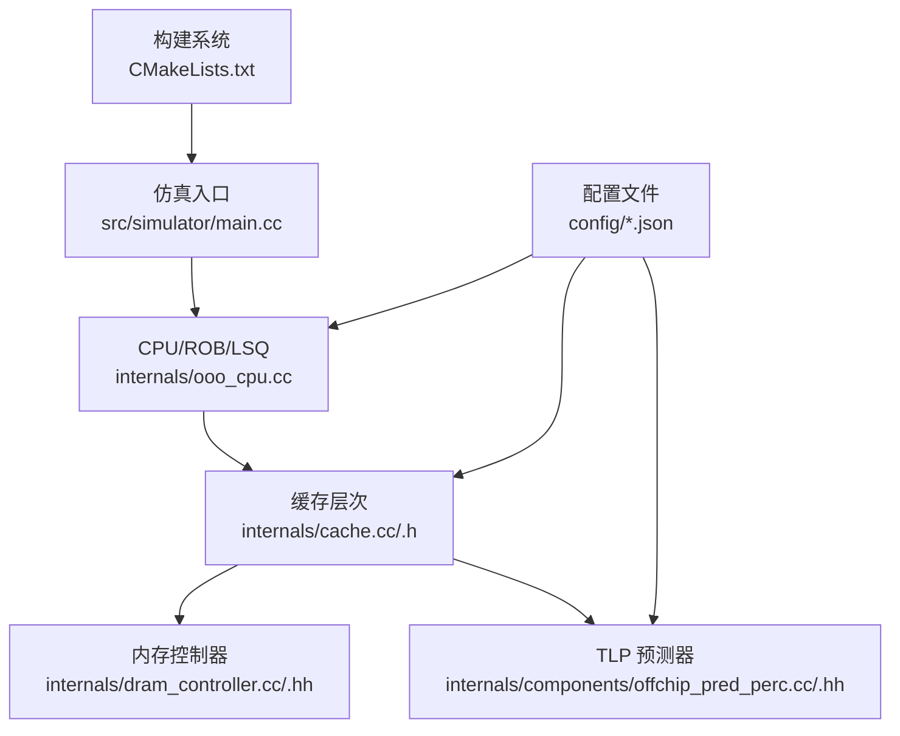
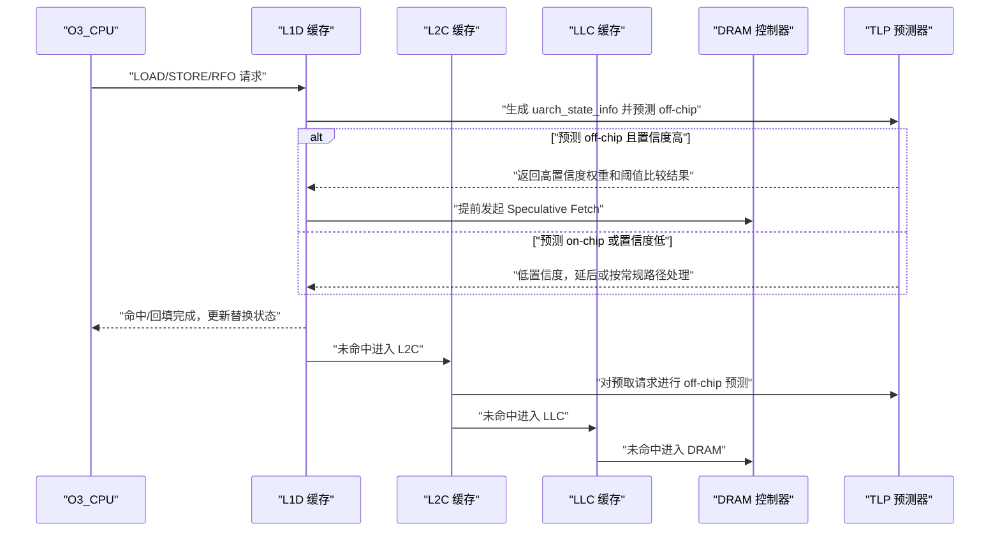
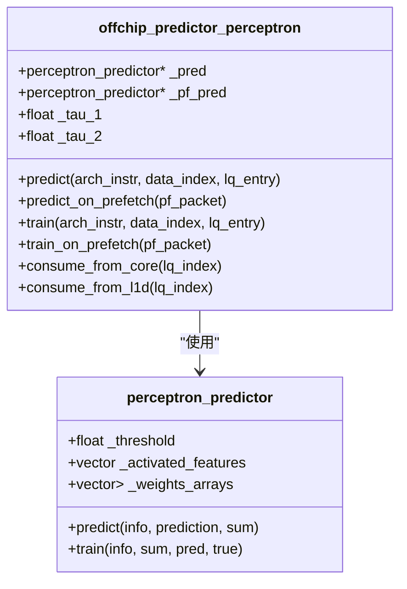
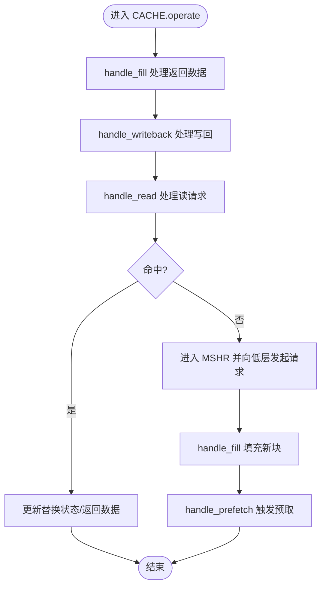
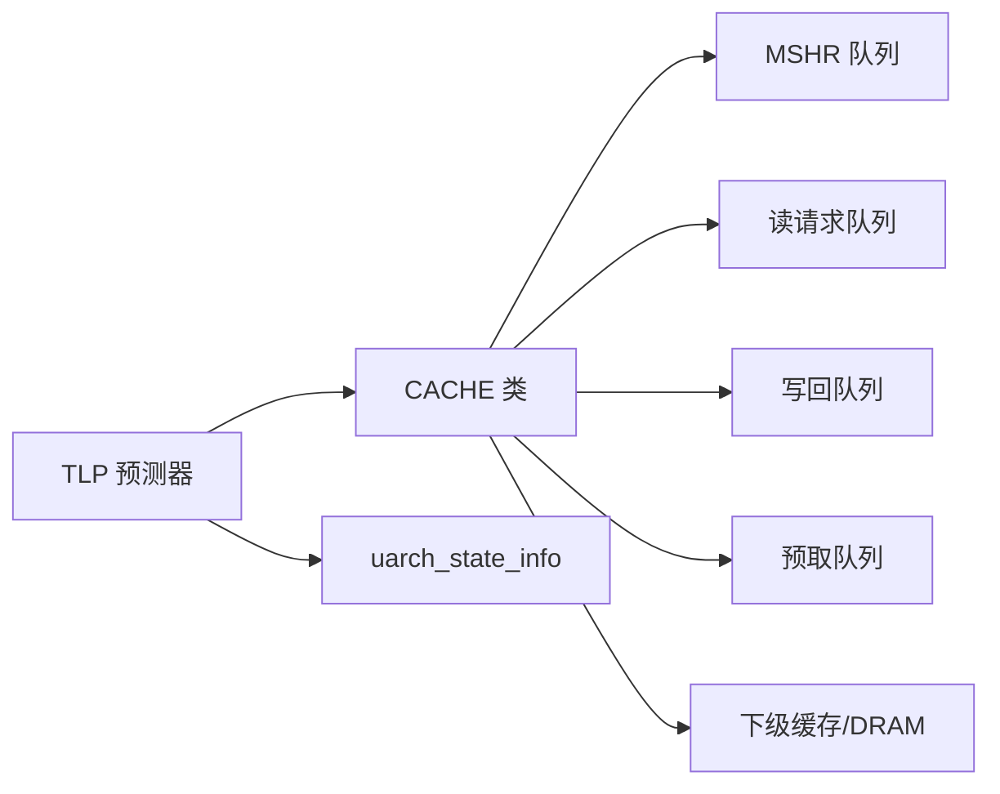

# 核心仿真器

<cite>
**本文引用的文件**
- [README.md](file://README.md)
- [offchip_pred_perc.cc](file://src/internals/components/offchip_pred_perc.cc)
- [offchip_pred_perc.hh](file://src/internals/components/offchip_pred_perc.hh)
- [cache.h](file://src/internals/cache.h)
- [cache.cc](file://src/internals/cache.cc)
- [baseline_cascade_lake_4_cores_tlp_ipcp_800mtps.json](file://config/baseline_cascade_lake_4_cores_tlp_ipcp_800mtps.json)
</cite>

## 目录
1. [简介](#简介)
2. [项目结构](#项目结构)
3. [核心组件](#核心组件)
4. [架构总览](#架构总览)
5. [详细组件分析](#详细组件分析)
6. [依赖关系分析](#依赖关系分析)
7. [性能考量](#性能考量)
8. [故障排查指南](#故障排查指南)
9. [结论](#结论)
10. [附录](#附录)

## 简介
本技术文档面向 TLP-HPCA30 核心仿真器，围绕 ChampSim 仿真框架，系统阐述两层感知机（TLP）预测器与缓存层次结构的集成方式，详解缓存系统工作原理、内存访问流程与数据流，说明仿真器初始化、时钟周期管理与性能统计机制，并通过配置文件路径与源码片段路径定位具体实现细节，帮助读者快速理解并扩展该仿真器。

## 项目结构
- 顶层使用 CMake 构建系统，支持多核、DRAM 频率等参数化配置。
- 源码位于 src/，按功能域划分为 internals（内核组件）、plugins（插件化组件如 L1D/IPCP 预测器）、prefetchers（预取器）、replacement_policies（替换策略）等。
- 配置位于 config/，以 JSON 描述各核心的 L1I/L1D/L2C/LLC/SDC 等缓存配置及 TLP 参数（特征集、阈值、选择位等）。
- 仿真入口在 src/simulator/main.cc；核心 CPU/内存子系统在 internals 中实现。

图示来源
- [cache.h:89-267](file://src/internals/cache.h#L89-L267)
- [cache.cc:1373-1380](file://src/internals/cache.cc#L1373-L1380)
- [offchip_pred_perc.cc:10-34](file://src/internals/components/offchip_pred_perc.cc#L10-L34)
- [baseline_cascade_lake_4_cores_tlp_ipcp_800mtps.json:1-234](file://config/baseline_cascade_lake_4_cores_tlp_ipcp_800mtps.json#L1-L234)

章节来源
- [README.md:1-203](file://README.md#L1-L203)

## 核心组件
- 缓存层次与队列：L1I/L1D/L2C/LLC/STLB/ITLB 等，统一抽象为 CACHE 类，维护读写队列、MSHR、预取队列与替换状态。
- TLP 两层感知机预测器：对“是否离片”进行预测，并结合阈值决定是否提前发起主存 Speculative Fetch 或丢弃 L1D 预取请求。
- 内存系统：DRAM 控制器与带宽/延迟建模，配合 LLC/SDC/IRREG 等组件。
- 预取器与替换策略：插件化设计，可按配置启用不同 L1D/L2C/LLC 预取器与替换策略。

章节来源
- [cache.h:89-267](file://src/internals/cache.h#L89-L267)
- [cache.cc:1373-1380](file://src/internals/cache.cc#L1373-L1380)
- [offchip_pred_perc.cc:10-34](file://src/internals/components/offchip_pred_perc.cc#L10-L34)
- [offchip_pred_perc.hh:68-526](file://src/internals/components/offchip_pred_perc.hh#L68-L526)

## 架构总览
下图展示了从 CPU 请求到缓存/主存的数据通路，以及 TLP 预测器在 L1D/L2C/LLC 层级中的参与点与训练/消费阶段。

图示来源
- [offchip_pred_perc.cc:282-311](file://src/internals/components/offchip_pred_perc.cc#L282-L311)
- [offchip_pred_perc.cc:321-366](file://src/internals/components/offchip_pred_perc.cc#L321-L366)
- [cache.cc:692-800](file://src/internals/cache.cc#L692-L800)
- [cache.cc:10-120](file://src/internals/cache.cc#L10-L120)

## 详细组件分析

### TLP 两层感知机预测器
- 结构与职责
  - 提供两类感知机：需求路径预测器与预取路径预测器，分别用于 L1D miss 时的 off-chip 判定与预取请求的 off-chip 判定。
  - 维护页缓冲（page buffer）与控制流签名（last-N PC/VPN），用于特征生成与历史记录。
  - 支持动态设置阈值与激活特征集合，便于实验对比。
- 特征与决策
  - 特征类型覆盖 PC、页号、块偏移、PC-页组合、PC-块偏移、最近 N 条加载 PC 等。
  - 决策基于加权和与阈值比较，支持对预取场景加入额外偏移项以协同需求路径预测。
- 训练与消费
  - 训练采用增量/减量权重更新策略，依据预测输出与真实结果调整权重数组。
  - 消费阶段根据阈值（tau_1/tau_2）决定是否允许从核心或 L1D 路径提前消费。

图示来源
- [offchip_pred_perc.hh:68-464](file://src/internals/components/offchip_pred_perc.hh#L68-L464)
- [offchip_pred_perc.cc:10-34](file://src/internals/components/offchip_pred_perc.cc#L10-L34)

章节来源
- [offchip_pred_perc.hh:13-43](file://src/internals/components/offchip_pred_perc.hh#L13-L43)
- [offchip_pred_perc.hh:68-526](file://src/internals/components/offchip_pred_perc.hh#L68-L526)
- [offchip_pred_perc.cc:61-106](file://src/internals/components/offchip_pred_perc.cc#L61-L106)
- [offchip_pred_perc.cc:282-311](file://src/internals/components/offchip_pred_perc.cc#L282-L311)
- [offchip_pred_perc.cc:321-366](file://src/internals/components/offchip_pred_perc.cc#L321-L366)
- [offchip_pred_perc.cc:368-393](file://src/internals/components/offchip_pred_perc.cc#L368-L393)

### 缓存层次结构与内存访问流程
- 缓存抽象
  - CACHE 类统一管理 SET/WAY/MSHR/PQ/RQ/WQ，定义 operate()/handle_read()/handle_writeback()/handle_fill()/handle_prefetch() 等处理流程。
  - 各级缓存（L1I/L1D/L2C/LLC/STLB/ITLB）通过宏参数配置容量、队列深度与延迟。
- 数据流
  - 读请求：先查命中，命中则更新替换状态并返回；未命中则进入 MSHR 并向低层发起请求。
  - 写回：若替换出脏块则先写回低层，再填充新块。
  - 填充：低层返回数据后，更新替换状态、统计计数，并向上层返回数据。
  - 预取：根据各级预取器策略在命中/未命中时触发预取。

图示来源
- [cache.cc:1373-1380](file://src/internals/cache.cc#L1373-L1380)
- [cache.cc:10-120](file://src/internals/cache.cc#L10-L120)
- [cache.cc:692-800](file://src/internals/cache.cc#L692-L800)

章节来源
- [cache.h:89-267](file://src/internals/cache.h#L89-L267)
- [cache.cc:10-120](file://src/internals/cache.cc#L10-L120)
- [cache.cc:692-800](file://src/internals/cache.cc#L692-L800)
- [cache.cc:1373-1380](file://src/internals/cache.cc#L1373-L1380)

### TLP 在缓存系统中的集成点
- L1D 层：在 L1D miss 时，利用 TLP 对需求请求进行 off-chip 预测，决定是否提前发起主存 Speculative Fetch。
- L2C/LLC 层：对预取请求进行 off-chip 预测，结合阈值策略过滤掉可能 off-chip 的预取，减少带宽浪费。
- 统计与调试：提供 dump_stats/reset_stats 接口，记录真阳性/假阳性等指标，便于评估预测效果。

章节来源
- [offchip_pred_perc.cc:282-311](file://src/internals/components/offchip_pred_perc.cc#L282-L311)
- [offchip_pred_perc.cc:321-366](file://src/internals/components/offchip_pred_perc.cc#L321-L366)
- [offchip_pred_perc.cc:253-280](file://src/internals/components/offchip_pred_perc.cc#L253-L280)

### 配置与参数化
- 通过 JSON 配置文件为每个核心设置 L1D/L2C/LLC/SDC 等缓存配置，以及 TLP 的特征集、阈值与选择位等参数。
- 示例配置文件展示了如何为 L1D 使用 TLP 预测器，并设定 demand/prefetch 的特征与阈值。

章节来源
- [baseline_cascade_lake_4_cores_tlp_ipcp_800mtps.json:1-234](file://config/baseline_cascade_lake_4_cores_tlp_ipcp_800mtps.json#L1-L234)

## 依赖关系分析
- 组件耦合
  - CACHE 依赖于 MSHR、队列与替换策略接口；与上/下级缓存通过 return_data/extra_interface 连接。
  - offchip_predictor_perceptron 依赖 uarch_state_info 与感知机权重数组，通过训练/预测接口与缓存交互。
- 外部依赖
  - 构建系统依赖 CMake、编译器与 Boost；运行期依赖 trace 文件与配置文件。

图示来源
- [cache.h:122-127](file://src/internals/cache.h#L122-L127)
- [offchip_pred_perc.hh:45-66](file://src/internals/components/offchip_pred_perc.hh#L45-L66)

章节来源
- [cache.h:122-127](file://src/internals/cache.h#L122-L127)
- [offchip_pred_perc.hh:45-66](file://src/internals/components/offchip_pred_perc.hh#L45-L66)

## 性能考量
- 预测精度与阈值：通过调整感知机阈值与特征集，平衡预测准确率与误报率，从而影响 Speculative Fetch 的收益与带宽占用。
- 预取过滤：对可能 off-chip 的预取请求进行过滤，降低无效带宽消耗。
- 替换策略与队列深度：合理设置 MSHR、RQ/WQ/PQ 尺寸与替换算法，避免拥塞导致的吞吐下降。
- 多核与 DRAM 频率：通过构建参数调节核心数与 DRAM IO 频率，适配不同规模实验。

## 故障排查指南
- 预测器统计异常
  - 使用 dump_stats/reset_stats 检查真阳性/假阳性等指标，定位预测器性能问题。
- 缓存拥塞
  - 关注 WQ_FULL/STALL 计数，检查下级队列是否饱和，必要时增大队列尺寸或优化替换策略。
- 预取无效
  - 若预取命中率低，检查预取器配置与阈值设置，确认与 TLP 的协同策略有效。

章节来源
- [offchip_pred_perc.cc:253-280](file://src/internals/components/offchip_pred_perc.cc#L253-L280)
- [cache.cc:170-180](file://src/internals/cache.cc#L170-L180)

## 结论
TLP-HPCA30 通过在 L1D/L2C/LLC 层级引入两层感知机预测器，实现了对 off-chip 访问的精准预测与自适应预取过滤，显著提升了缓存系统的整体效率。结合 ChampSim 的模块化架构与丰富的配置选项，研究者可以灵活地评估不同特征组合、阈值策略与预取器协同方案，为后续缓存优化提供实证支撑。

## 附录
- 安装与构建
  - 使用 CMake 参数化构建，支持指定输出目录、核心数、DRAM 频率等。
- 实验工作流
  - 准备 traces，运行脚本，收集结果并在 Jupyter 中进行统计分析。

章节来源
- [README.md:95-179](file://README.md#L95-L179)