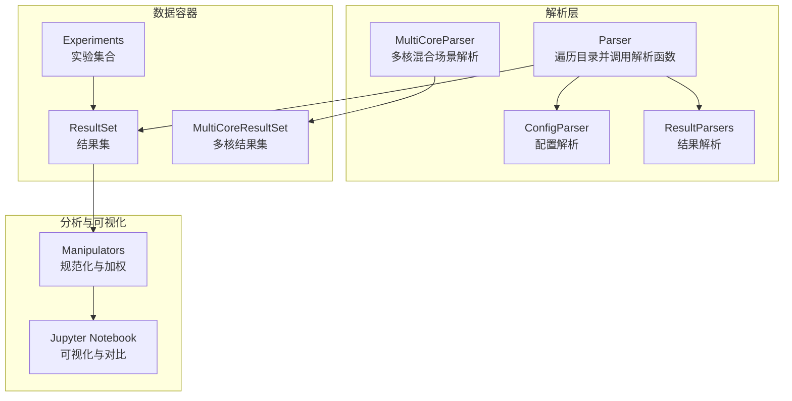
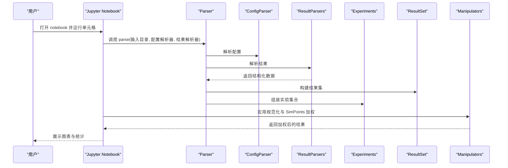
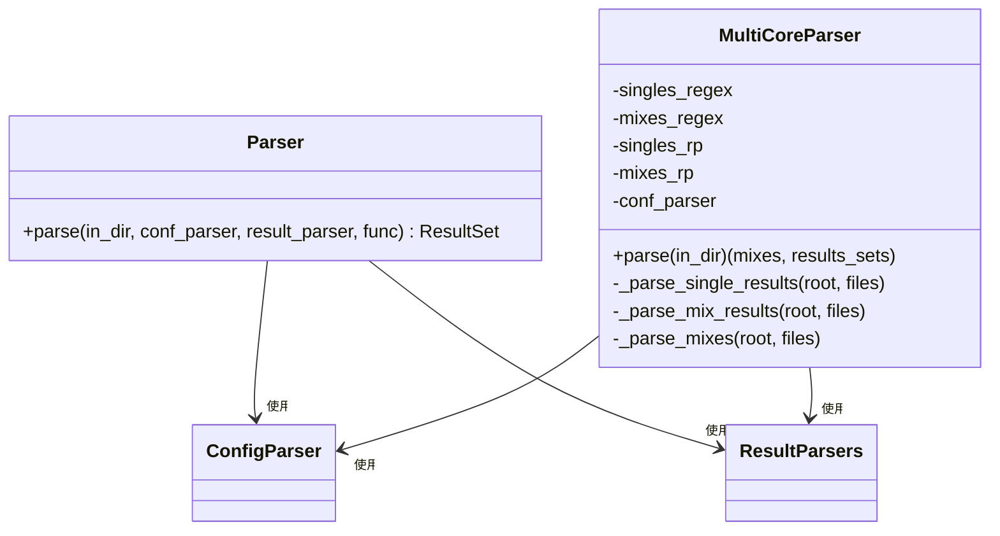
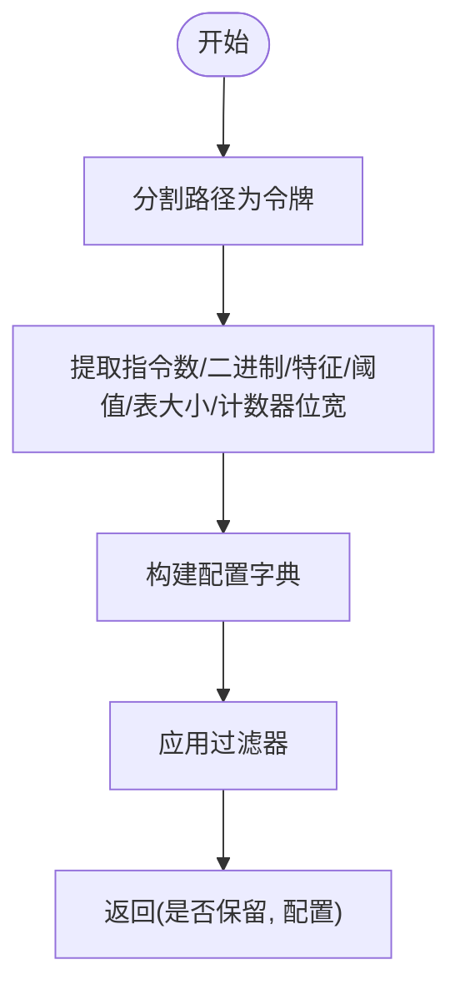
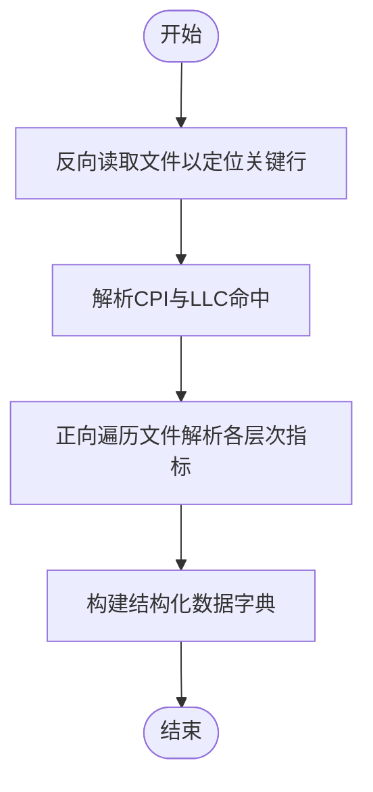
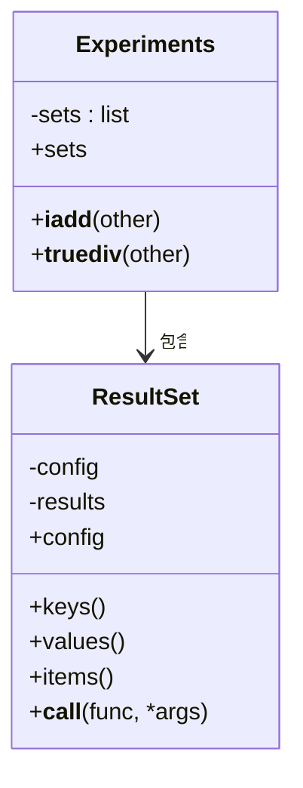
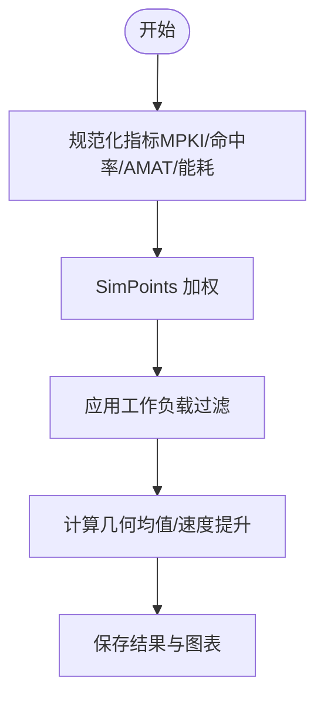
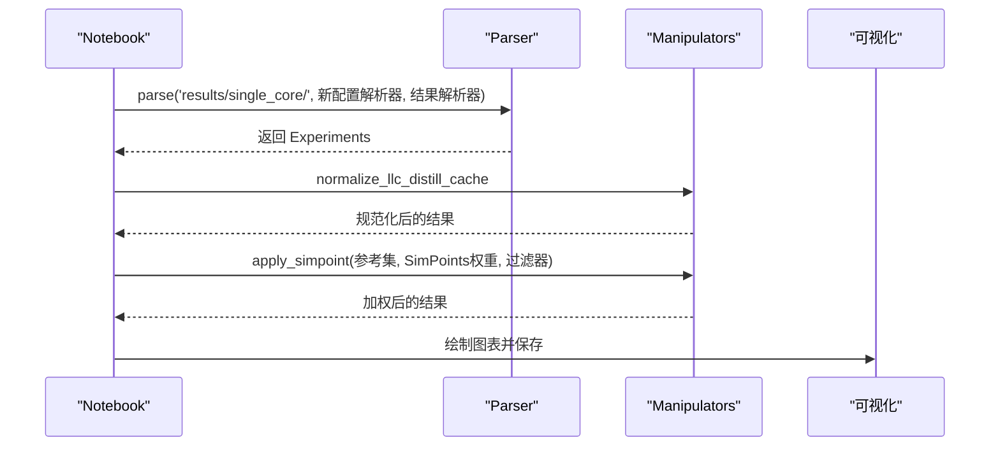
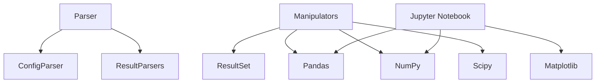

# 结果分析系统

<cite>
**本文档引用的文件**
- [README.md](file://README.md)
- [parser.py](file://champsim_parser/parser.py)
- [result_parsers.py](file://champsim_parser/result_parsers.py)
- [config_parser.py](file://champsim_parser/config_parser.py)
- [experiments.py](file://champsim_parser/experiments/experiments.py)
- [result_set.py](file://champsim_parser/result_set/result_set.py)
- [manipulators.py](file://champsim_parser/result_set/manipulators.py)
- [single_core.ipynb](file://notebooks/single_core.ipynb)
- [single_core.py](file://notebooks/single_core.py)
</cite>

## 目录
1. [简介](#简介)
2. [项目结构](#项目结构)
3. [核心组件](#核心组件)
4. [架构总览](#架构总览)
5. [详细组件分析](#详细组件分析)
6. [依赖关系分析](#依赖关系分析)
7. [性能考虑](#性能考虑)
8. [故障排除指南](#故障排除指南)
9. [结论](#结论)
10. [附录](#附录)

## 简介
本项目是针对 TLP-HPCA30 论文结果的分析系统，基于 ChampSim 模拟器输出文件进行解析、规范化与统计分析。系统通过 Python 解析器读取多层级目录中的模拟结果，提取关键指标（如 CPI、LLC MPKI、各级缓存命中率、DRAM 事务等），并结合 SimPoints 加权方法生成可比性更强的综合指标，最终在 Jupyter 笔记本中完成可视化与对比分析。

## 项目结构
- 核心解析模块：位于 champsim_parser 目录，包含解析器、配置解析器、结果解析器、实验容器与数据处理工具。
- 结果数据：results/single_core/ 下存放单核实验的模拟输出文件。
- 可视化与分析：notebooks/single_core.ipynb 与 single_core.py 提供完整的数据分析与绘图流程。
- 配置与基线：config/ 目录下包含大量基准配置文件，用于对比不同缓存/预取策略。

**图表来源**
- [parser.py:10-75](file://champsim_parser/parser.py#L10-L75)
- [parser.py:78-217](file://champsim_parser/parser.py#L78-L217)
- [config_parser.py:13-40](file://champsim_parser/config_parser.py#L13-L40)
- [result_parsers.py:111-139](file://champsim_parser/result_parsers.py#L111-L139)
- [experiments.py:4-19](file://champsim_parser/experiments/experiments.py#L4-L19)
- [result_set.py:9-89](file://champsim_parser/result_set/result_set.py#L9-L89)
- [manipulators.py:323-413](file://champsim_parser/result_set/manipulators.py#L323-L413)
- [single_core.ipynb:138-227](file://notebooks/single_core.ipynb#L138-L227)

**章节来源**
- [README.md:135-179](file://README.md#L135-L179)
- [parser.py:10-75](file://champsim_parser/parser.py#L10-L75)
- [parser.py:78-217](file://champsim_parser/parser.py#L78-L217)

## 核心组件
- 解析器（Parser/MultiCoreParser）：负责遍历结果目录，调用配置解析器与结果解析器，构建结果集；支持单核与多核混合场景。
- 配置解析器（ConfigParser）：从路径信息中提取仿真参数（如指令数、warmup、二进制名、特征与阈值等）。
- 结果解析器（ResultParsers）：从 ChampSim 输出文件中抽取关键指标，如 CPI、LLC 命中/未命中、各级缓存访问与延迟、DRAM 事务、STLB/不规则访问预测等。
- 实验容器（Experiments/ResultSet）：管理多个结果集，支持过滤、排序与组合操作。
- 数据处理工具（Manipulators）：提供规范化（MPKI、命中率、AMAT、能耗）、SimPoints 加权、速度提升计算等。
- 可视化（Jupyter Notebook/Python 脚本）：加载数据、应用过滤与加权、生成图表并保存。

**章节来源**
- [parser.py:10-75](file://champsim_parser/parser.py#L10-L75)
- [parser.py:78-217](file://champsim_parser/parser.py#L78-L217)
- [config_parser.py:13-40](file://champsim_parser/config_parser.py#L13-L40)
- [result_parsers.py:111-139](file://champsim_parser/result_parsers.py#L111-L139)
- [experiments.py:4-19](file://champsim_parser/experiments/experiments.py#L4-L19)
- [result_set.py:9-89](file://champsim_parser/result_set/result_set.py#L9-L89)
- [manipulators.py:323-413](file://champsim_parser/result_set/manipulators.py#L323-L413)
- [single_core.ipynb:138-227](file://notebooks/single_core.ipynb#L138-L227)

## 架构总览
系统采用“解析-容器-处理-可视化”的分层架构：
- 输入：ChampSim 输出文件（含 CPU 统计、缓存层次、DRAM 事务等）。
- 处理：解析器按目录结构提取配置与结果，容器组织数据，处理工具进行规范化与加权。
- 输出：Jupyter Notebook 生成图表与报告，支持与基线系统对比与趋势识别。

**图表来源**
- [parser.py:14-75](file://champsim_parser/parser.py#L14-L75)
- [config_parser.py:13-40](file://champsim_parser/config_parser.py#L13-L40)
- [result_parsers.py:111-139](file://champsim_parser/result_parsers.py#L111-L139)
- [manipulators.py:323-413](file://champsim_parser/result_set/manipulators.py#L323-L413)
- [single_core.ipynb:138-227](file://notebooks/single_core.ipynb#L138-L227)

## 详细组件分析

### 解析器组件
- 单核解析器（Parser）
  - 功能：遍历指定目录，调用配置解析器与结果解析器，构建 ResultSet；支持后处理函数（如计算额外指标）与排序。
  - 关键点：使用 os.walk 遍历目录，正则匹配过滤隐藏文件；根据配置是否已存在决定新增条目或新建结果集。
- 多核解析器（MultiCoreParser）
  - 功能：识别 singles/mixes 子目录，分别解析单核与混合场景；读取 mixes 描述文件，构建多核结果集。
  - 关键点：正则表达式匹配 singles/mixes 目录；分别调用 singles_result_parser 与 mixes_results_parser。

**图表来源**
- [parser.py:10-75](file://champsim_parser/parser.py#L10-L75)
- [parser.py:78-217](file://champsim_parser/parser.py#L78-L217)

**章节来源**
- [parser.py:10-75](file://champsim_parser/parser.py#L10-L75)
- [parser.py:78-217](file://champsim_parser/parser.py#L78-L217)

### 配置解析器组件
- 功能：从路径中提取仿真参数，如 warmup 指令数、仿真指令数、二进制名称、特征集合、阈值表大小与计数器位宽等。
- 支持多种采样器配置（new_caches、four_sampler、multi_sampler、hyperion_coefficient）。
- 过滤：可结合 BaseFilter 对配置进行筛选。

**图表来源**
- [config_parser.py:13-40](file://champsim_parser/config_parser.py#L13-L40)
- [config_parser.py:129-191](file://champsim_parser/config_parser.py#L129-L191)
- [config_parser.py:194-246](file://champsim_parser/config_parser.py#L194-L246)

**章节来源**
- [config_parser.py:13-40](file://champsim_parser/config_parser.py#L13-L40)
- [config_parser.py:129-191](file://champsim_parser/config_parser.py#L129-L191)
- [config_parser.py:194-246](file://champsim_parser/config_parser.py#L194-L246)

### 结果解析器组件
- 功能：从 ChampSim 输出文件中抽取关键指标，如 CPI、LLC 命中/未命中、各级缓存访问/命中/缺失、平均缺失延迟、DRAM 事务、STLB/不规则访问预测、LocMap 准确率、路由引擎准确率、能耗模型等。
- 支持状态机解析（如重用距离出现次数、Distill Cache 指标等）。
- 正则表达式：NUMERIC_CONST_PATTERN、STLB_DOA_PATTERN、IRREG_ACCESS_PREDICTOR_ACCURACY_PATTERN 等。

**图表来源**
- [result_parsers.py:230-280](file://champsim_parser/result_parsers.py#L230-L280)
- [result_parsers.py:283-368](file://champsim_parser/result_parsers.py#L283-L368)
- [result_parsers.py:371-662](file://champsim_parser/result_parsers.py#L371-L662)

**章节来源**
- [result_parsers.py:230-280](file://champsim_parser/result_parsers.py#L230-L280)
- [result_parsers.py:283-368](file://champsim_parser/result_parsers.py#L283-L368)
- [result_parsers.py:371-662](file://champsim_parser/result_parsers.py#L371-L662)

### 数据容器与实验管理
- Experiments：管理多个 ResultSet，支持 += 添加与 / 过滤。
- ResultSet：维护配置与结果字典，支持排序、索引与调用处理函数。
- MultiCoreResultSet：多核场景下的结果集，包含 mixes 描述。

**图表来源**
- [experiments.py:4-19](file://champsim_parser/experiments/experiments.py#L4-L19)
- [result_set.py:9-89](file://champsim_parser/result_set/result_set.py#L9-L89)

**章节来源**
- [experiments.py:4-19](file://champsim_parser/experiments/experiments.py#L4-L19)
- [result_set.py:9-89](file://champsim_parser/result_set/result_set.py#L9-L89)

### 数据处理与规范化
- 规范化指标：LLC MPKI、各级缓存命中率/缺失率、AMAT、能耗（静态/动态/总）、预取器准确率与覆盖率、DRAM 事务变化、LocMap 准确率、Off-chip 预测准确率等。
- SimPoints 加权：按权重对每个基准的指标进行加权求和，得到整体几何均值。
- 过滤：提供多种过滤器（如 SPEC/GAPBS/Ligra 等）与 MPKI 过滤。

**图表来源**
- [manipulators.py:51-60](file://champsim_parser/result_set/manipulators.py#L51-L60)
- [manipulators.py:63-278](file://champsim_parser/result_set/manipulators.py#L63-L278)
- [manipulators.py:323-413](file://champsim_parser/result_set/manipulators.py#L323-L413)

**章节来源**
- [manipulators.py:51-60](file://champsim_parser/result_set/manipulators.py#L51-L60)
- [manipulators.py:63-278](file://champsim_parser/result_set/manipulators.py#L63-L278)
- [manipulators.py:323-413](file://champsim_parser/result_set/manipulators.py#L323-L413)

### Jupyter 笔记本使用指南
- 打开方式：在 VS Code 中安装 Jupyter 扩展后直接打开 single_core.ipynb 或执行 single_core.py。
- 主要步骤：
  - 创建 Parser，解析 results/single_core/ 目录。
  - 定义配置过滤条件（如 bin 字段），分离基线与对比组。
  - 应用 normalize_llc_distill_cache 规范化指标。
  - 使用 apply_simpoint 应用 SimPoints 加权，按 SPEC/GAPBS/ALL 等子集分析。
  - 生成 MPKI、DRAM 事务变化、速度提升等图表并保存。

**图表来源**
- [single_core.ipynb:138-227](file://notebooks/single_core.ipynb#L138-L227)
- [single_core.py:187-226](file://notebooks/single_core.py#L187-L226)
- [manipulators.py:323-413](file://champsim_parser/result_set/manipulators.py#L323-L413)

**章节来源**
- [single_core.ipynb:138-227](file://notebooks/single_core.ipynb#L138-L227)
- [single_core.py:187-226](file://notebooks/single_core.py#L187-L226)

## 依赖关系分析
- 模块耦合：
  - Parser 依赖 ConfigParser 与 ResultParsers。
  - Manipulators 依赖 ResultSet 与 pandas/scipy。
  - Jupyter Notebook 依赖 matplotlib/pandas/numpy/scipy。
- 外部依赖：Boost、CMake、IPython、Matplotlib、Pandas、NumPy、SciPy 等。

**图表来源**
- [parser.py:10-75](file://champsim_parser/parser.py#L10-L75)
- [config_parser.py:13-40](file://champsim_parser/config_parser.py#L13-L40)
- [result_parsers.py:111-139](file://champsim_parser/result_parsers.py#L111-L139)
- [manipulators.py:1-16](file://champsim_parser/result_set/manipulators.py#L1-L16)
- [single_core.ipynb:1-32](file://notebooks/single_core.ipynb#L1-L32)

**章节来源**
- [README.md:57-93](file://README.md#L57-L93)

## 性能考虑
- I/O 优化：解析器使用 os.walk 递归遍历，建议在大规模数据时限制目录深度或并行化处理。
- 内存占用：SimPoints 加权会构建大型中间字典，注意内存峰值；可按工作负载分批处理。
- 计算复杂度：规范化与加权主要为 O(n) 遍历，瓶颈在于正则匹配与数值提取；可通过缓存常用正则与批量处理优化。
- 可视化：图表生成涉及大量 numpy/pandas 操作，建议在 Jupyter 中设置合适的绘图参数以减少内存压力。

## 故障排除指南
- 文件编码问题：解析器在打开文件时使用 UTF-8 编码并忽略错误，若出现乱码，检查 ChampSim 输出编码。
- 目录结构异常：确保 results/single_core/ 下的目录命名符合预期（包含仿真参数与二进制名），否则配置解析器可能无法正确提取参数。
- SimPoints 权重缺失：确认 SimPoints/ 目录存在且包含 concat.txt 文件，否则 apply_simpoint 将无法加权。
- 过滤器误判：若某些工作负载被错误过滤，检查 mpki_filter 与工作负载正则表达式，必要时调整阈值或正则。

**章节来源**
- [parser.py:49-53](file://champsim_parser/parser.py#L49-L53)
- [manipulators.py:19-48](file://champsim_parser/result_set/manipulators.py#L19-L48)
- [manipulators.py:93-104](file://champsim_parser/result_set/manipulators.py#L93-L104)

## 结论
本系统通过模块化的解析与处理流程，实现了对 TLP-HPCA30 实验结果的自动化分析与可视化。其核心优势在于：
- 清晰的分层架构与可扩展的数据处理工具；
- 基于 SimPoints 的加权方法，提高跨工作负载的可比性；
- 丰富的统计指标与对比分析能力，便于与基线系统进行趋势识别与性能评估。

## 附录

### 结果文件格式与字段说明
- 基础指标：CPI、LLC 命中/缺失、各级缓存访问/命中/缺失、平均缺失延迟。
- DRAM 指标：事务数、拥塞事件。
- STLB/不规则访问：DOA/Alive、命中/缺失统计。
- LocMap：预测结果矩阵与准确率。
- 路由引擎：全局/路径级准确率。
- 预取器：准确率、覆盖率、有用/无用预取分布。
- 能耗：基于 CACTI 模型的静态/动态/总能耗。

**章节来源**
- [result_parsers.py:230-280](file://champsim_parser/result_parsers.py#L230-L280)
- [result_parsers.py:283-368](file://champsim_parser/result_parsers.py#L283-L368)
- [result_parsers.py:371-662](file://champsim_parser/result_parsers.py#L371-L662)

### 统计指标计算方法
- MPKI：misses / (simulation_instructions × 1000)
- 命中率/缺失率：hits/accesses 或 misses/accesses
- AMAT：hit_latency × hit_rate + miss_rate × avg_miss_latency
- 能耗：CACTI 模型参数与加载/存储次数、时间计算
- SimPoints 加权：按权重对各基准指标加权求和，再计算几何均值

**章节来源**
- [manipulators.py:63-278](file://champsim_parser/result_set/manipulators.py#L63-L278)
- [manipulators.py:323-413](file://champsim_parser/result_set/manipulators.py#L323-L413)

### 自定义分析脚本开发指南
- 步骤：
  - 引入所需模块（Parser、ConfigParser、ResultParsers、Manipulators、Experiments、ResultSet）。
  - 定义新的配置解析器与结果解析器（遵循现有接口）。
  - 使用 Parser.parse 加载数据，应用 Manipulators 进行规范化与加权。
  - 使用 pandas/matplotlib 生成图表并保存。
- 注意事项：
  - 保持数据结构一致性，遵循现有键名规范。
  - 合理使用过滤器，避免噪声数据影响结果。
  - 在 Jupyter 中设置合适的绘图参数，确保图表清晰可读。

**章节来源**
- [parser.py:14-75](file://champsim_parser/parser.py#L14-L75)
- [manipulators.py:323-413](file://champsim_parser/result_set/manipulators.py#L323-L413)
- [single_core.ipynb:1-32](file://notebooks/single_core.ipynb#L1-L32)