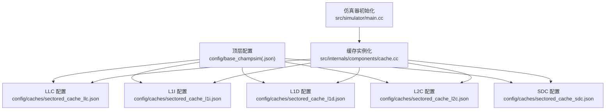
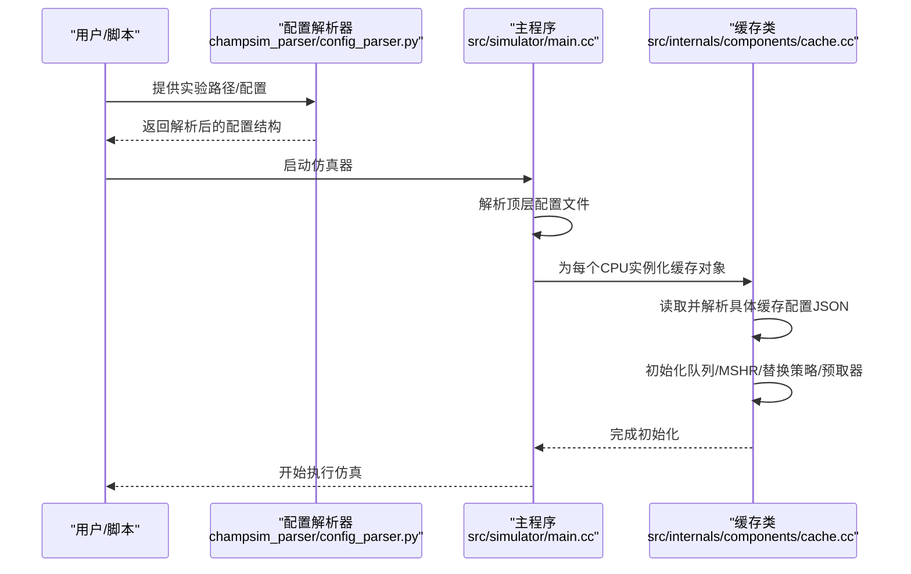
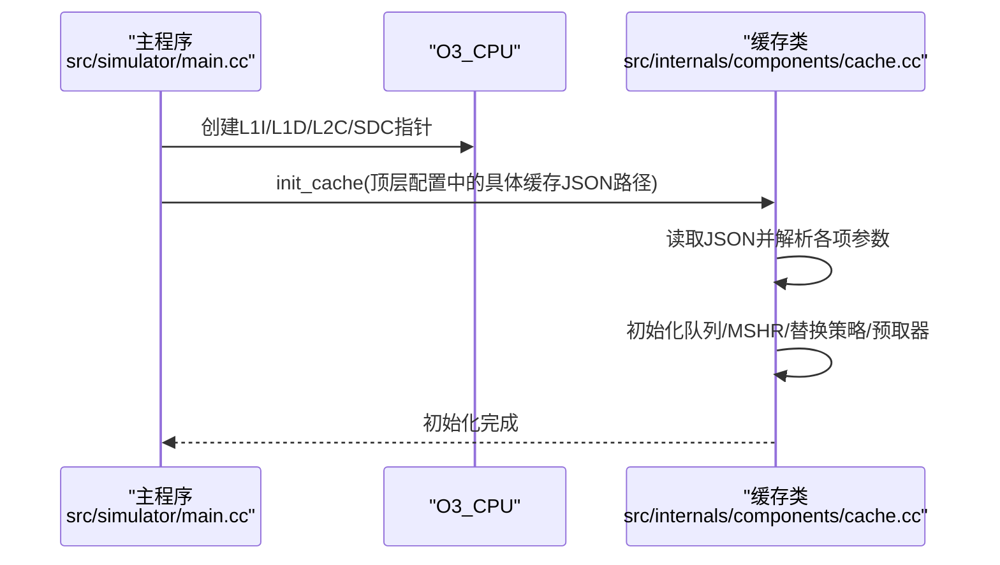
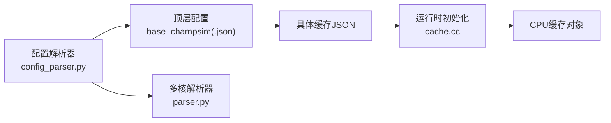

# 基础配置

<cite>
**本文引用的文件**
- [config/base_champsim.json](file://config/base_champsim.json)
- [config/base_champsim_sdc.json](file://config/base_champsim_sdc.json)
- [config/caches/sectored_cache_llc.json](file://config/caches/sectored_cache_llc.json)
- [config/caches/sectored_cache_l1i.json](file://config/caches/sectored_cache_l1i.json)
- [config/caches/sectored_cache_l1d.json](file://config/caches/sectored_cache_l1d.json)
- [config/caches/sectored_cache_l2c.json](file://config/caches/sectored_cache_l2c.json)
- [config/caches/sectored_cache_sdc.json](file://config/caches/sectored_cache_sdc.json)
- [src/simulator/main.cc](file://src/simulator/main.cc)
- [src/internals/components/cache.cc](file://src/internals/components/cache.cc)
- [champsim_parser/config_parser.py](file://champsim_parser/config_parser.py)
- [champsim_parser/parser.py](file://champsim_parser/parser.py)
- [config/baseline_cascade_lake.json](file://config/baseline_cascade_lake.json)
- [config/baseline_cascade_lake_4_cores.json](file://config/baseline_cascade_lake_4_cores.json)
</cite>

## 目录
1. [简介](#简介)
2. [项目结构](#项目结构)
3. [核心组件](#核心组件)
4. [架构总览](#架构总览)
5. [详细组件分析](#详细组件分析)
6. [依赖关系分析](#依赖关系分析)
7. [性能考量](#性能考量)
8. [故障排查指南](#故障排查指南)
9. [结论](#结论)
10. [附录](#附录)

## 简介
本文件系统性阐述ChampSim基础配置系统，重点围绕基础配置文件base_champsim.json与其变体base_champsim_sdc.json，解释LLC、L1I、L1D、L2C、SDC五级缓存的配置方式与继承机制，并给出核心参数（如缓存大小、组相联度、行大小等）的含义与调优建议。同时，结合配置解析器与运行时初始化流程，说明配置如何被加载到仿真器中，以及如何通过模块化设计进行扩展与复用。

## 项目结构
基础配置系统由“顶层配置文件”和“具体缓存配置文件”两部分组成：
- 顶层配置：定义各缓存层级的配置入口与是否启用SDC等全局开关
- 具体缓存配置：以JSON形式描述每个缓存的类型、延迟、队列容量、替换策略、预取器等细节
- 运行时初始化：在仿真启动阶段按配置文件实例化各级缓存对象

**图表来源**
- [config/base_champsim.json:1-23](file://config/base_champsim.json#L1-L23)
- [config/caches/sectored_cache_llc.json:1-29](file://config/caches/sectored_cache_llc.json#L1-L29)
- [config/caches/sectored_cache_l1i.json:1-30](file://config/caches/sectored_cache_l1i.json#L1-L30)
- [config/caches/sectored_cache_l1d.json:1-30](file://config/caches/sectored_cache_l1d.json#L1-L30)
- [config/caches/sectored_cache_l2c.json:1-29](file://config/caches/sectored_cache_l2c.json#L1-L29)
- [config/caches/sectored_cache_sdc.json:1-35](file://config/caches/sectored_cache_sdc.json#L1-L35)
- [src/simulator/main.cc:552-584](file://src/simulator/main.cc#L552-L584)
- [src/internals/components/cache.cc:65-84](file://src/internals/components/cache.cc#L65-L84)

**章节来源**
- [config/base_champsim.json:1-23](file://config/base_champsim.json#L1-L23)
- [config/base_champsim_sdc.json:1-23](file://config/base_champsim_sdc.json#L1-L23)

## 核心组件
- 顶层配置文件
  - base_champsim.json：默认禁用SDC，其他缓存均采用分段（sectored）配置
  - base_champsim_sdc.json：启用SDC，其余同上
- 缓存配置文件
  - LLC/L1I/L1D/L2C/SDC各自对应一个JSON文件，包含名称、类型、延迟、队列尺寸、MSHR、替换策略、预取器等
- 运行时初始化
  - 仿真器启动时为每个CPU实例化L1I/L1D/L2C/SDC对象，并根据配置文件初始化缓存与替换策略

**章节来源**
- [config/base_champsim.json:1-23](file://config/base_champsim.json#L1-L23)
- [config/base_champsim_sdc.json:1-23](file://config/base_champsim_sdc.json#L1-L23)
- [config/caches/sectored_cache_llc.json:1-29](file://config/caches/sectored_cache_llc.json#L1-L29)
- [config/caches/sectored_cache_l1i.json:1-30](file://config/caches/sectored_cache_l1i.json#L1-L30)
- [config/caches/sectored_cache_l1d.json:1-30](file://config/caches/sectored_cache_l1d.json#L1-L30)
- [config/caches/sectored_cache_l2c.json:1-29](file://config/caches/sectored_cache_l2c.json#L1-L29)
- [config/caches/sectored_cache_sdc.json:1-35](file://config/caches/sectored_cache_sdc.json#L1-L35)
- [src/simulator/main.cc:552-584](file://src/simulator/main.cc#L552-L584)

## 架构总览
下图展示从顶层配置到缓存实例化的整体流程：

**图表来源**
- [champsim_parser/config_parser.py:249-336](file://champsim_parser/config_parser.py#L249-L336)
- [src/simulator/main.cc:552-584](file://src/simulator/main.cc#L552-L584)
- [src/internals/components/cache.cc:65-84](file://src/internals/components/cache.cc#L65-L84)

## 详细组件分析

### 顶层配置：base_champsim.json 与 base_champsim_sdc.json
- 结构要点
  - llc：指定LLC配置文件路径
  - cores：数组，每个元素代表一个CPU核的缓存配置
  - 每个核包含：l1i、l1d、l2c、sdc四个键，分别指向对应缓存的配置文件
  - sdc键可包含enabled字段控制是否启用
- 继承与模块化
  - 通过将“缓存类型→配置文件”的映射放在顶层，实现“按需选择”的模块化设计
  - 不同场景仅需切换顶层配置或覆盖单个缓存的config路径即可
- 变体差异
  - base_champsim_sdc.json将sdc.enabled设为true，用于启用SDC；其余保持一致

**章节来源**
- [config/base_champsim.json:1-23](file://config/base_champsim.json#L1-L23)
- [config/base_champsim_sdc.json:1-23](file://config/base_champsim_sdc.json#L1-L23)

### LLC（最后一级缓存）
- 关键参数
  - latency：访问延迟周期数
  - max_reads/writes：每周期最大读写请求数
  - write/read/prefetch/mshr/processed队列：缓冲不同阶段的请求
  - set_degree、associativity_degree、sectoring_degree：组织结构参数
  - block_size：块大小（字节）
  - prefetcher：预取器类型
- 设计意义
  - 分段（sectoring_degree>1）有助于降低冲突、提升并发
  - 较大的MSHR与队列容量可提升高带宽场景下的吞吐
- 示例参考
  - [config/caches/sectored_cache_llc.json:1-29](file://config/caches/sectored_cache_llc.json#L1-L29)

**章节来源**
- [config/caches/sectored_cache_llc.json:1-29](file://config/caches/sectored_cache_llc.json#L1-L29)

### L1I（一级指令缓存）
- 关键参数
  - 与LLC类似，但通常更小、更快
  - block_size较大（典型64B），以满足指令流的连续访问
  - replacement_policy：L1I专用替换策略
- 示例参考
  - [config/caches/sectored_cache_l1i.json:1-30](file://config/caches/sectored_cache_l1i.json#L1-L30)

**章节来源**
- [config/caches/sectored_cache_l1i.json:1-30](file://config/caches/sectored_cache_l1i.json#L1-L30)

### L1D（一级数据缓存）
- 关键参数
  - block_size：典型64B
  - prefetcher：常用next-line等简单预取器
  - replacement_policy：L1D专用替换策略
- 示例参考
  - [config/caches/sectored_cache_l1d.json:1-30](file://config/caches/sectored_cache_l1d.json#L1-L30)

**章节来源**
- [config/caches/sectored_cache_l1d.json:1-30](file://config/caches/sectored_cache_l1d.json#L1-L30)

### L2C（二级缓存）
- 关键参数
  - 通常比L1大且速度较慢
  - set_degree、associativity_degree、sectoring_degree影响命中率与冲突
  - prefetcher：可配置为SPP等策略
- 示例参考
  - [config/caches/sectored_cache_l2c.json:1-29](file://config/caches/sectored_cache_l2c.json#L1-L29)

**章节来源**
- [config/caches/sectored_cache_l2c.json:1-29](file://config/caches/sectored_cache_l2c.json#L1-L29)

### SDC（子统一数据缓存，可选）
- 关键参数
  - 与L1D类似的结构参数
  - routing_engine：包含嗅探周期、历史长度、刷新周期等路由引擎参数
  - enabled：顶层配置中可控制是否启用
- 示例参考
  - [config/caches/sectored_cache_sdc.json:1-35](file://config/caches/sectored_cache_sdc.json#L1-L35)
  - [config/base_champsim_sdc.json:16-19](file://config/base_champsim_sdc.json#L16-L19)

**章节来源**
- [config/caches/sectored_cache_sdc.json:1-35](file://config/caches/sectored_cache_sdc.json#L1-L35)
- [config/base_champsim_sdc.json:16-19](file://config/base_champsim_sdc.json#L16-L19)

### 运行时初始化流程
- 主程序负责为每个CPU创建L1I/L1D/L2C/SDC对象，并调用init_cache加载对应JSON配置
- 缓存类内部读取JSON并设置延迟、队列、MSHR、替换策略与预取器
- 替换策略与预取器通过动态库/配置文件进一步初始化

**图表来源**
- [src/simulator/main.cc:552-584](file://src/simulator/main.cc#L552-L584)
- [src/internals/components/cache.cc:65-84](file://src/internals/components/cache.cc#L65-L84)

**章节来源**
- [src/simulator/main.cc:552-584](file://src/simulator/main.cc#L552-L584)
- [src/internals/components/cache.cc:65-84](file://src/internals/components/cache.cc#L65-L84)

### 配置解析器与实验组织
- 配置解析器负责从结果目录层次结构中提取实验配置（如热身/仿真步数、二进制名、特征等）
- 多核解析器支持单核与混合场景的结果组织
- 通过正则表达式识别是否使用SDC，辅助筛选与统计

**章节来源**
- [champsim_parser/config_parser.py:10-40](file://champsim_parser/config_parser.py#L10-L40)
- [champsim_parser/parser.py:14-75](file://champsim_parser/parser.py#L14-L75)

## 依赖关系分析
- 顶层配置对具体缓存配置的依赖是“文件路径依赖”，通过JSON键值对建立松耦合连接
- 运行时对缓存类的依赖体现在初始化链路：主程序→缓存类→JSON配置
- 配置解析器与实验组织层独立于缓存实现，便于扩展新的配置项与统计维度

**图表来源**
- [config/base_champsim.json:1-23](file://config/base_champsim.json#L1-L23)
- [src/internals/components/cache.cc:65-84](file://src/internals/components/cache.cc#L65-L84)
- [champsim_parser/config_parser.py:249-336](file://champsim_parser/config_parser.py#L249-L336)
- [champsim_parser/parser.py:78-218](file://champsim_parser/parser.py#L78-L218)

**章节来源**
- [config/base_champsim.json:1-23](file://config/base_champsim.json#L1-L23)
- [src/internals/components/cache.cc:65-84](file://src/internals/components/cache.cc#L65-L84)
- [champsim_parser/config_parser.py:249-336](file://champsim_parser/config_parser.py#L249-L336)
- [champsim_parser/parser.py:78-218](file://champsim_parser/parser.py#L78-L218)

## 性能考量
- 组织结构参数
  - set_degree与associativity_degree共同决定缓存容量与冲突概率，增大容量可降低缺失率，但可能增加访问延迟
  - sectoring_degree提高并发，减少跨线程冲突，适合多核场景
- 队列与MSHR
  - write_queue/read_queue/prefetch_queue/processed_queue的容量直接影响高负载下的吞吐与延迟
  - mshr过大可能导致内存占用上升，过小则易造成阻塞
- 预取与替换
  - 预取器策略应与工作负载匹配；对于顺序访问强的工作负载，next-line等简单预取有效
  - 替换策略需与缓存类型匹配（如L1I/L1D/L2C/LLC/SDC各有专用策略）
- SDC启用
  - 在需要细粒度数据缓存与路由优化的场景启用SDC；否则关闭可简化路径

[本节为通用指导，不直接分析特定文件]

## 故障排查指南
- 配置未生效
  - 检查顶层配置中各缓存的config路径是否正确
  - 确认具体JSON文件存在且格式合法
- 运行时异常
  - 核查cache.cc中初始化流程是否成功读取JSON并设置参数
  - 若替换策略或预取器配置错误，可能导致初始化失败
- 实验结果异常
  - 使用配置解析器确认热身/仿真步数、二进制名等元信息是否正确
  - 对于多核场景，检查每个核的配置是否一致

**章节来源**
- [src/internals/components/cache.cc:1175-1211](file://src/internals/components/cache.cc#L1175-L1211)
- [champsim_parser/config_parser.py:10-40](file://champsim_parser/config_parser.py#L10-L40)

## 结论
基础配置系统通过“顶层配置+具体缓存配置”的双层设计实现了高度模块化与可复用性。顶层配置以最小改动适配不同缓存层次组合，具体缓存配置聚焦于参数化与策略选择。配合运行时初始化与配置解析器，该体系既保证了灵活性，又确保了可维护性与可扩展性。

## 附录

### 基础配置最佳实践
- 优先从base_champsim.json开始，按需启用/禁用SDC
- 针对多核场景，先统一核间配置，再在baseline_*系列配置中微调（如L1D的选择性预取参数）
- 参数调整遵循“先结构后队列”的思路：先改set_degree/associativity_degree/sectoring_degree，再调队列与MSHR
- 保留一份基准配置作为对照，每次只变更一个变量，便于对比分析

**章节来源**
- [config/baseline_cascade_lake.json:1-64](file://config/baseline_cascade_lake.json#L1-L64)
- [config/baseline_cascade_lake_4_cores.json:1-214](file://config/baseline_cascade_lake_4_cores.json#L1-L214)

### 常见修改示例（步骤说明）
- 启用SDC
  - 将顶层配置中sdc.enabled设为true，并确保其config指向有效JSON
  - 参考：[config/base_champsim_sdc.json:16-19](file://config/base_champsim_sdc.json#L16-L19)
- 调整L1D预取
  - 修改L1D配置文件中的prefetcher键值
  - 参考：[config/caches/sectored_cache_l1d.json:27](file://config/caches/sectored_cache_l1d.json#L27)
- 扩容L2C队列
  - 增大write_queue/read_queue/prefetch_queue/processed_queue的size
  - 参考：[config/caches/sectored_cache_l2c.json:8-22](file://config/caches/sectored_cache_l2c.json#L8-L22)
- 启用SDC并定制路由引擎
  - 在SDC配置中完善routing_engine参数
  - 参考：[config/caches/sectored_cache_sdc.json:29-33](file://config/caches/sectored_cache_sdc.json#L29-L33)