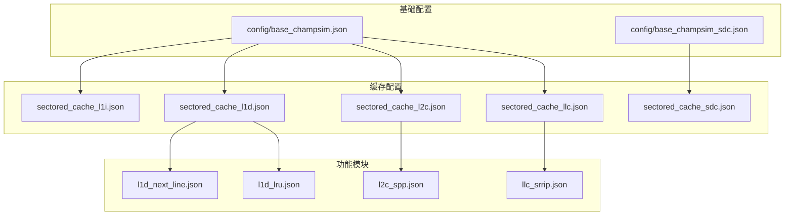
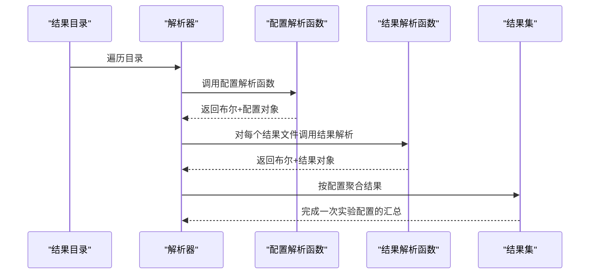
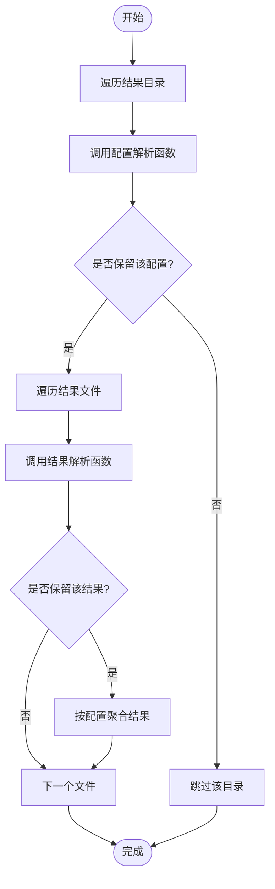
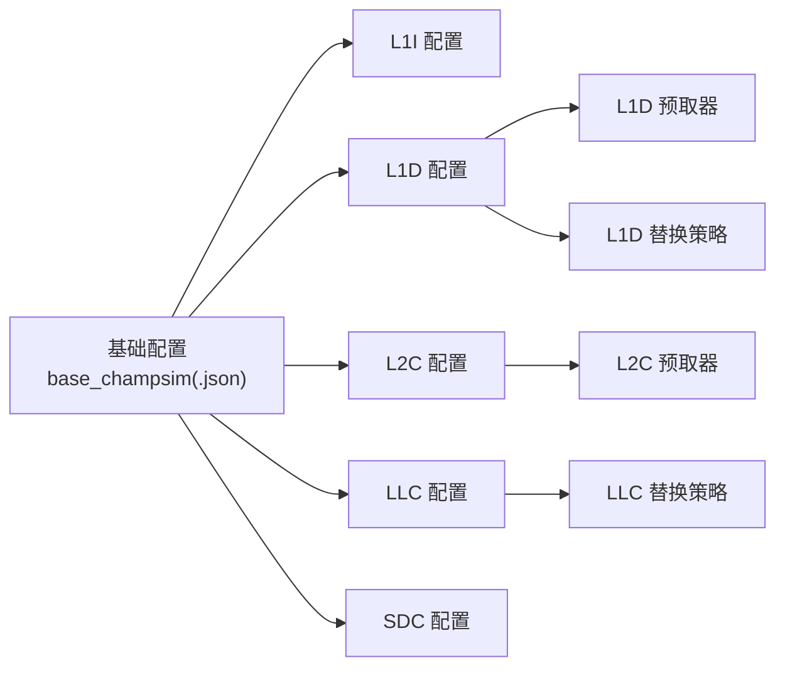

# 配置系统

<cite>
**本文引用的文件**
- [README.md](file://README.md)
- [champsim_parser/config_parser.py](file://champsim_parser/config_parser.py)
- [champsim_parser/parser.py](file://champsim_parser/parser.py)
- [config/base_champsim.json](file://config/base_champsim.json)
- [config/base_champsim_sdc.json](file://config/base_champsim_sdc.json)
- [config/caches/sectored_cache_l1d.json](file://config/caches/sectored_cache_l1d.json)
- [config/caches/sectored_cache_l2c.json](file://config/caches/sectored_cache_l2c.json)
- [config/caches/sectored_cache_llc.json](file://config/caches/sectored_cache_llc.json)
- [config/caches/sectored_cache_sdc.json](file://config/caches/sectored_cache_sdc.json)
- [config/prefetchers/l1d_next_line.json](file://config/prefetchers/l1d_next_line.json)
- [config/prefetchers/l2c_spp.json](file://config/prefetchers/l2c_spp.json)
- [config/replacements/l1d_lru.json](file://config/replacements/l1d_lru.json)
- [config/replacements/llc_srrip.json](file://config/replacements/llc_srrip.json)
</cite>

## 目录
1. [简介](#简介)
2. [项目结构](#项目结构)
3. [核心组件](#核心组件)
4. [架构总览](#架构总览)
5. [详细组件分析](#详细组件分析)
6. [依赖分析](#依赖分析)
7. [性能考虑](#性能考虑)
8. [故障排查指南](#故障排查指南)
9. [结论](#结论)
10. [附录：配置参数参考手册](#附录配置参数参考手册)

## 简介
本文件系统性梳理 TLP-HPCA30 的配置系统，聚焦于 JSON 配置文件的格式、参数语义与可选配置项，解释三类关键配置的作用与适用场景：基准测试配置（顶层）、缓存配置（各级缓存与 SDC）、预取器配置（L1D/L2C/LLC/SDC）。同时给出完整参数参考、继承与覆盖规则、自定义配置方法、参数调优建议与最佳实践，并通过图示展示解析流程与数据流。

## 项目结构
配置系统由三层组成：
- 基础配置层：顶层 JSON 描述各层级缓存与核心数量等全局信息，决定是否启用 SDC。
- 缓存配置层：每个缓存级别（L1I/L1D/L2C/LLC/SDC）对应独立的 JSON 文件，定义容量、队列、替换策略、预取器、块大小等。
- 预取器与替换策略层：分别在 prefetchers 与 replacements 目录下，以名称映射到具体实现或行为。

图表来源
- [config/base_champsim.json:1-23](file://config/base_champsim.json#L1-L23)
- [config/base_champsim_sdc.json:1-23](file://config/base_champsim_sdc.json#L1-L23)
- [config/caches/sectored_cache_l1d.json:1-30](file://config/caches/sectored_cache_l1d.json#L1-L30)
- [config/caches/sectored_cache_l2c.json:1-29](file://config/caches/sectored_cache_l2c.json#L1-L29)
- [config/caches/sectored_cache_llc.json](file://config/caches/sectored_cache_llc.json)
- [config/caches/sectored_cache_sdc.json:1-35](file://config/caches/sectored_cache_sdc.json#L1-L35)
- [config/prefetchers/l1d_next_line.json:1-5](file://config/prefetchers/l1d_next_line.json#L1-L5)
- [config/prefetchers/l2c_spp.json:1-33](file://config/prefetchers/l2c_spp.json#L1-L33)
- [config/replacements/l1d_lru.json:1-5](file://config/replacements/l1d_lru.json#L1-L5)
- [config/replacements/llc_srrip.json:1-5](file://config/replacements/llc_srrip.json#L1-L5)

章节来源
- [README.md:135-178](file://README.md#L135-L178)

## 核心组件
- 基础配置文件（顶层）
  - base_champsim.json：描述 L1I/L1D/L2C/LLC 的配置路径，默认禁用 SDC。
  - base_champsim_sdc.json：与上述类似，但启用 SDC。
- 缓存配置文件（各级缓存）
  - L1D/L2C/LLC/SDC：包含延迟、队列尺寸、MSHR、块大小、关联度、扇区化度、预取器、替换策略等。
- 预取器与替换策略
  - 预取器：如 L1D 的 next-line、L2C 的 SPP；SDC 默认 next-line。
  - 替换策略：如 L1D 的 LRU、LLC 的 SRIP。

章节来源
- [config/base_champsim.json:1-23](file://config/base_champsim.json#L1-L23)
- [config/base_champsim_sdc.json:1-23](file://config/base_champsim_sdc.json#L1-L23)
- [config/caches/sectored_cache_l1d.json:1-30](file://config/caches/sectored_cache_l1d.json#L1-L30)
- [config/caches/sectored_cache_l2c.json:1-29](file://config/caches/sectored_cache_l2c.json#L1-L29)
- [config/caches/sectored_cache_sdc.json:1-35](file://config/caches/sectored_cache_sdc.json#L1-L35)
- [config/prefetchers/l1d_next_line.json:1-5](file://config/prefetchers/l1d_next_line.json#L1-L5)
- [config/prefetchers/l2c_spp.json:1-33](file://config/prefetchers/l2c_spp.json#L1-L33)
- [config/replacements/l1d_lru.json:1-5](file://config/replacements/l1d_lru.json#L1-L5)
- [config/replacements/llc_srrip.json:1-5](file://config/replacements/llc_srrip.json#L1-L5)

## 架构总览
配置系统采用“顶层 JSON 引用缓存配置”的模式，缓存配置再分别指向预取器与替换策略。运行时通过解析器从结果目录中抽取配置元信息与实验结果，形成统一的结果集。

图表来源
- [champsim_parser/parser.py:14-75](file://champsim_parser/parser.py#L14-L75)
- [champsim_parser/config_parser.py:265-336](file://champsim_parser/config_parser.py#L265-L336)

章节来源
- [champsim_parser/parser.py:10-75](file://champsim_parser/parser.py#L10-L75)
- [champsim_parser/config_parser.py:13-40](file://champsim_parser/config_parser.py#L13-L40)

## 详细组件分析

### 基础配置（顶层 JSON）
- 作用
  - 指定各层级缓存的配置文件路径。
  - 控制是否启用 SDC（字段 enabled）。
- 关键字段
  - llc.config：LLC 配置文件路径。
  - cores[0].l1i/l1d/l2c/sdc.config：各级缓存配置文件路径。
  - sdc.enabled：是否启用 SDC。
- 使用场景
  - 单核/多核、不同 CPU 架构（Cascade Lake/Alder Lake）的基线对比。
  - 启用/禁用 SDC 进行消融实验。

章节来源
- [config/base_champsim.json:1-23](file://config/base_champsim.json#L1-L23)
- [config/base_champsim_sdc.json:1-23](file://config/base_champsim_sdc.json#L1-L23)

### 缓存配置（L1D/L2C/LLC/SDC）
- 共同字段
  - name、cache_type、fill_level、latency、max_reads、max_writes、block_size。
  - 队列：read_queue、write_queue、prefetch_queue、processed_queue 的 size。
  - MSHR：mshr.size。
  - 组织参数：set_degree、associativity_degree、sectoring_degree。
  - 预取器：prefetcher（如 l1d_next_line、l2c_spp）。
  - 替换策略：replacement_policy（如 l1d_lru、llc_srrip）。
- L1D
  - 默认预取器：next-line；默认替换：LRU。
- L2C
  - 默认预取器：SPP；支持多种变体（如带/不带 SPP、TOPT 等）。
- LLC
  - 可选择 SRIP、LRU、TOP-T 等策略。
- SDC
  - 可选启用；默认预取器：next-line；默认替换：LRU。
  - 新增路由引擎参数：sniffing_periodicity、histories_length、flush_periods。

章节来源
- [config/caches/sectored_cache_l1d.json:1-30](file://config/caches/sectored_cache_l1d.json#L1-L30)
- [config/caches/sectored_cache_l2c.json:1-29](file://config/caches/sectored_cache_l2c.json#L1-L29)
- [config/caches/sectored_cache_llc.json](file://config/caches/sectored_cache_llc.json)
- [config/caches/sectored_cache_sdc.json:1-35](file://config/caches/sectored_cache_sdc.json#L1-L35)

### 预取器配置
- L1D
  - next-line：按行进方向发起预取。
- L2C
  - SPP：Signature/Pattern/Prefetch Filter/GSR 结构，含表规模、位宽、阈值等参数。

章节来源
- [config/prefetchers/l1d_next_line.json:1-5](file://config/prefetchers/l1d_next_line.json#L1-L5)
- [config/prefetchers/l2c_spp.json:1-33](file://config/prefetchers/l2c_spp.json#L1-L33)

### 替换策略配置
- L1D：LRU。
- LLC：SRIP（基于走查的替换）。
- SDC：LRU 或随机（见 replacements 目录）。

章节来源
- [config/replacements/l1d_lru.json:1-5](file://config/replacements/l1d_lru.json#L1-L5)
- [config/replacements/llc_srrip.json:1-5](file://config/replacements/llc_srrip.json#L1-L5)

### 解析器与配置抽取
- 配置解析函数
  - new_caches_parser：从目录名提取仿真/预热指令数、二进制名、是否使用 SDC。
  - 多采样器解析器：four_sampler_parser/multi_sampler_parser/hyperion_coefficient_parser：从路径解析 tau 表、表大小、计数器位宽等。
- 解析器类
  - Parser/MultiCoreParser：遍历结果目录，调用配置与结果解析函数，构建结果集。
- 过滤器
  - BaseFilter：可扩展过滤逻辑（例如按特征集合筛选）。

图表来源
- [champsim_parser/parser.py:14-75](file://champsim_parser/parser.py#L14-L75)
- [champsim_parser/config_parser.py:265-336](file://champsim_parser/config_parser.py#L265-L336)

章节来源
- [champsim_parser/config_parser.py:13-40](file://champsim_parser/config_parser.py#L13-L40)
- [champsim_parser/config_parser.py:42-126](file://champsim_parser/config_parser.py#L42-L126)
- [champsim_parser/config_parser.py:129-191](file://champsim_parser/config_parser.py#L129-L191)
- [champsim_parser/config_parser.py:194-246](file://champsim_parser/config_parser.py#L194-L246)
- [champsim_parser/parser.py:78-217](file://champsim_parser/parser.py#L78-L217)

## 依赖分析
- 继承与覆盖关系
  - 顶层基础配置通过 config 字段“继承”到具体缓存配置文件。
  - 缓存配置再“覆盖”预取器与替换策略的具体实现。
  - SDC 的启用与否由顶层配置控制，影响最终运行时行为。
- 外部依赖
  - 解析器依赖 Python 标准库（os、re）与结果解析器接口。
  - 预取器与替换策略通过名称字符串在缓存配置中引用。

图表来源
- [config/base_champsim.json:1-23](file://config/base_champsim.json#L1-L23)
- [config/caches/sectored_cache_l1d.json:1-30](file://config/caches/sectored_cache_l1d.json#L1-L30)
- [config/caches/sectored_cache_l2c.json:1-29](file://config/caches/sectored_cache_l2c.json#L1-L29)
- [config/prefetchers/l1d_next_line.json:1-5](file://config/prefetchers/l1d_next_line.json#L1-L5)
- [config/prefetchers/l2c_spp.json:1-33](file://config/prefetchers/l2c_spp.json#L1-L33)
- [config/replacements/l1d_lru.json:1-5](file://config/replacements/l1d_lru.json#L1-L5)
- [config/replacements/llc_srrip.json:1-5](file://config/replacements/llc_srrip.json#L1-L5)

章节来源
- [config/base_champsim.json:1-23](file://config/base_champsim.json#L1-L23)
- [config/base_champsim_sdc.json:1-23](file://config/base_champsim_sdc.json#L1-L23)

## 性能考虑
- 队列与 MSHR 尺寸
  - 过小导致阻塞，过大增加资源占用。应结合核心数与工作负载特征调整。
- 关联度与扇区化
  - 提高关联度可降低冲突缺失，但增加查找开销；扇区化有助于减少跨扇区冲突。
- 预取器
  - L2C 的 SPP 在空间局部性强的工作负载上收益显著，但需平衡过滤阈值与误杀率。
- 替换策略
  - LRU 实现简单，SRIP 在 LLC 上通常更稳健。
- SDC
  - 启用 SDC 会引入额外的嗅探与路由开销，需评估对吞吐的影响。

## 故障排查指南
- 配置未生效
  - 检查顶层基础配置中的 config 路径是否正确，文件是否存在。
  - 若启用 SDC，请确认 base_champsim_sdc.json 已被使用。
- 预期结果与实际不符
  - 核对缓存配置中的 block_size、set_degree、associativity_degree 是否与目标架构匹配。
  - 检查预取器与替换策略名称是否存在于对应目录。
- 解析失败
  - 确认结果目录命名符合解析器预期（路径分段与参数顺序）。
  - 若使用多采样器解析器，确保路径中 tau、表大小、计数器位宽等参数齐全。

章节来源
- [champsim_parser/config_parser.py:13-40](file://champsim_parser/config_parser.py#L13-L40)
- [champsim_parser/config_parser.py:42-126](file://champsim_parser/config_parser.py#L42-L126)
- [champsim_parser/parser.py:14-75](file://champsim_parser/parser.py#L14-L75)

## 结论
本配置系统通过“顶层 JSON 引用 + 缓存/预取器/替换策略分离”的设计，实现了清晰的层次化与可组合性。合理设置缓存容量、队列与 MSHR、预取策略与替换策略，以及是否启用 SDC，是获得稳定且高性能仿真的关键。解析器提供了灵活的配置抽取与结果聚合能力，便于大规模实验的自动化处理。

## 附录：配置参数参考手册

- 顶层基础配置（顶层 JSON）
  - llc.config：LLC 配置文件路径
  - cores[0].l1i/l1d/l2c.config：各级缓存配置文件路径
  - cores[0].sdc.config：SDC 配置文件路径
  - cores[0].sdc.enabled：是否启用 SDC（布尔）

- L1D 缓存配置
  - latency：访问延迟
  - max_reads/max_writes：并发读写上限
  - read_queue/write_queue/prefetch_queue/processed_queue.size：队列深度
  - mshr.size：MSHR 深度
  - set_degree、associativity_degree、sectoring_degree：组织参数
  - block_size：块大小
  - prefetcher：预取器名称
  - replacement_policy：替换策略名称

- L2C 缓存配置
  - 同 L1D，另有默认预取器（如 SPP）

- LLC 缓存配置
  - 同 L1D，可选替换策略（如 SRIP）

- SDC 缓存配置
  - 同 L1D，新增 routing_engine 参数：
    - sniffing_periodicity：嗅探周期
    - histories_length：历史长度
    - flush_periods：刷新周期

- 预取器
  - l1d_next_line：L1D next-line 预取
  - l2c_spp：L2C SPP 预取器（含 signature/pattern/prefetch_filter/global_register 子参数）

- 替换策略
  - l1d_lru：L1D LRU
  - llc_srrip：LLC SRIP

章节来源
- [config/base_champsim.json:1-23](file://config/base_champsim.json#L1-L23)
- [config/base_champsim_sdc.json:1-23](file://config/base_champsim_sdc.json#L1-L23)
- [config/caches/sectored_cache_l1d.json:1-30](file://config/caches/sectored_cache_l1d.json#L1-L30)
- [config/caches/sectored_cache_l2c.json:1-29](file://config/caches/sectored_cache_l2c.json#L1-L29)
- [config/caches/sectored_cache_llc.json](file://config/caches/sectored_cache_llc.json)
- [config/caches/sectored_cache_sdc.json:1-35](file://config/caches/sectored_cache_sdc.json#L1-L35)
- [config/prefetchers/l1d_next_line.json:1-5](file://config/prefetchers/l1d_next_line.json#L1-L5)
- [config/prefetchers/l2c_spp.json:1-33](file://config/prefetchers/l2c_spp.json#L1-L33)
- [config/replacements/l1d_lru.json:1-5](file://config/replacements/l1d_lru.json#L1-L5)
- [config/replacements/llc_srrip.json:1-5](file://config/replacements/llc_srrip.json#L1-L5)

### 自定义配置步骤与最佳实践
- 步骤
  - 选择或复制一份基础配置（如 base_champsim.json 或 base_champsim_sdc.json）作为起点。
  - 修改各级缓存的 config 路径，指向自定义的缓存配置文件。
  - 在自定义缓存配置中调整 block_size、set_degree、associativity_degree、队列与 MSHR 尺寸、预取器与替换策略。
  - 如启用 SDC，确保 routing_engine 参数合理设置。
- 最佳实践
  - 先以基线配置运行，再逐项调整单一参数，观察 MPKI/IPC/CPI 等指标变化。
  - 对于 L2C/SPP，先固定 signature/pattern 表规模，再微调阈值与计数器位宽。
  - 多核场景下，优先保证 L1D/L2C 的队列与 MSHR 不成为瓶颈。
  - 启用 SDC 时，结合嗅探周期与历史长度，避免过度嗅探带来的开销。