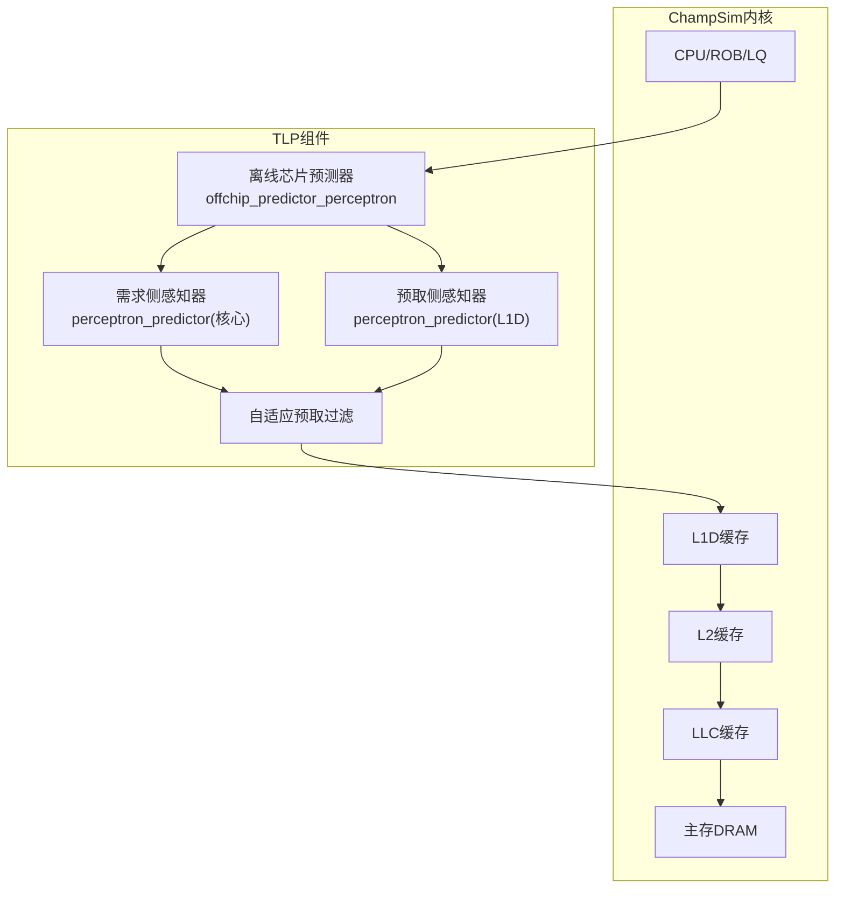
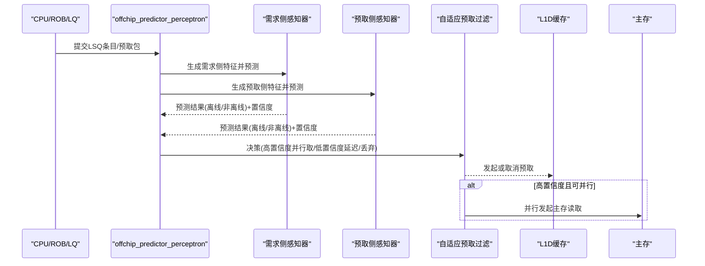
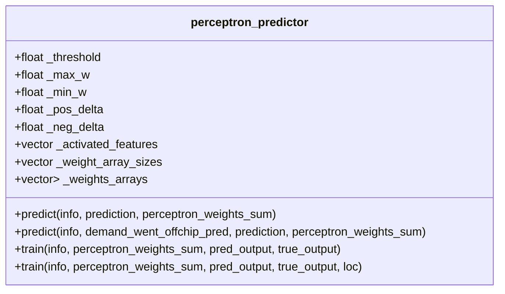
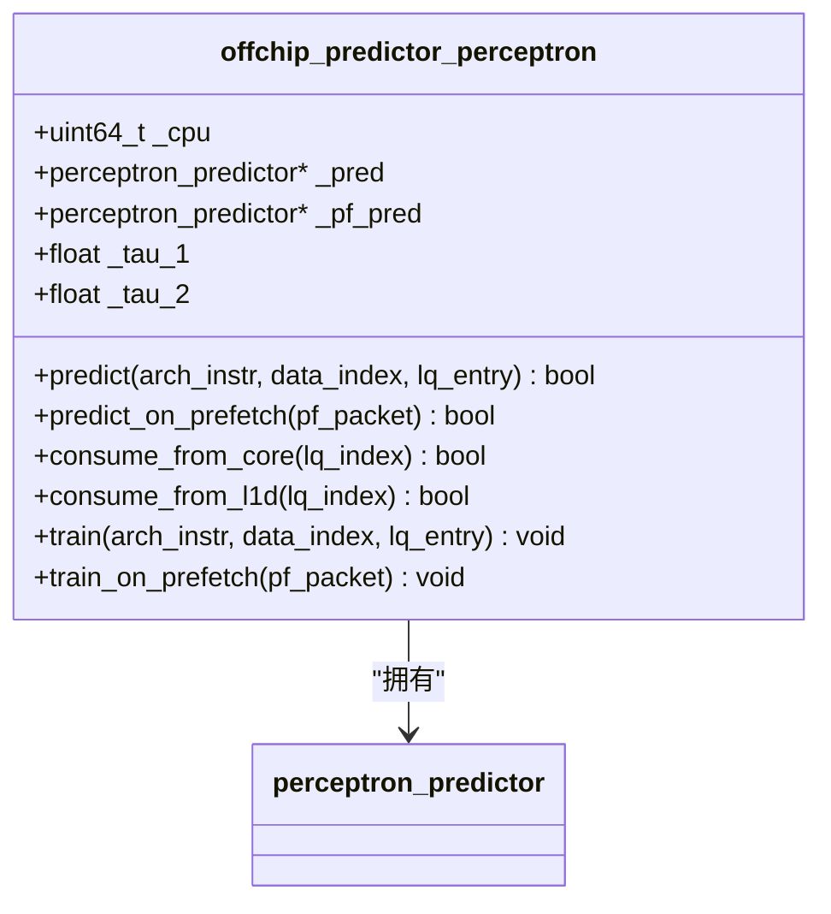
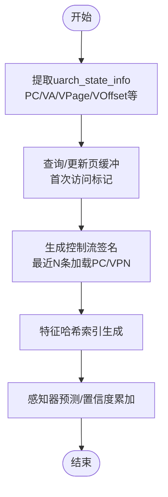
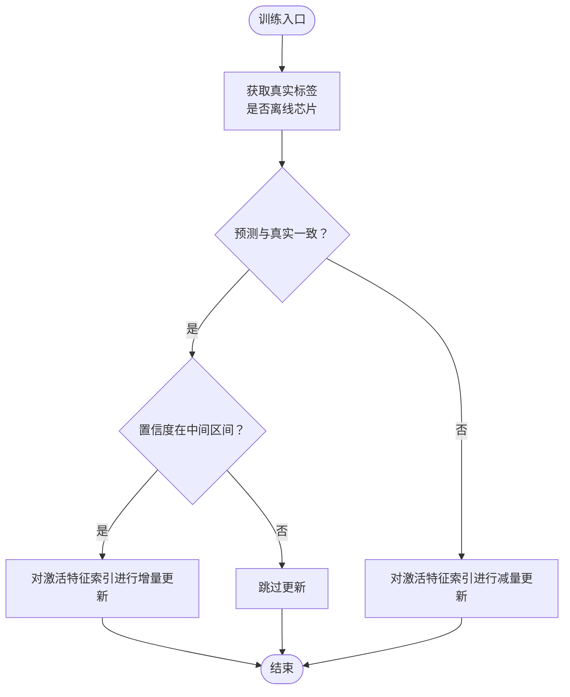
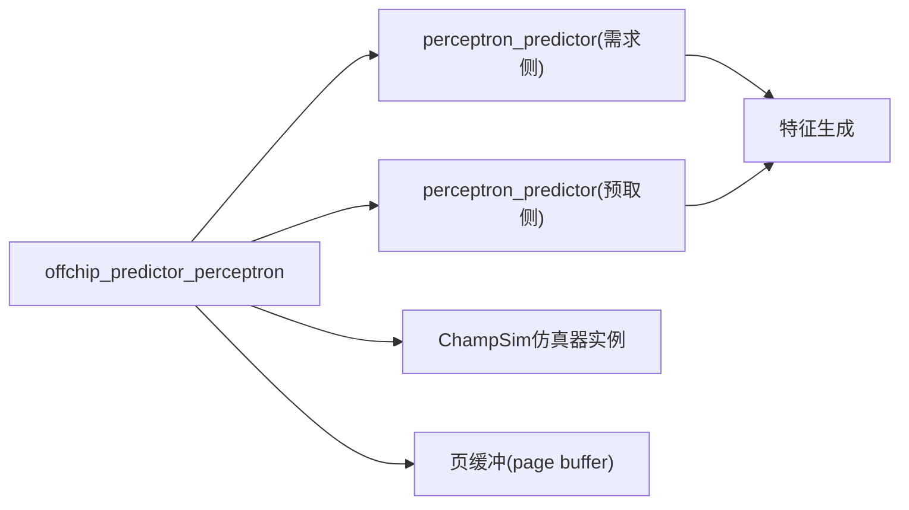

# TLP核心概念

<cite>
**本文引用的文件**
- [README.md](file://README.md)
- [offchip_pred_perc.cc](file://src/internals/components/offchip_pred_perc.cc)
- [offchip_pred_perc.hh](file://src/internals/components/offchip_pred_perc.hh)
</cite>

## 目录
1. [引言](#引言)
2. [项目结构](#项目结构)
3. [核心组件](#核心组件)
4. [架构总览](#架构总览)
5. [详细组件分析](#详细组件分析)
6. [依赖关系分析](#依赖关系分析)
7. [性能考量](#性能考量)
8. [故障排查指南](#故障排查指南)
9. [结论](#结论)
10. [附录](#附录)

## 引言
本文件面向初学者与研究人员，系统阐述Two Level Perceptron（TLP）预测器的核心理念与实现要点。TLP通过“片外预测”与“自适应预取过滤”的组合，提升缓存系统的整体命中率与吞吐。其目标是：
- 准确预测哪些访存会走向片外（主存）
- 预测L1D预取请求是否也会走向片外
- 在高置信度时，提前并行从主存获取数据；低置信度时延迟主存获取
- 对预测为片外的L1D预取请求进行丢弃，避免浪费带宽与污染缓存

这些能力在ChampSim仿真框架中以两层感知器（perceptron）为核心实现，分别用于“核心侧需求访存”和“L1D预取请求”的离线芯片预测。

章节来源
- [README.md:39-51](file://README.md#L39-L51)

## 项目结构
仓库采用ChampSim风格的模块化组织，TLP相关的关键实现位于“internals/components”目录下的“offchip_pred_perc”组件，负责：
- 离线芯片预测感知器（perceptron_predictor）
- 双层感知器管理器（offchip_predictor_perceptron），包含核心侧需求预测与L1D预取预测两个子感知器
- 特征工程与状态信息封装（uarch_state_info、perceptron_feature）

下图给出与TLP相关的高层结构示意（概念性，非代码映射）：

## 核心组件
本节聚焦TLP的两大关键组件：双感知器结构与特征工程。

- 双感知器结构
  - 需求侧感知器（PRED）：对来自ROB/LQ的需求访存进行离线芯片预测
  - 预取侧感知器（PFP）：对L1D预取请求进行离线芯片预测
  - 两者共享同一perceptron_predictor类，但使用不同的特征集与阈值

- 特征工程与状态封装
  - uarch_state_info：封装PC、虚拟地址、页号、块内偏移、最近N条PC签名、最近N个VPN签名等
  - perceptron_feature：保存感知器预测时的权重累加和，用于后续消费策略（置信度阈值）

章节来源
- [offchip_pred_perc.hh:45-66](file://src/internals/components/offchip_pred_perc.hh#L45-L66)
- [offchip_pred_perc.hh:13-43](file://src/internals/components/offchip_pred_perc.hh#L13-L43)

## 架构总览
TLP在ChampSim中的工作流如下：
- 访存进入LSQ后，提取uarch_state_info并生成perceptron_feature
- 使用PRED对需求访存进行预测；使用PFP对L1D预取请求进行预测
- 基于感知器输出与置信度阈值，决定是否提前发起主存读取或丢弃预取
- 训练阶段根据实际是否离线芯片更新权重

图表来源
- [offchip_pred_perc.cc:282-311](file://src/internals/components/offchip_pred_perc.cc#L282-L311)
- [offchip_pred_perc.cc:368-393](file://src/internals/components/offchip_pred_perc.cc#L368-L393)

## 详细组件分析

### 组件A：双感知器预测器（perceptron_predictor）
perceptron_predictor是TLP的核心分类器，采用多哈希索引的权重数组，按激活特征计算权重累加和，并以阈值判定是否离线芯片。其关键点：
- 多特征类型：PC、页号、块内偏移、PC×偏移组合、最近N条加载PC签名、最近N个VPN签名等
- 权重更新：正确预测且处于“中间置信区间”时进行增量/减量更新，不同缓存层级采用不同学习步长
- 预测接口支持两种形式：纯感知器预测与结合需求侧预测结果的条件预测

图表来源
- [offchip_pred_perc.hh:68-464](file://src/internals/components/offchip_pred_perc.hh#L68-L464)

章节来源
- [offchip_pred_perc.hh:331-350](file://src/internals/components/offchip_pred_perc.hh#L331-L350)
- [offchip_pred_perc.hh:359-431](file://src/internals/components/offchip_pred_perc.hh#L359-L431)

### 组件B：双层感知器管理器（offchip_predictor_perceptron）
该类负责：
- 特征提取：从LSQ条目或预取包中抽取uarch_state_info
- 预测：调用PRED与PFP分别对需求与预取进行预测
- 消费策略：基于权重累加和与阈值（tau_1、tau_2）判断是否在核心侧或L1D侧进行高置信度并行取数
- 训练：根据实际是否离线芯片更新权重

图表来源
- [offchip_pred_perc.hh:466-521](file://src/internals/components/offchip_pred_perc.hh#L466-L521)

章节来源
- [offchip_pred_perc.cc:10-34](file://src/internals/components/offchip_pred_perc.cc#L10-L34)
- [offchip_pred_perc.cc:282-311](file://src/internals/components/offchip_pred_perc.cc#L282-L311)
- [offchip_pred_perc.cc:368-393](file://src/internals/components/offchip_pred_perc.cc#L368-L393)

### 组件C：特征生成与状态管理
- 特征生成：针对PC、页号、块内偏移、最近N条加载PC签名、最近N个VPN签名等，采用折叠异或+jenkins哈希的方式生成多维索引
- 状态管理：维护页缓冲（page buffer）记录每页的首次访问位图，辅助“首次访问”特征
- 控制流签名：从ROB中回溯最近若干条指令PC，形成签名，增强对控制流变化的敏感性

图表来源
- [offchip_pred_perc.cc:61-84](file://src/internals/components/offchip_pred_perc.cc#L61-L84)
- [offchip_pred_perc.cc:116-148](file://src/internals/components/offchip_pred_perc.cc#L116-L148)
- [offchip_pred_perc.cc:196-251](file://src/internals/components/offchip_pred_perc.cc#L196-L251)

章节来源
- [offchip_pred_perc.cc:61-84](file://src/internals/components/offchip_pred_perc.cc#L61-L84)
- [offchip_pred_perc.cc:116-148](file://src/internals/components/offchip_pred_perc.cc#L116-L148)
- [offchip_pred_perc.cc:196-251](file://src/internals/components/offchip_pred_perc.cc#L196-L251)

### 组件D：训练与统计
- 训练：根据实际是否离线芯片，对感知器权重进行增量/减量更新，维持中间置信度区域的稳定性
- 统计：记录真阳性、假阳性、真阴性、假阴性，以及L1D/L2C上的“预测命中”次数，便于评估性能

图表来源
- [offchip_pred_perc.cc:321-347](file://src/internals/components/offchip_pred_perc.cc#L321-L347)
- [offchip_pred_perc.cc:349-366](file://src/internals/components/offchip_pred_perc.cc#L349-L366)

章节来源
- [offchip_pred_perc.cc:321-347](file://src/internals/components/offchip_pred_perc.cc#L321-L347)
- [offchip_pred_perc.cc:349-366](file://src/internals/components/offchip_pred_perc.cc#L349-L366)

## 依赖关系分析
- offchip_predictor_perceptron依赖于perceptron_predictor完成特征到权重的映射与预测
- 特征生成依赖于ChampSim仿真器实例提供的ROB/LQ信息，以及页缓冲机制
- 训练过程与消费策略受编译期宏（如ENABLE_FSP、ENABLE_BIMODAL_FSP、ENABLE_DELAYED_FSP）影响，体现TLP与传统预取器的差异

图表来源
- [offchip_pred_perc.cc:367-393](file://src/internals/components/offchip_pred_perc.cc#L367-L393)
- [offchip_pred_perc.cc:10-34](file://src/internals/components/offchip_pred_perc.cc#L10-L34)

章节来源
- [offchip_pred_perc.cc:367-393](file://src/internals/components/offchip_pred_perc.cc#L367-L393)
- [offchip_pred_perc.cc:10-34](file://src/internals/components/offchip_pred_perc.cc#L10-L34)

## 性能考量
- 特征维度与哈希表规模：多特征组合与较大的权重数组规模带来更强的表达能力，但也增加内存占用与计算开销
- 学习步长与中间区间：仅在中间置信度区间进行权重更新，有助于稳定预测，避免过拟合
- 层级权重衰减：对不同缓存层级采用不同学习步长，使感知器更关注更高层的反馈信号
- 置信度阈值（tau_1、tau_2）：区分核心侧与L1D侧的消费策略，平衡并行取数与延迟取数的收益

章节来源
- [offchip_pred_perc.hh:331-350](file://src/internals/components/offchip_pred_perc.hh#L331-L350)
- [offchip_pred_perc.hh:252-279](file://src/internals/components/offchip_pred_perc.hh#L252-L279)
- [offchip_pred_perc.cc:368-393](file://src/internals/components/offchip_pred_perc.cc#L368-L393)

## 故障排查指南
- 预测不准确
  - 检查特征激活列表与权重数组规模是否合理
  - 关注中间置信度区间的更新策略是否生效
- 性能退化
  - 查看统计指标（TP/FP/TN/FN）与L1D/L2C预测命中次数，定位问题来源
- 行为异常（与传统预取器对比）
  - 确认编译期宏配置（ENABLE_FSP、ENABLE_BIMODAL_FSP、ENABLE_DELAYED_FSP）是否符合预期
  - 对比PRED与PFP的阈值设置与特征集合

章节来源
- [offchip_pred_perc.cc:253-280](file://src/internals/components/offchip_pred_perc.cc#L253-L280)
- [offchip_pred_perc.cc:367-393](file://src/internals/components/offchip_pred_perc.cc#L367-L393)

## 结论
TLP通过两层感知器将“离线芯片预测”与“自适应预取过滤”有机结合：需求侧感知器用于识别高置信度的离线芯片访存并触发并行主存取数，预取侧感知器用于过滤掉预测为离线芯片的L1D预取，从而减少带宽浪费与缓存污染。其神经网络机制体现在多特征哈希索引与权重动态更新上，两层设计则提供了对不同层次访存行为的精细建模。对于研究人员而言，TLP为探索“感知器+过滤”的缓存预取新范式提供了清晰的实现参考。

## 附录
- 术语说明
  - 离线芯片：指访存最终命中主存而非缓存
  - 自适应预取过滤：根据预测结果动态决定是否发起预取
  - 置信度：感知器输出的权重累加和，用于阈值决策