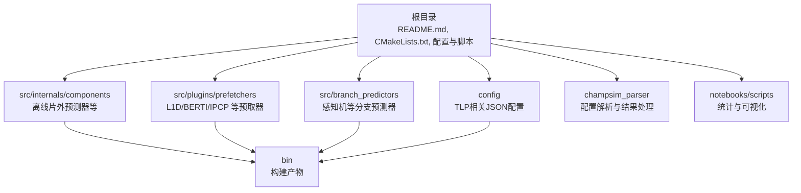
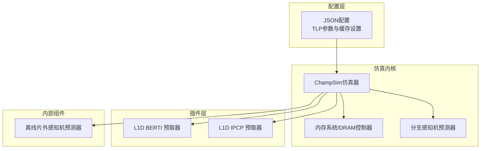
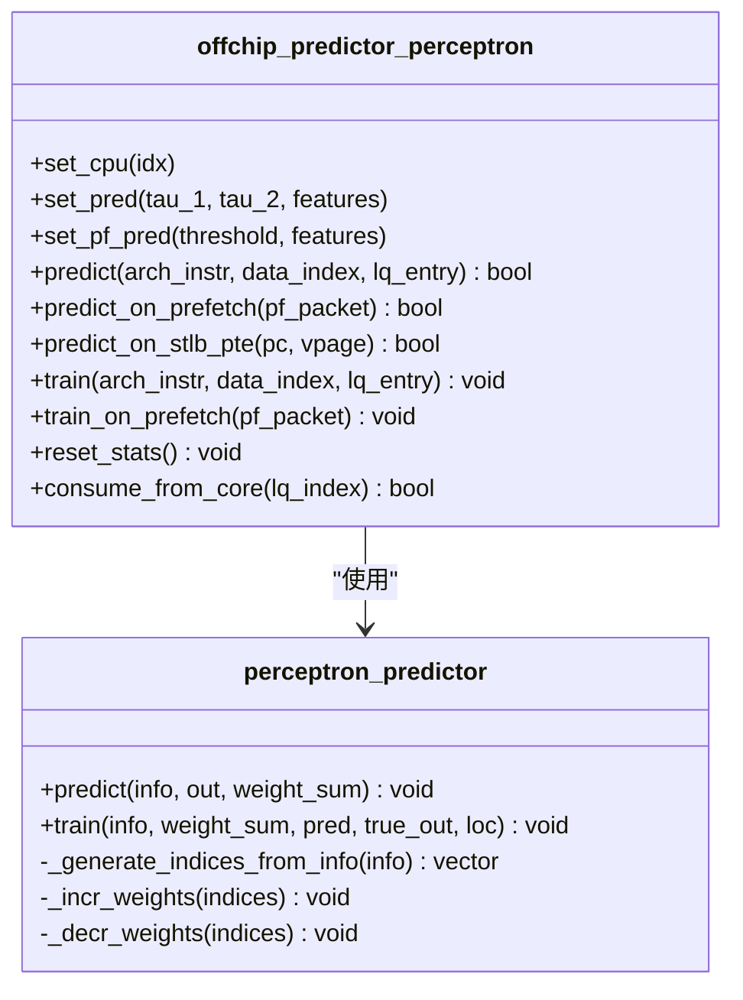
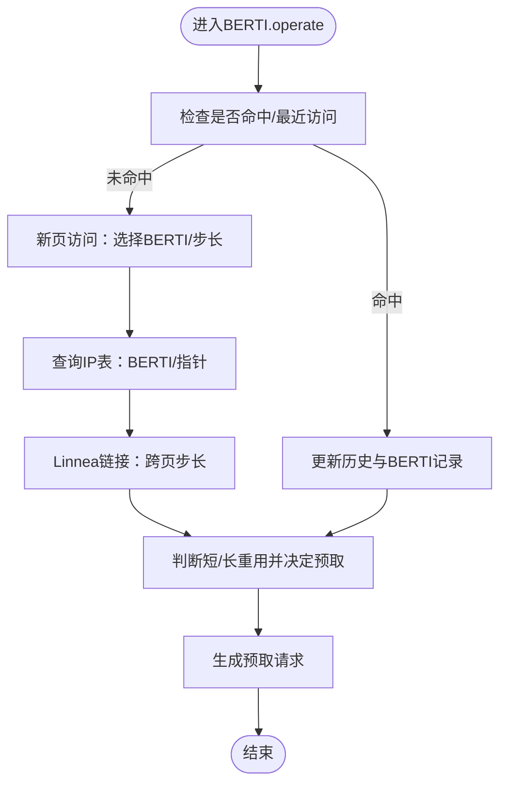
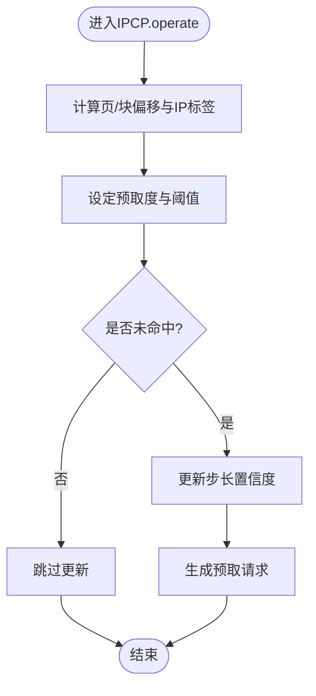
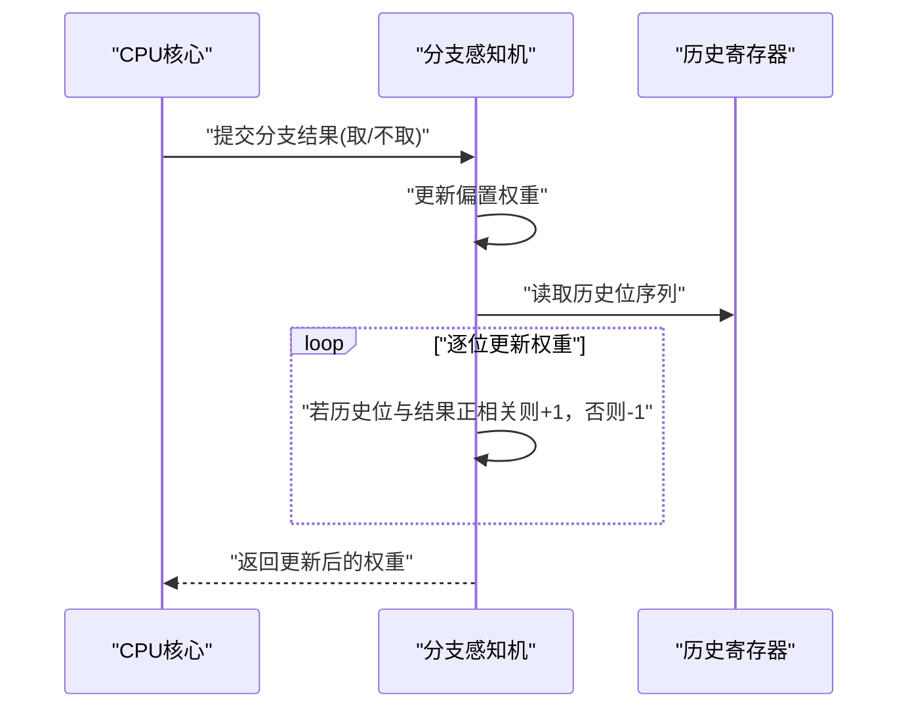
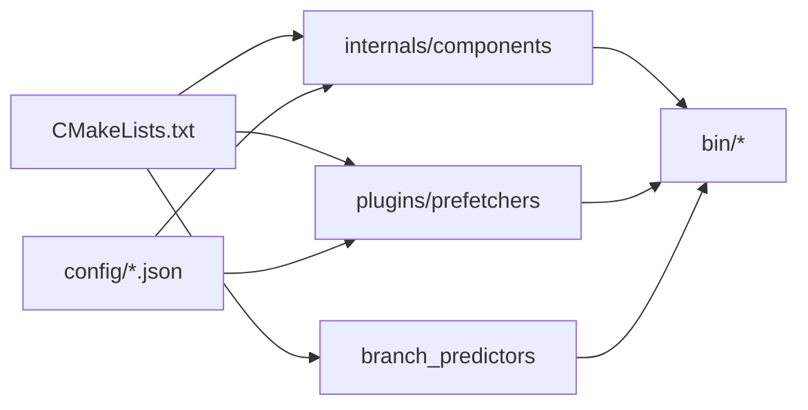

# 项目概述

<cite>
**本文引用的文件**   
- [README.md](file://README.md)
- [CMakeLists.txt](file://CMakeLists.txt)
- [offchip_pred_perc.cc](file://src/internals/components/offchip_pred_perc.cc)
- [offchip_pred_perc.hh](file://src/internals/components/offchip_pred_perc.hh)
- [baseline_cascade_lake_4_cores_tlp_l1d_berti_l2c_no_800mtps.json](file://config/baseline_cascade_lake_4_cores_tlp_l1d_berti_l2c_no_800mtps.json)
- [l1d_berti.cc](file://src/plugins/prefetchers/l1d_berti/l1d_berti.cc)
- [helpers.hh](file://src/plugins/prefetchers/l1d_berti/helpers.hh)
- [ipcp.cc](file://src/prefetchers/ipcp/ipcp.cc)
- [perceptron.cc](file://src/branch_predictors/perceptron/perceptron.cc)
- [config_parser.py](file://champsim_parser/config_parser.py)
</cite>

## 目录
1. [引言](#引言)
2. [项目结构](#项目结构)
3. [核心组件](#核心组件)
4. [架构总览](#架构总览)
5. [详细组件分析](#详细组件分析)
6. [依赖关系分析](#依赖关系分析)
7. [性能考量](#性能考量)
8. [故障排查指南](#故障排查指南)
9. [结论](#结论)
10. [附录](#附录)

## 引言
本项目围绕“两级感知机”（Two-Level Perceptron，简称 TLP）预测器展开，旨在通过结合片外访问预测与自适应预取过滤，在ChampSim仿真器中显著优化一级数据缓存（L1D）的性能。TLP的核心思想包括：对可能走向片外的加载请求进行准确预测；对L1D预取请求是否走向片外进行预测；在置信度足够高时，对预测走向片外的加载请求提前从主存并行取数；在置信度不足时延迟主存推测取数；对预测将走向片外的L1D预取请求进行丢弃。该方法已在IEEE HPCA 2024会议录用。

本概述面向初学者与有经验的开发者，既提供概念性介绍，也给出可追溯到源码的技术细节与实现路径，帮助读者快速理解TLP的设计理念、技术架构与实验流程。

## 项目结构
仓库采用模块化组织方式，核心目录与职责如下：
- 根目录：安装说明、构建脚本、实验工作流与依赖准备等
- src：ChampSim内部组件与插件实现
  - internals/components：内存系统关键组件（如离线片外预测器）
  - plugins/prefetchers：各级缓存的预取器插件（含BERTI、IPCP等）
  - branch_predictors：分支预测器（如感知机）
  - simulator：仿真入口
- config：仿真配置（含TLP相关配置示例）
- champsim_parser：结果解析工具
- notebooks/scripts：Jupyter笔记本与统计汇总脚本
- build/bin：构建产物输出目录

图示来源
- [CMakeLists.txt:1-66](file://CMakeLists.txt#L1-L66)
- [README.md:15-86](file://README.md#L15-L86)

章节来源
- [README.md:15-86](file://README.md#L15-L86)
- [CMakeLists.txt:1-66](file://CMakeLists.txt#L1-L66)

## 核心组件
- 片外访问感知机预测器（off-chip perceptron predictor）
  - 负责对加载/预取请求是否走向片外进行预测，并维护两套感知机（针对加载与预取），支持训练与阈值调整
  - 提供预测、训练、状态特征提取与消费判定接口
- L1D BERTI 预取器
  - 基于页面与IP表的模式识别与突发预测机制，结合历史访问与重用信息生成预取
- L1D IPCP 预取器
  - 基于IP标签与步长置信度的预取策略，支持多核场景下的约束调整
- 分支感知机预测器
  - 作为ChampSim的分支预测基础，体现感知机权重更新机制
- 配置系统
  - JSON配置文件定义各核心的L1D/L2C/SDC/Metadata Cache/Off-chip Pred等参数，支撑TLP实验

章节来源
- [offchip_pred_perc.cc:1-379](file://src/internals/components/offchip_pred_perc.cc#L1-L379)
- [offchip_pred_perc.hh:316-435](file://src/internals/components/offchip_pred_perc.hh#L316-L435)
- [l1d_berti.cc:1-200](file://src/plugins/prefetchers/l1d_berti/l1d_berti.cc#L1-L200)
- [helpers.hh:1-200](file://src/plugins/prefetchers/l1d_berti/helpers.hh#L1-L200)
- [ipcp.cc:156-196](file://src/prefetchers/ipcp/ipcp.cc#L156-L196)
- [perceptron.cc:273-313](file://src/branch_predictors/perceptron/perceptron.cc#L273-L313)
- [baseline_cascade_lake_4_cores_tlp_l1d_berti_l2c_no_800mtps.json:1-214](file://config/baseline_cascade_lake_4_cores_tlp_l1d_berti_l2c_no_800mtps.json#L1-L214)

## 架构总览
TLP在ChampSim框架内通过以下层次协同工作：
- 顶层配置层：以JSON描述CPU核心、缓存层级、预取器与片外预测器参数
- 内部组件层：提供感知机预测器、内存系统、DRAM控制器等
- 插件层：提供L1D/BERTI、L1D/IPCP等预取器插件
- 仿真执行层：驱动指令读取、访存、预取决策与统计收集

图示来源
- [CMakeLists.txt:31-66](file://CMakeLists.txt#L31-L66)
- [baseline_cascade_lake_4_cores_tlp_l1d_berti_l2c_no_800mtps.json:1-214](file://config/baseline_cascade_lake_4_cores_tlp_l1d_berti_l2c_no_800mtps.json#L1-L214)

## 详细组件分析

### 片外访问感知机预测器（Two-Level Perceptron）
该组件是TLP的关键神经预测模块，负责：
- 对加载请求与预取请求分别建立感知机模型
- 提取体系结构状态特征（PC、虚拟地址、页号、块偏移、IP标签等）
- 在预测阶段根据权重和阈值输出是否走向片外
- 在训练阶段依据真实走向更新权重，统计TP/FP/TN/FN等指标

图示来源
- [offchip_pred_perc.cc:10-379](file://src/internals/components/offchip_pred_perc.cc#L10-L379)
- [offchip_pred_perc.hh:316-435](file://src/internals/components/offchip_pred_perc.hh#L316-L435)

章节来源
- [offchip_pred_perc.cc:10-379](file://src/internals/components/offchip_pred_perc.cc#L10-L379)
- [offchip_pred_perc.hh:316-435](file://src/internals/components/offchip_pred_perc.hh#L316-L435)

### L1D BERTI 预取器
BERTI通过当前页表、IP表、记录页表与历史延迟表，对突发模式与长重用进行建模，从而在命中/未命中场景下动态决定预取粒度与方向。其关键特性包括：
- 当前页表：记录每页的位向量、BERTI候选集、短/长重用标记
- IP表：按指令指针索引BERTI或指针，支持Linnea链接
- 记录页表：记录跨页转移与步长，辅助长重用预测
- 历史延迟表：记录请求完成时间，用于回溯BERTI距离

图示来源
- [l1d_berti.cc:34-200](file://src/plugins/prefetchers/l1d_berti/l1d_berti.cc#L34-L200)
- [helpers.hh:69-200](file://src/plugins/prefetchers/l1d_berti/helpers.hh#L69-L200)

章节来源
- [l1d_berti.cc:34-200](file://src/plugins/prefetchers/l1d_berti/l1d_berti.cc#L34-L200)
- [helpers.hh:69-200](file://src/plugins/prefetchers/l1d_berti/helpers.hh#L69-L200)

### L1D IPCP 预取器
IPCP基于IP标签与步长置信度，动态调整预取度与阈值，尤其在多核场景下收紧约束，避免过度预取。其关键逻辑包括：
- 计算当前页与块偏移，确定预取度与特殊下一行为阈值
- 使用2比特饱和计数器更新步长置信度
- 根据命中/未命中更新统计与阈值

图示来源
- [ipcp.cc:156-196](file://src/prefetchers/ipcp/ipcp.cc#L156-L196)

章节来源
- [ipcp.cc:156-196](file://src/prefetchers/ipcp/ipcp.cc#L156-L196)

### 分支感知机预测器（对比参考）
作为ChampSim的分支预测基础，感知机权重通过饱和算子进行增量/减量更新，体现感知机学习的基本范式。

图示来源
- [perceptron.cc:273-313](file://src/branch_predictors/perceptron/perceptron.cc#L273-L313)

章节来源
- [perceptron.cc:273-313](file://src/branch_predictors/perceptron/perceptron.cc#L273-L313)

## 依赖关系分析
- 构建系统
  - CMakeLists集中管理编译目标、包含路径与第三方依赖（Boost），并统一添加各插件子目录
- 组件耦合
  - 片外预测器与感知机预测器解耦，通过特征结构与权重和阈值交互
  - L1D预取器（BERTI/IPCP）与仿真内核通过统一接口交互，便于替换与组合
- 配置耦合
  - JSON配置文件将TLP参数（特征维度、阈值、预取度等）注入到具体插件与组件

图示来源
- [CMakeLists.txt:1-66](file://CMakeLists.txt#L1-L66)

章节来源
- [CMakeLists.txt:1-66](file://CMakeLists.txt#L1-L66)

## 性能考量
- 预测置信度与阈值
  - 片外预测器通过权重和阈值控制“推测取数”的启动时机，过高置信度可提升并行收益，过低则避免无效带宽占用
- 预取粒度与度数
  - BERTI与IPCP在不同重用模式下动态调整预取度，减少冗余预取
- 多核场景约束
  - IPCP在多核下收紧预取度与阈值，降低跨核干扰
- 统计与收敛
  - 预测器训练过程统计TP/FP/TN/FN，有助于评估与调优

## 故障排查指南
- 构建失败
  - 检查CMake版本、GCC版本与Boost依赖是否满足要求
  - 确认CMake变量（如SIMULATOR_OUTPUT_DIRECTORY、CHAMPSIM_CPU_NUMBER_CORE、CHAMPSIM_CPU_DRAM_IO_FREQUENCY等）设置正确
- 运行异常
  - 核对JSON配置中offchip_pred.prefetch的features与threshold是否与期望一致
  - 检查L1D预取器插件是否启用（如l1d_berti或l1d_ipcp）
- 结果异常
  - 使用champsim_parser解析配置路径，确认参数令牌数量与顺序符合预期
  - 关注预取器统计（如BERTI的IP命中/早/晚、缓存命中/未命中）以定位问题

章节来源
- [README.md:57-112](file://README.md#L57-L112)
- [config_parser.py:213-249](file://champsim_parser/config_parser.py#L213-L249)
- [baseline_cascade_lake_4_cores_tlp_l1d_berti_l2c_no_800mtps.json:51-110](file://config/baseline_cascade_lake_4_cores_tlp_l1d_berti_l2c_no_800mtps.json#L51-L110)

## 结论
TLP通过“两级感知机”将片外访问预测与自适应预取过滤有机结合，既能并行加速走向片外的加载请求，又能抑制无谓的预取，从而在ChampSim中有效提升L1D缓存性能。其模块化设计与丰富的配置选项，使其易于扩展与评估不同场景下的效果。建议在单核/多核、不同DRAM频率与预取策略组合下开展系统性实验，进一步验证TLP的鲁棒性与泛化能力。

## 附录
- 实验工作流
  - 准备三卷追踪数据，解压后生成traces目录
  - 使用SLURM在裸金属集群上运行脚本，产出results目录
  - 使用Jupyter笔记本或IPython脚本汇总统计并生成图表
- 参考文献
  - TLP已被IEEE HPCA 2024接收，可在README中找到会议链接

章节来源
- [README.md:135-179](file://README.md#L135-L179)