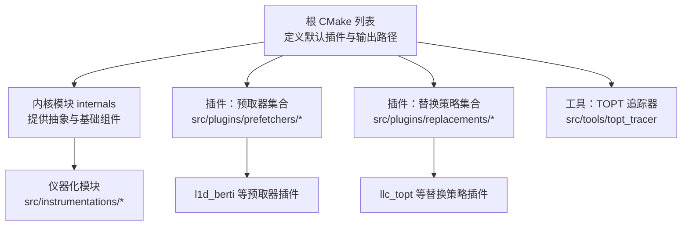
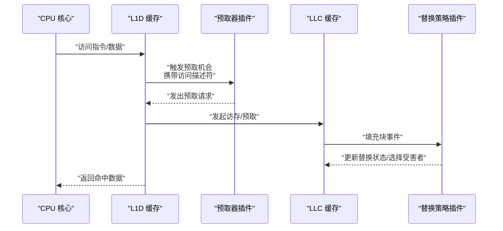
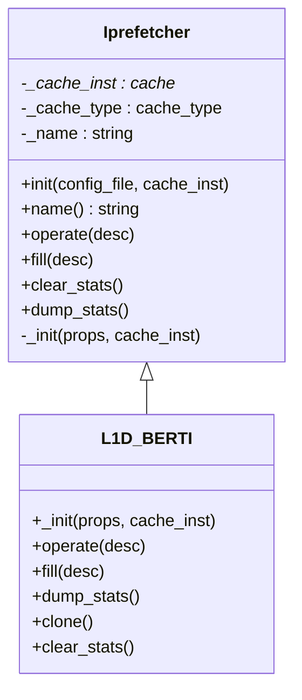
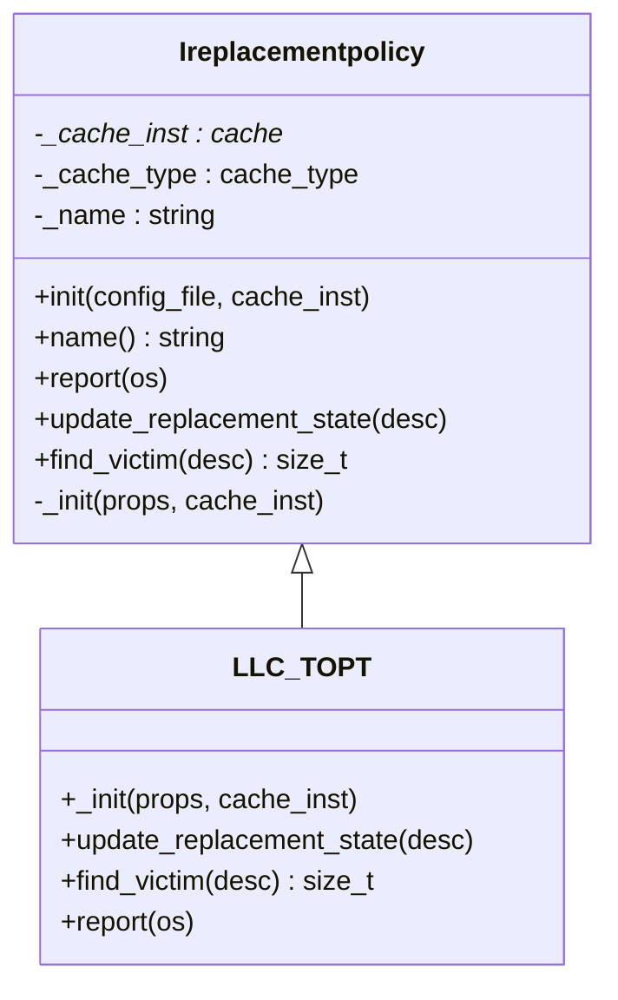
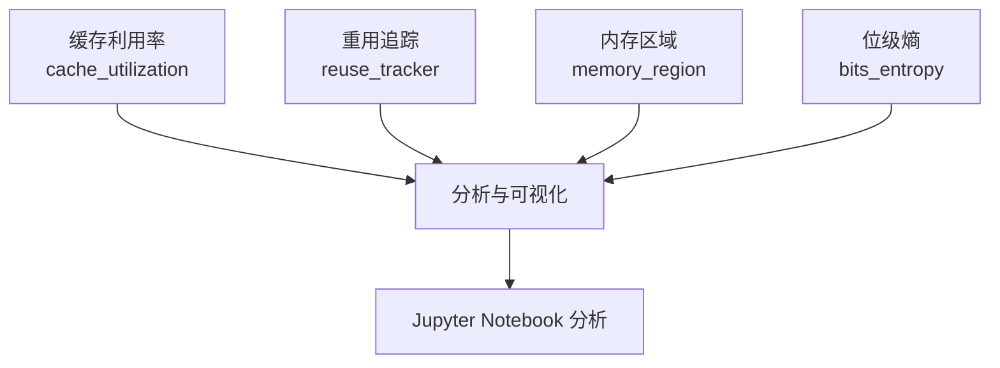
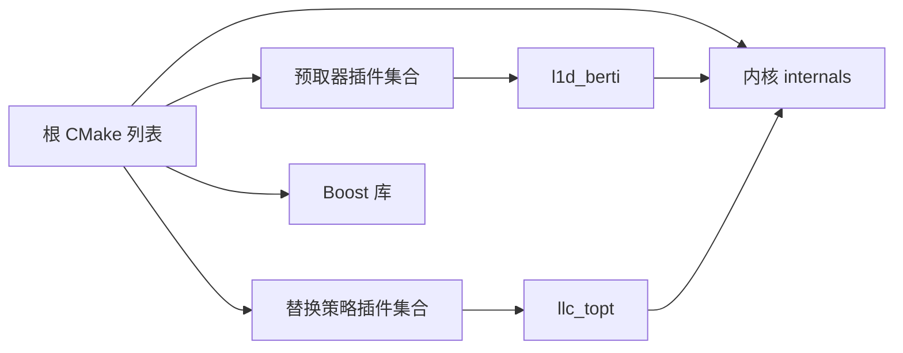

# 高级功能模块

<cite>
**本文引用的文件**
- [README.md](file://README.md)
- [CMakeLists.txt](file://CMakeLists.txt)
- [iprefetcher.hh](file://src/internals/prefetchers/iprefetcher.hh)
- [ireplacementpolicy.hh](file://src/internals/replacements/ireplacementpolicy.hh)
- [CMakeLists.txt（l1d_berti 插件）](file://src/plugins/prefetchers/l1d_berti/CMakeLists.txt)
- [l1d_berti.cc](file://src/plugins/prefetchers/l1d_berti/l1d_berti.cc)
- [l1d_berti.hh](file://src/plugins/prefetchers/l1d_berti/l1d_berti.hh)
- [helpers.cc](file://src/plugins/prefetchers/l1d_berti/helpers.cc)
- [helpers.hh](file://src/plugins/prefetchers/l1d_berti/helpers.hh)
- [CMakeLists.txt（llc_topt 插件）](file://src/plugins/replacements/llc_topt/CMakeLists.txt)
- [llc_topt.cc](file://src/plugins/replacements/llc_topt/llc_topt.cc)
- [llc_topt.hh](file://src/plugins/replacements/llc_topt/llc_topt.hh)
- [builder.h](file://src/plugins/replacements/llc_topt/builder.h)
- [generator.h](file://src/plugins/replacements/llc_topt/generator.h)
- [platform_atomics.h](file://src/plugins/replacements/llc_topt/platform_atomics.h)
- [pvector.h](file://src/plugins/replacements/llc_topt/pvector.h)
- [instrumentation 目录](file://src/instrumentations/)
- [cache_utilization.cc](file://src/instrumentations/cache_utilization.cc)
- [cache_utilization.hh](file://src/instrumentations/cache_utilization.hh)
- [reuse_tracker.cc](file://src/instrumentations/reuse_tracker.cc)
- [reuse_tracker.hh](file://src/instrumentations/reuse_tracker.hh)
- [block_usage_descriptor.cc](file://src/instrumentations/block_usage_descriptor.cc)
- [block_usage_descriptor.hh](file://src/instrumentations/block_usage_descriptor.hh)
- [memory_region.cc](file://src/instrumentations/memory_region.cc)
- [memory_region.hh](file://src/instrumentations/memory_region.hh)
- [bits_entropy.hh](file://src/instrumentations/bits_entropy.hh)
- [topt_tracer CMakeLists.txt](file://src/tools/topt_tracer/CMakeLists.txt)
</cite>

## 目录
1. [简介](#简介)
2. [项目结构](#项目结构)
3. [核心组件](#核心组件)
4. [架构总览](#架构总览)
5. [详细组件分析](#详细组件分析)
6. [依赖关系分析](#依赖关系分析)
7. [性能考量](#性能考量)
8. [故障排查指南](#故障排查指南)
9. [结论](#结论)
10. [附录](#附录)

## 简介
本文件面向 TLP-HPCA30 的高级功能模块，聚焦于插件系统架构与扩展机制，系统性阐述预取器插件与替换策略插件的设计、接口规范、开发流程与集成方式；提供自定义预取器与替换策略的完整开发指南，包含算法实现、性能测试与验证方法；解释仪器化模块的功能与使用场景，并给出开发示例与最佳实践。

## 项目结构
该仓库基于 CMake 构建，采用“内核模块 + 插件模块”的分层组织方式：
- 内核模块位于 src/internals，提供通用抽象与基础组件（如缓存、替换策略接口、分支预测等）。
- 插件模块位于 src/plugins，按功能域划分为预取器与替换策略两类，每个插件独立构建为共享库并链接至内核。
- 根目录 CMakeLists.txt 定义了可配置的默认插件选择，并统一纳入构建流程。
- 仪器化模块位于 src/instrumentations，提供缓存利用率、重用追踪、内存区域与熵统计等工具。
- 工具模块位于 src/tools/topt_tracer，用于 TOPT 相关追踪与分析。

图表来源
- [CMakeLists.txt:1-66](file://CMakeLists.txt#L1-L66)
- [CMakeLists.txt（l1d_berti 插件）:1-13](file://src/plugins/prefetchers/l1d_berti/CMakeLists.txt#L1-L13)
- [CMakeLists.txt（llc_topt 插件）:1-13](file://src/plugins/replacements/llc_topt/CMakeLists.txt#L1-L13)

章节来源
- [CMakeLists.txt:1-66](file://CMakeLists.txt#L1-L66)
- [README.md:1-203](file://README.md#L1-L203)

## 核心组件
- 预取器接口：抽象出统一的初始化、操作、填充回调与统计导出能力，确保不同预取器可被缓存子系统以一致方式调用。
- 替换策略接口：抽象出更新替换状态与查找受害者的方法，保证替换策略与缓存类型匹配。
- 插件构建：通过 CMake 将各插件编译为共享库并链接内核，便于运行时加载与替换。
- 仪器化模块：提供缓存利用率、重用追踪、内存区域划分与熵统计等工具，支持性能监控与调试。

章节来源
- [iprefetcher.hh:1-165](file://src/internals/prefetchers/iprefetcher.hh#L1-L165)
- [ireplacementpolicy.hh:1-97](file://src/internals/replacements/ireplacementpolicy.hh#L1-L97)
- [CMakeLists.txt（l1d_berti 插件）:1-13](file://src/plugins/prefetchers/l1d_berti/CMakeLists.txt#L1-L13)
- [CMakeLists.txt（llc_topt 插件）:1-13](file://src/plugins/replacements/llc_topt/CMakeLists.txt#L1-L13)

## 架构总览
下图展示从缓存访问到预取请求生成与替换策略决策的关键交互路径，以及插件如何通过接口与内核解耦协作。

图表来源
- [iprefetcher.hh:78-101](file://src/internals/prefetchers/iprefetcher.hh#L78-L101)
- [ireplacementpolicy.hh:54-56](file://src/internals/replacements/ireplacementpolicy.hh#L54-L56)

## 详细组件分析

### 预取器插件体系
- 接口规范
  - 初始化：读取 JSON 配置，校验缓存类型兼容性，绑定到目标缓存实例。
  - 操作：在每次预取机会触发时，接收包含访问类型、物理地址、指令指针等信息的描述符，决定是否发出预取请求。
  - 填充回调：当缓存发生填充时，接收填充描述符进行内部状态更新。
  - 统计：提供清零与导出统计的能力，便于实验对比。
- 开发步骤
  - 新建目录与 CMake 列表，声明源文件并设置输出路径为 bin/prefetchers。
  - 实现继承 iprefetcher 的类，覆盖 _init、operate、fill、dump_stats 等方法。
  - 在配置 JSON 中声明插件名称与绑定的缓存类型，确保与缓存实例类型一致。
  - 在根 CMake 中添加 add_subdirectory，使插件参与构建。
- 集成方式
  - 通过 CHAMPSIM_*_PREFETCHER 变量选择默认预取器，或在运行脚本中指定。
  - 插件以共享库形式加载，与内核解耦，便于快速迭代与替换。

图表来源
- [iprefetcher.hh:46-160](file://src/internals/prefetchers/iprefetcher.hh#L46-L160)
- [l1d_berti.hh](file://src/plugins/prefetchers/l1d_berti/l1d_berti.hh)

章节来源
- [iprefetcher.hh:55-101](file://src/internals/prefetchers/iprefetcher.hh#L55-L101)
- [CMakeLists.txt（l1d_berti 插件）:1-13](file://src/plugins/prefetchers/l1d_berti/CMakeLists.txt#L1-L13)
- [l1d_berti.cc](file://src/plugins/prefetchers/l1d_berti/l1d_berti.cc)
- [l1d_berti.hh](file://src/plugins/prefetchers/l1d_berti/l1d_berti.hh)
- [helpers.cc](file://src/plugins/prefetchers/l1d_berti/helpers.cc)
- [helpers.hh](file://src/plugins/prefetchers/l1d_berti/helpers.hh)

### 替换策略插件体系
- 接口规范
  - 初始化：读取 JSON 配置，校验缓存类型兼容性，绑定到目标缓存实例。
  - 更新替换状态：在缓存访问后根据描述符更新策略内部状态。
  - 查找受害者：在需要替换时，依据策略选择应淘汰的组内行。
  - 报告：可选地将策略状态写入报告流，便于分析。
- 开发步骤
  - 新建目录与 CMake 列表，声明源文件并设置输出路径为 bin/replacements。
  - 实现继承 ireplacementpolicy 的类，覆盖 _init、update_replacement_state、find_victim 等方法。
  - 在配置 JSON 中声明插件名称与绑定的缓存类型，确保与缓存实例类型一致。
  - 在根 CMake 中添加 add_subdirectory，使插件参与构建。
- 集成方式
  - 通过 CHAMPSIM_REPLACEMENT_POLICY 变量选择默认替换策略，或在运行脚本中指定。
  - 插件以共享库形式加载，与内核解耦，便于快速迭代与替换。

图表来源
- [ireplacementpolicy.hh:29-92](file://src/internals/replacements/ireplacementpolicy.hh#L29-L92)
- [llc_topt.hh](file://src/plugins/replacements/llc_topt/llc_topt.hh)

章节来源
- [ireplacementpolicy.hh:37-79](file://src/internals/replacements/ireplacementpolicy.hh#L37-L79)
- [CMakeLists.txt（llc_topt 插件）:1-13](file://src/plugins/replacements/llc_topt/CMakeLists.txt#L1-L13)
- [llc_topt.cc](file://src/plugins/replacements/llc_topt/llc_topt.cc)
- [llc_topt.hh](file://src/plugins/replacements/llc_topt/llc_topt.hh)
- [builder.h](file://src/plugins/replacements/llc_topt/builder.h)
- [generator.h](file://src/plugins/replacements/llc_topt/generator.h)
- [platform_atomics.h](file://src/plugins/replacements/llc_topt/platform_atomics.h)
- [pvector.h](file://src/plugins/replacements/llc_topt/pvector.h)

### 仪器化模块
- 功能概述
  - 缓存利用率：统计与记录各级缓存的占用与使用情况，辅助评估替换策略与预取效果。
  - 重用追踪：跟踪同一块数据在时间维度上的访问模式，识别重用热点与周期性。
  - 内存区域：对程序访问的内存区域进行划分与统计，辅助定位大块数据访问。
  - 熵统计：计算位级熵，帮助识别随机性与可压缩性特征。
- 使用场景
  - 性能分析：结合实验结果，定位瓶颈与异常行为。
  - 调试优化：通过重用与区域信息指导预取与替换策略参数调整。
  - 论文复现：为论文中的指标提供可复现的度量手段。
- 集成方式
  - 作为内核的一部分，在仿真运行过程中按需启用与采集。
  - 输出结果可用于 Jupyter Notebook 分析脚本进行可视化与统计汇总。

图表来源
- [cache_utilization.cc](file://src/instrumentations/cache_utilization.cc)
- [cache_utilization.hh](file://src/instrumentations/cache_utilization.hh)
- [reuse_tracker.cc](file://src/instrumentations/reuse_tracker.cc)
- [reuse_tracker.hh](file://src/instrumentations/reuse_tracker.hh)
- [block_usage_descriptor.cc](file://src/instrumentations/block_usage_descriptor.cc)
- [block_usage_descriptor.hh](file://src/instrumentations/block_usage_descriptor.hh)
- [memory_region.cc](file://src/instrumentations/memory_region.cc)
- [memory_region.hh](file://src/instrumentations/memory_region.hh)
- [bits_entropy.hh](file://src/instrumentations/bits_entropy.hh)

章节来源
- [instrumentation 目录](file://src/instrumentations/)

### TOPT 追踪器工具
- 功能概述
  - 提供针对 TOPT（Tree-based On-chip Prefetch Trigger）相关行为的追踪与分析能力，支撑替换策略的训练与评估。
- 构建与集成
  - 通过独立的 CMake 列表管理源文件与依赖，最终链接至内核模块。
- 使用建议
  - 在替换策略开发与调试阶段，结合 TOPT 追踪输出进行行为验证与参数调优。

章节来源
- [topt_tracer CMakeLists.txt](file://src/tools/topt_tracer/CMakeLists.txt)

## 依赖关系分析
- 插件与内核的耦合
  - 插件通过继承内核提供的接口类实现功能，避免直接依赖具体实现细节，降低耦合度。
  - 插件以共享库形式存在，运行时动态加载，进一步增强可插拔性。
- 构建系统
  - 根 CMakeLists.txt 统一管理插件子目录，通过 add_subdirectory 将所有插件纳入构建。
  - 各插件 CMakeLists.txt 设置输出路径与链接关系，确保产物位于 bin/prefetchers 或 bin/replacements。
- 外部依赖
  - 依赖 Boost 库（program_options、filesystem、system），用于配置解析与文件系统操作。

图表来源
- [CMakeLists.txt:34-63](file://CMakeLists.txt#L34-L63)
- [CMakeLists.txt（l1d_berti 插件）:9-12](file://src/plugins/prefetchers/l1d_berti/CMakeLists.txt#L9-L12)
- [CMakeLists.txt（llc_topt 插件）:9-12](file://src/plugins/replacements/llc_topt/CMakeLists.txt#L9-L12)

章节来源
- [CMakeLists.txt:1-66](file://CMakeLists.txt#L1-L66)

## 性能考量
- 插件加载与切换
  - 通过 CMake 变量与运行脚本控制默认插件，减少不必要的编译与链接开销。
  - 插件以共享库形式加载，便于在相同内核版本下快速切换策略组合。
- 统计与仪器化
  - 仅在需要时启用高开销的统计项，避免影响仿真吞吐。
  - 将统计结果导出到文件，配合 Notebook 进行离线分析，降低在线成本。
- 参数化与可配置性
  - 通过 JSON 配置与 CMake 变量实现参数化，便于批量实验与对比分析。

## 故障排查指南
- 预取器/替换策略不生效
  - 检查配置 JSON 中的 cache_type 是否与目标缓存类型一致。
  - 确认插件已正确添加到根 CMake 的 add_subdirectory 列表中。
- 运行时错误或崩溃
  - 检查插件初始化流程是否抛出异常（例如类型不匹配）。
  - 确认插件共享库已正确链接至内核模块。
- 统计缺失或异常
  - 确认插件实现了 dump_stats/clear_stats 并在合适时机调用。
  - 检查仪器化模块是否按预期启用与采集。

章节来源
- [iprefetcher.hh:133-143](file://src/internals/prefetchers/iprefetcher.hh#L133-L143)
- [ireplacementpolicy.hh:67-76](file://src/internals/replacements/ireplacementpolicy.hh#L67-L76)

## 结论
本高级功能模块通过清晰的接口抽象与插件化架构，实现了预取器与替换策略的灵活扩展与高效集成。依托仪器化模块与工具链，开发者可以完成从算法实现、性能测试到结果可视化的全链路工作流。遵循本文的开发指南与最佳实践，可快速构建高质量的自定义插件并融入现有仿真框架。

## 附录
- 开发示例（步骤）
  - 预取器：新建目录与 CMake 列表 → 实现 iprefetcher 子类 → 编写配置 JSON → 在根 CMake 添加子目录 → 构建并运行。
  - 替换策略：新建目录与 CMake 列表 → 实现 ireplacementpolicy 子类 → 编写配置 JSON → 在根 CMake 添加子目录 → 构建并运行。
- 最佳实践
  - 保持接口最小可用，避免过度耦合。
  - 充分利用仪器化模块进行离线分析，减少在线统计开销。
  - 通过 CMake 变量与配置文件实现参数化，便于大规模实验。